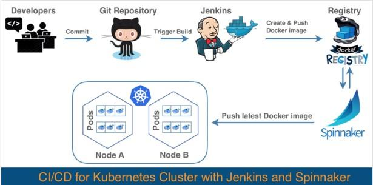

## CI/CD

DevOps 实践的企业都希望能够快速持续做每一件事情，无论是集成、部署、测试还是监控。无论小型企业还是大型企业，若想要成功做到 DevOps 式运维，CI/CD 都至关重要，可以用来缩短开发周期并快速响应变化，同时可减少部署失败的次数，并且在部署失败时能够做到安全回滚并减少平均修复时间（MTTR）

---

##### 如上图所示，当开发者向 GitHub 提交代码之后，Jenkins 将在某一配置好的分支上进行轮询，并针对这次代码提交触发一次应用的构建。Jenkins 会构建一个 Docker 镜像，然后将其推送到 Docker registry，并为该镜像打上标签（可以选择不同的方式为镜像做标签，比如采用 Git 提交号，或者采用递增的数字）。对于 Spinnaker，我们要提前配置好部署流水线，然后当它在 Docker registry 中发现带有新标签的 Docker 镜像时，就会自动触发部署。 
---