## cloud Building
# [ref](https://zhuanlan.zhihu.com/p/43384684)

我们每天都在打交道的那一部分：硬件，但我们知道那对用户却是基本上不可见的。就像任何投资于下一个伟大的（通常是私有的）东西的秘密实验室一样，我们认为地下室是其最好的地点。

从大家公认的像 Intel、AMD 和华为（传言他们雇佣的工程师接近 80000 名）这样的巨头，到像 Mellanox这样的细分市场参与者，硬件生态系统现在非常火。事实上，随着数十亿美元投入去攻克新的 offload（LCTT 译注：offload 泛指以前由软件及 CPU 来完成的工作，现在通过硬件来完成，以提升速度并降低 CPU 负载的做法）、GPU、定制协处理器，我们可能正在进入硬件的黄金时代。

著名的软件先驱艾伦·凯（Alan Kay）在 25 年前说过：“真正认真对待软件的人应该自己创造硬件”。说得不错，Alan！
------------------
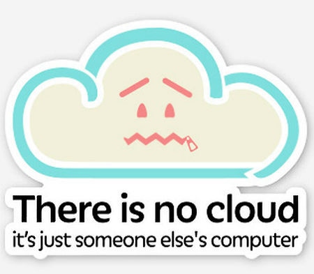

如果没有非常棒的用户，技术栈还有什么用呢？确实，他们享受了大量的创新，但在云原生的世界里，他们所做的远不止消费这么简单：他们也创造并贡献了很多。从像 Kubernetes 这样的大量的贡献者到越来越多的（但同样重要）更多方面，而我们都是其中的非常棒的一份子。

在我们屋顶上有许多悠闲的用户，比如 Ticketmaster 和《纽约时报》，而不仅仅是新贵：这些组织拥抱了部署和管理应用程序的方法的变革，并且他们的用户正在享受变革带来的回报。

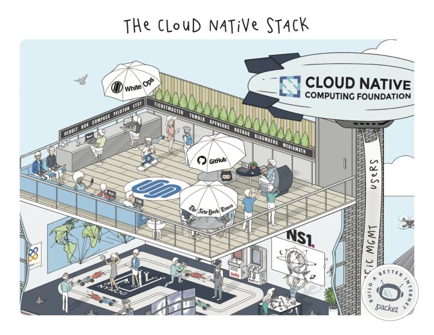

人们往往认为互联网“只是能工作而已”，但事实上，我们很惊讶于它居然能如此工作。我的意思是，就这些大规模的、不同的网络间的松散连接 —— 你不是在开玩笑吧？

能够把所有的这些独立的网络拼接到一起的一个原因是流量管理、DNS 和类似的东西。随着规模越来越大，这些让互联网变得更快、更安全、同时更具弹性。我们尤其高兴的是看到像 Fly.io 和 NS1 这样的新贵与优秀的老牌玩家进行竞争，最后的结果是整个生态系统都得以提升。让竞争来的更激烈吧！

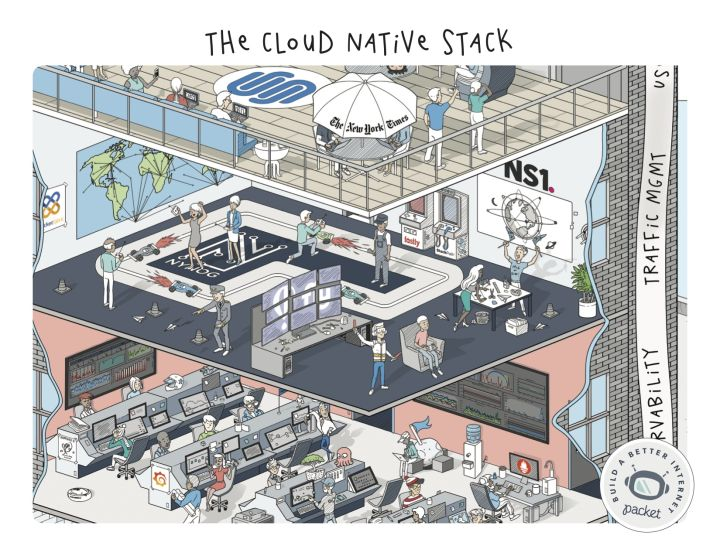

由于我们的工作负载开始到处移动，规模也越来越大，这里没有一件事情能够像一个非常好用的 Grafana 仪表盘、或方便的 Datadog 代理让人更加欣慰了。由于复杂度的提升，SRE 时代开始越来越多地依赖监控告警和其它智能事件去帮我们感知发生的事件，出现越来越多的自我修复的基础设施和应用程序。

在未来的几个月或几年中，我们将看到什么样的面孔进入这一领域……或许是一些人工智能、区块链、机器学习支撑的仪表盘？:-)

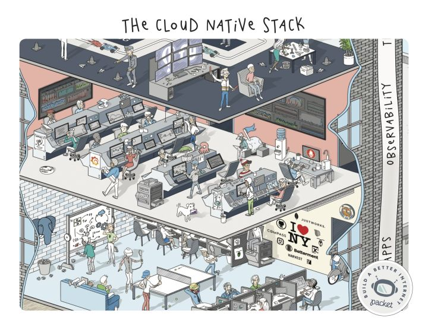

如何去表示海量的、无限的应用程序生态系统？在这个案例中，很容易：我们在纽约，选我们最喜欢的。;) 从 Postgres “房间里的大象” 和 Timescale 时钟，到鬼鬼祟祟的 ScyllaDB 垃圾桶和那个悠闲的 Travis哥们 —— 我们把这个片子拼到一起很有趣。

让我们感到很惊奇的一件事情是：很少有人注意到那个复印屁股的家伙。我想现在复印机已经不常见了吧？

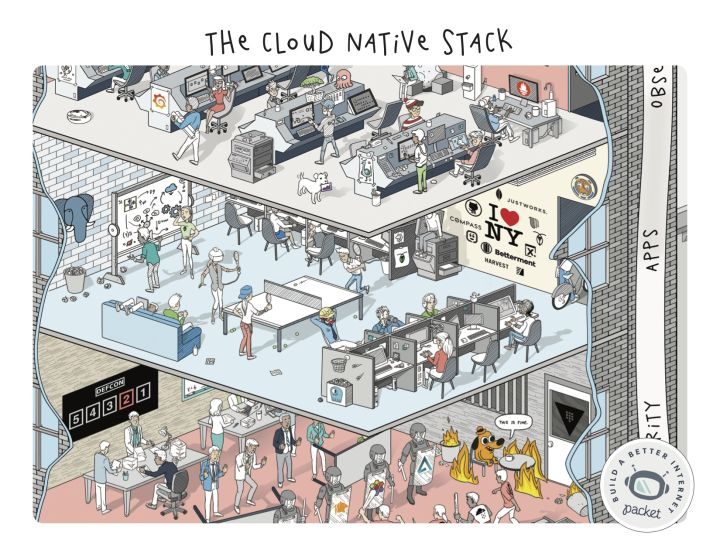

当说到安全时，今年真是很忙的一年！我们尝试去展示一些很著名的攻击，并说明随着工作负载变得更加分散和更加可迁移（当然，同时攻击者也变得更加智能），这些各式各样的工具是如何去帮助保护我们的。

我们看到一个用于不可信环境（如 Aporeto）和低级安全（Cilium）的强大动作，以及尝试在网络级别上的像 Tigera 这样的可信方法。不管你的方法如何，记住这一点：安全无止境。:0

这是栈中我们喜欢的层之一，因为每个平台都有如此多的工具帮助用户去完成他们想要做的事情（顺便说一下，不是去运行容器，而是运行应用程序）。从 Rancher 和 Kontena，到 Tectonic 和 Redshift 都是像 Cycle.io 和 Flynn.io 一样是完全不同的方法 —— 我们看到这些项目如何以不同的方式为用户提供服务，总是激动不已。

关键点：这些平台是帮助用户转化云原生生态系统中各种各样的快速变化的部分。很高兴能看到他们各自带来的东西！

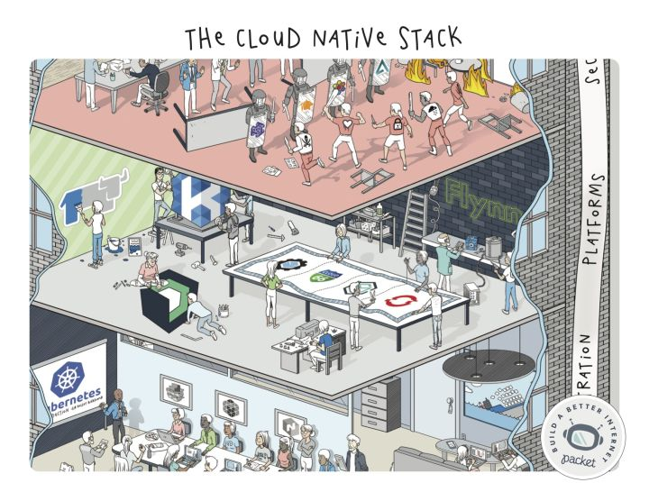

在过去的这一年里，编排层全是 Kubernetes 了，因此我们选取了其中一位著名的布道者（Kelsey Hightower），并在这个古怪的会议场景中给他一个特写。在我们的团队中有一些 Nomad（LCTT 译注：一个管理机器集群并在集群上运行应用程序的工具）的忠实粉丝，并且如果抛开 Docker 和它的工具集的影响，就无从谈起云原生。

虽然负载编排应用程序在我们栈中的地位非常高，我们看到的各种各样的证据表明，这些强大的工具开始去深入到栈中，以帮助用户利用 GPU 和其它特定硬件的优势。请继续关注 —— 我们正处于容器化革命的早期阶段！

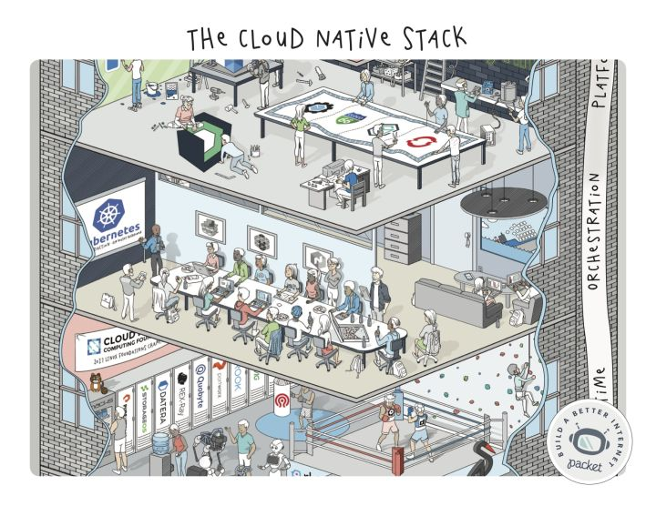

为了有趣些，我们将 运行时(runtime)放在了体育馆内，并为 CoreOS 赞助的 rkt 和 Docker 的容器化举行了一次比赛。而无论如何赢家都是 CNCF！

我们认为快速演进的存储生态系统应该是一些可上锁的储物柜。关于存储部分有趣的地方在于许多的新玩家尝试去解决持久性的挑战问题，以及性能和灵活性问题。就像他们说的：存储很简单。

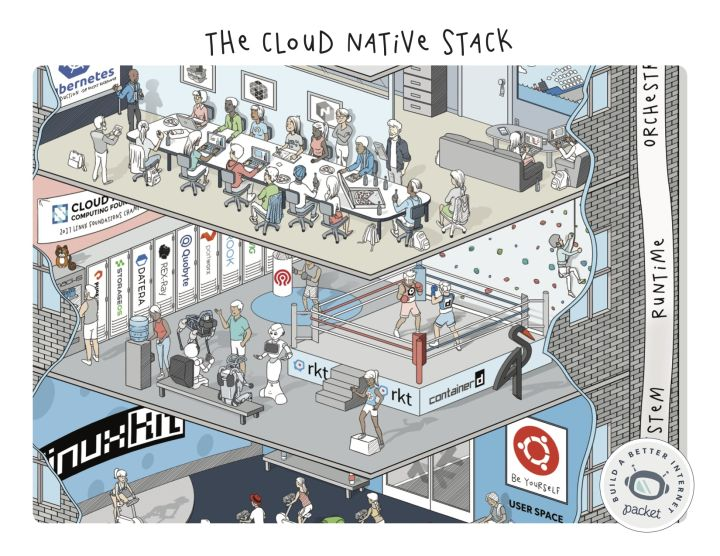

供应就绪后，我们来到操作系统层。在这里你可以看到我们打趣一些我们最喜欢的同事：注意上面 Brian Redbeard 那超众的瑜珈姿势。:)

Packet 为客户提供了 11 种主要的操作系统可供选择，包括一些你在图中看到的：Ubuntu、CoreOS、FreeBSD、Suse、和各种 Red Hat 系的发行版。我们看到越来越多的人们在这一层上加入了他们自己的看法：从定制内核和用于不可变部署的 黄金镜像(golden images)（LCCT 注：golden image 指定型的镜像或模板，一般是经过一些定制，并做快照和版本控制，由此可拷贝出大量与此镜像一致的开发、测试或部署环境，也有人称作 master image），到像 NixOS 和 LinuxKit 这样的项目。

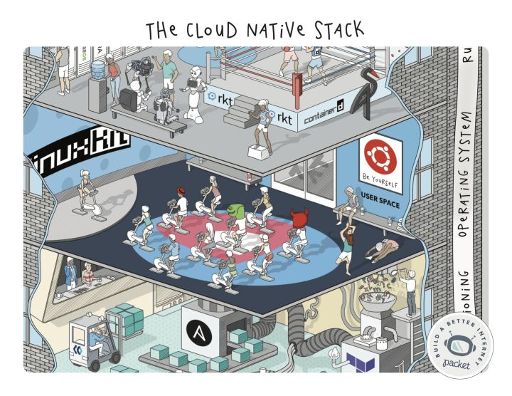

再上一层，在基础设施层之上是供给层。这是我们最喜欢的地方之一，它以前被我们称为 配置管理(config management)。但是现在到处都是一开始就是 不可变基础设施(immutable infrastructure)和自动化：Terraform、Ansible、Quay.io 等等类似的东西。你可以看出软件是按它的方式来工作的，对吗？

Kelsey Hightower 最近写道“呆在无聊的基础设施中是一个让人兴奋的时刻”，我不认为这说的是物理部分（虽然我们认为它非常让人兴奋），但是由于软件持续侵入到栈的所有层，那必将是一个疯狂的旅程。

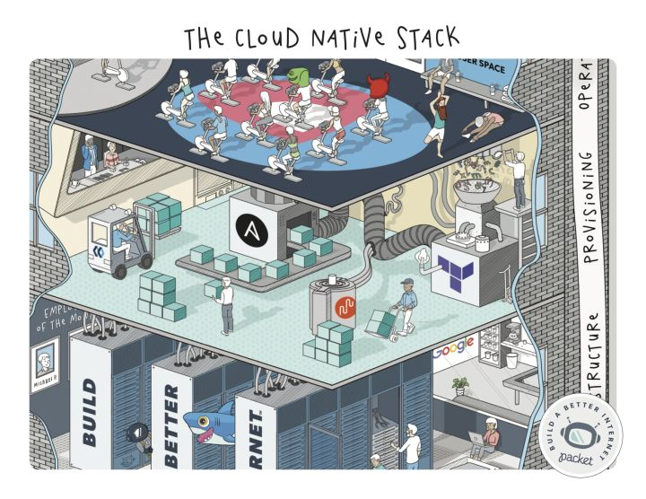

居于“连通”和“动力”之上的这一层，我们爱称为“处理器层”。这是奇迹发生的地方 —— 我们将来自下层的创新和实物投资转变成一个 API 终端的某些东西。

由于这是纽约的一个大楼，我们让在这里的云供应商处于纽约的中心。这就是为什么你会看到（Digital Ocean 系的）鲨鱼 Sammy 和对 “meet me” 房间里面的 Google 标志的致意的原因了。

正如你所见，这个场景是非常写实的。它是由多层机架堆叠起来的。尽管我们爱 EWR1 的设备经理（Michael Pedrazzini），我们努力去尽可能减少这种体力劳动。毕竟布线专业的博士学位是很难拿到的。

如果金钱是润滑油，那么消耗大量燃料的引擎就是数据中心供应商和连接它们的网络。我们称他们为“连通”和“动力”。

从像 Equinix 这样处于核心地位的接入商的和像 Vapor.io 这样的接入新贵，到 Verizon、Crown Castle 和其它接入商铺设在地下（或海底）的“管道”，这是我们所有的栈都依赖但很少有人能看到的一部分。

因为我们花费大量的时间去研究数据中心和连通性，需要注意的一件事情是，这一部分的变化非常快，尤其是在 5G 正式商用时，某些负载开始不再那么依赖中心化的基础设施了。

边缘计算即将到来！:-)

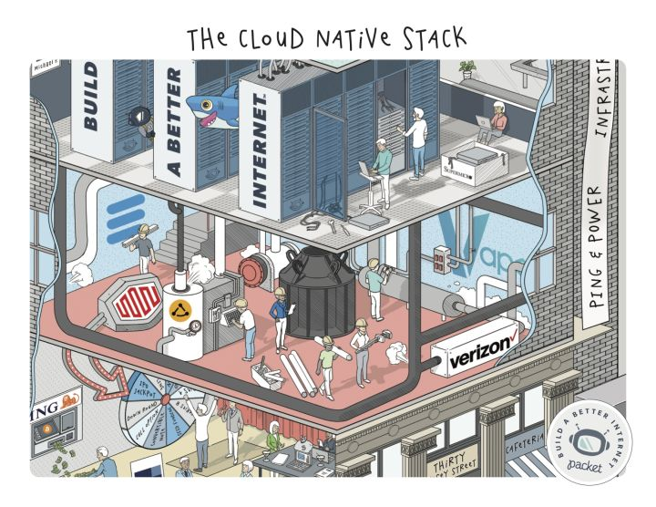

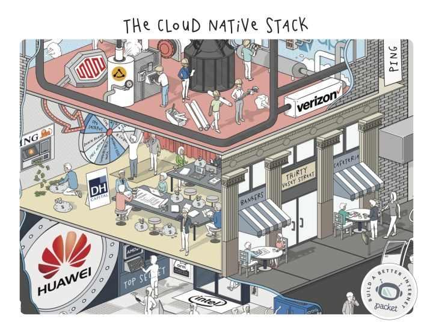

------------------

# all

