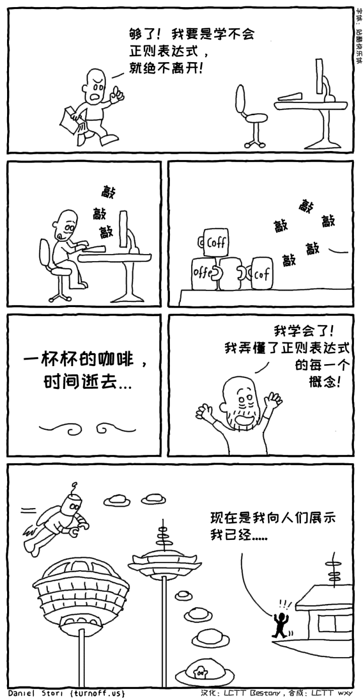

一个人希望掌握所有的正则表达式，却耗费了大量的时间，不知室外世事变迁，早已换了一个时代。

这个漫画讽刺了一些初学者，希望掌握一些比较复杂的东西的所有内容后再去做事，却不知道，这些东西过于复杂，你花费的时间可能很快就一文不值，因为它们可能已经过时了。

开发并不要求你掌握所有的内容，更多的时候，你只要能够掌握一些常用的，在真正需要用到的时候，再去查询一些比较详细的、不常用的内容即可。毕竟，没有人要求你马上做完所有事情。

# 不要浪费时间写完美的代码

### 有时候面对更重要的事情时，我们会迷信代码。我们经常有一个错觉，让卖出的产品有价值的是代码，然而实际上可能是对该问题领域的了解、设计难题的进展甚至是客户反馈。

### 建筑和工程方面的隐喻对软件从未有效过。我们不是设计和建造几年或几代将保持基本不变的桥梁或摩天大楼。我们构建的是更加弹性和抽象、更加短暂的东西。代码写来是被修改的 —— 这就是为什么它被称为“软件”。
    “经过五年的使用和修改，成功的软件程序的源码通常完全认不出它原来的样子，而一个成功建筑五年后几乎没有变化。”
    Kevin Tate，可持续软件开发

### 精益开发Lean Development的核心思想是：不要浪费时间在不重要的事情上。这应该提醒我们该如何编写代码，以及我们如何重构它、审查它、测试它。

    “你不能写出完美的软件。是不是收到了伤害？并不。把它作为生活的公理接受它、拥抱它、庆祝它。因为完美的软件不存在。在计算机的短暂历史中从没有人写过完美的软件。你不可能成为第一个。除非你接受这个事实，否则你最终会浪费时间和精力追逐不可能的梦想。”
    Andrew Hunt，务实的程序员: 从熟练工到大师

### 软件构建从没有止境。即使设计和代码是正确的，它们也可能只是一段时间内正确，直到环境要求再次更改或替换为更好的东西。
### 我们需要编写好的代码：代码可以理解、正确、安全和可靠。我们需要重构和审查它，并写出好的有用的测试，同时知道这其中一些或者所有的代码，可能会很快被抛弃，或者它可能永远不会被再被查看，或者它可能根本不会用到。我们需要认识到，我们的一些工作必然会被浪费，并为此而进行优化。做需要做的，没有别的了。不要浪费时间尝试编写完美的代码。