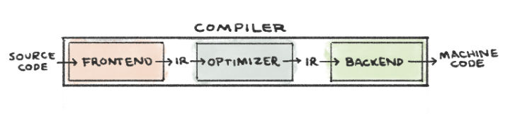

## 在 Siri 前时代如何与计算机对话


一个编译器（compiler）不过是一个可以翻译其他程序的程序。传统的编译器可以把源代码翻译成你的计算机能够理解的可执行机器代码.

传统的编译器设计包含三个部分：
* 前端（Frontend）将源代码翻译为中间表示（intermediate representation - IR)* 。clang 是 LLVM 中用于 C 家族语言的前端工具。
* 优化器（Optimizer）分析 IR 然后将其转化为更高效的形式。opt 是 LLVM 的优化工具。
* 后端（Backend）通过将 IR 映射到目标硬件指令集从而生成机器代码。llc 是 LLVM 的后端工具。
  


```c
// compile_me.c
// Wave to the compiler. The world can wait.

#include <stdio.h>

int main() {
    printf("Hello, Compiler!\n");
    return 0;
}
```

#### 前端
正如我在上面所提到的，clang 是 LLVM 中用于 C 家族语言的前端工具。Clang 包含 C 预处理器（C preprocessor）、词法分析器（lexer）、语法解析器（parser）、语义分析器（semantic analyzer）和 IR 生成器（IR generator）。

**C 预处理器**在将源程序翻译成 IR 前修改源程序。预处理器处理外部包含文件，比如上面的 `#include <stdio.h>`。 它将会把这一行替换为 `stdio.h` C 标准库文件的完整内容，其中包含 printf 函数的声明。

通过运行下面的命令来查看预处理步骤的输出：
```shell
clang -E compile_me.c -o preprocessed.i
```

**词法分析器**（或扫描器 - scanner 或分词器 - tokenizer）将一串字符转化为一串单词。每一个单词或记号token，被归并到五种语法类别之一：标点符号、关键字、标识符、文字或注释。

compile_me.c 的分词过程：


**语法分析器**确定源程序中的单词流是否组成了合法的句子。在分析记号流的语法后，它会输出一个抽象语法树（abstract syntax tree - AST）。Clang 的 AST 中的节点表示声明、语句和类型。

compile_me.c 的语法树：


**语义分析器**会遍历抽象语法树，从而确定代码语句是否有正确意义。这个阶段会检查类型错误。如果 compile_me.c 的 main 函数返回 "zero"而不是 0， 那么语义分析器将会抛出一个错误，因为 "zero" 不是 int 类型。

**IR 生成器**将抽象语法树翻译为 IR。
对 compile_me.c 运行 clang 来生成 LLVM IR：

```shell
clang -S -emit-llvm -o llvm_ir.ll compile_me.c
```

#### 优化程序

优化程序的工作是基于其对程序的运行时行为的理解来提高代码效率。优化程序将 IR 作为输入，然后生成改进后的 IR 作为输出。LLVM 的优化工具 opt 将会通过标记 -O2（大写字母 o，数字 2）来优化处理器速度，通过标记 Os（大写字母 o，小写字母 s）来减少指令数目。

看一看上面的前端工具生成的 LLVM IR 代码和运行下面的命令生成的结果之间的区别：

```shell
opt -O2 -S llvm_ir.ll -o optimized.ll
```
优化后的版本中， main 函数没有在栈中分配内存，因为它不使用任何内存。优化后的代码中调用 puts 函数而不是 printf 函数，因为程序中并没有使用 printf 函数的格式化功能。

当然，优化程序不仅仅知道何时可以把 printf 函数用 puts 函数代替。优化程序也能展开循环并内联简单计算的结果。考虑下面的程序，它将两个整数相加并打印出结果。
```c
// add.c
#include <stdio.h>

int main() {
    int a = 5, b = 10, c = a + b;
    printf("%i + %i = %i\n", a, b, c);
}
```

#### 后端

LLVM 的后端工具是 llc。它分三个阶段将 LLVM IR 作为输入生成机器代码。

* 指令选择是将 IR 指令映射到目标机器的指令集。这个步骤使用虚拟寄存器的无限名字空间。
* 寄存器分配是将虚拟寄存器映射到目标体系结构的实际寄存器。
* 指令安排是重排操作，从而反映出目标机器的性能约束。

运行下面这个命令将会产生一些机器代码：
```shell
llc -o compiled-assembly.s optimized.ll
```

```asm
_main:
   pushq   %rbp
   movq    %rsp, %rbp
   leaq    L_str(%rip), %rdi
   callq   _puts
   xorl    %eax, %eax
   popq    %rbp
   retq
L_str:
.asciz  "Hello, Compiler!"
```


