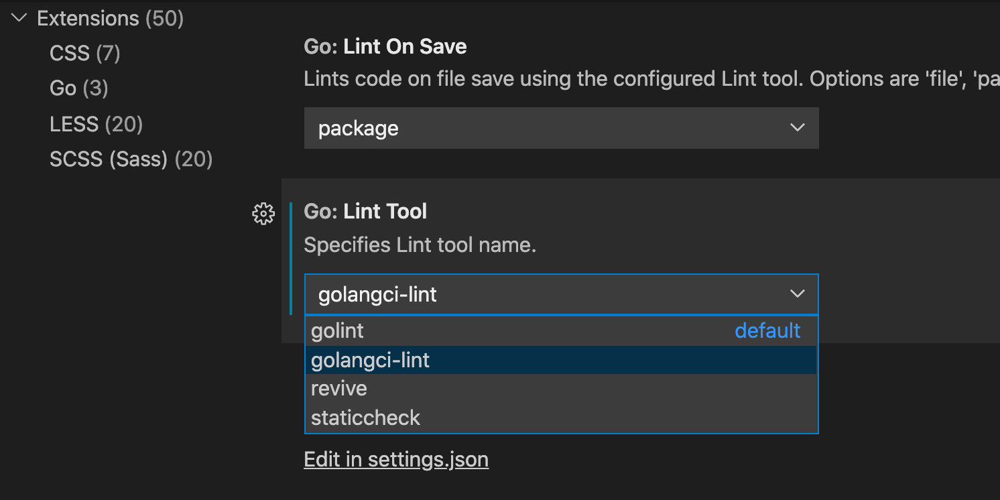
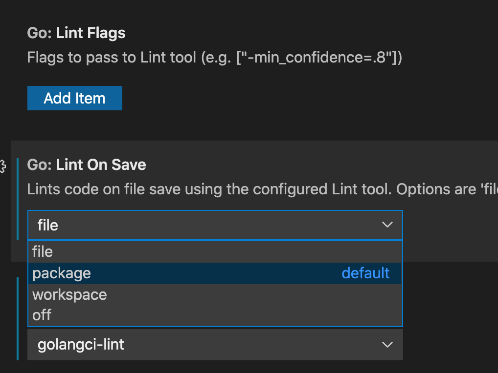
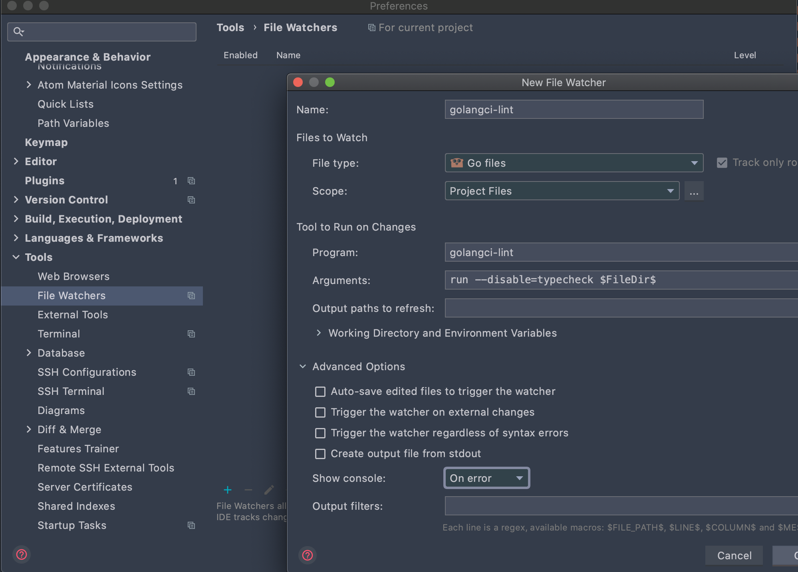
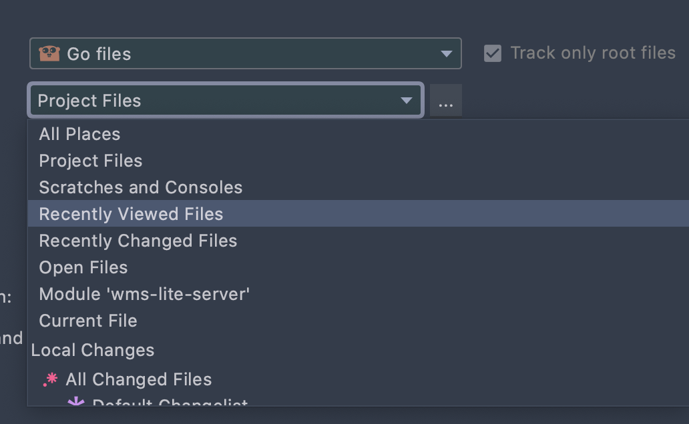
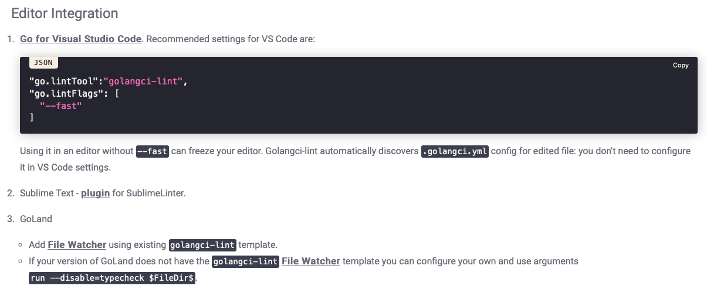

### go代码lint工具使用文档

  - [Lint是分析源代码以标记编程错误，风格错误和可疑结构的工具](#lint是分析源代码以标记编程错误风格错误和可疑结构的工具)
  - [golangci-lint的安装以及工作方式](#golangci-lint的安装以及工作方式)
  - [`vs code`以及`goland IDE`配置](#vs-code以及goland-ide配置)
  - [运行](#运行)

#### Lint是分析源代码以标记编程错误，风格错误和可疑结构的工具

`lint`可以带来一些如下的好处：

- 在早期发现`bug`
- 增强多人团队在协作开发中的代码风格一致
- 发现一些程序结构的不建议用法
- 提高整体的代码质量
- 减少`code review`的工作量

lint工具可以做的工作：

- gofmt 按照指定风格格式化代码
- goimports import的排序，以及内部包外部包的区分
- gocyclo 
- nakedret
- gocritic
- prealloc
- scopelint
- staticcheck
- gosec
- errcheck


`golang`的`lint`工具主要有`golint`，`golangci-lint`,`gometalinter`;建议使用`golangci-lint`
有开发者在维护，同时也是提供功能最多的一个`lint`工具，可以在本地以可执行程序运行，也可以使
用在`CI/CD`中，速度比较快，所以即使放在`pipeline`中，在大项目中对`CI/CD`的耗时也是影响不大的；
`gometalinter`已经废弃，并且使用时消耗内存十分高，速度也比较慢。


#### golangci-lint的安装以及工作方式
安装可以参考：[官方安装连接](https://golangci-lint.run/usage/install/)
安装时注意本地安装的`go`的版本要和`golangci-lint`编译时使用的一致

安装完`golangci-lint`之后:
```sh
golangci-lint
Smart, fast linters runner. Run it in cloud for every GitHub pull request on https://golangci.com

Usage:
  golangci-lint [flags]
  golangci-lint [command]

Available Commands:
  cache       Cache control and information
  completion  Output completion script
  config      Config
  help        Help
  linters     List current linters configuration
  run         Run this tool in cloud on every github pull request in https://golangci.com for free (public repos)
  version     Version

Flags:
      --color string              Use color when printing; can be 'always', 'auto', or 'never' (default "auto")
  -j, --concurrency int           Concurrency (default NumCPU) (default 8)
      --cpu-profile-path string   Path to CPU profile output file
  -h, --help                      help for golangci-lint
      --mem-profile-path string   Path to memory profile output file
      --trace-path string         Path to trace output file
  -v, --verbose                   verbose output
      --version                   Print version
```
golangci-lint的lint方式
```sh
Code parsing and loading only one time + linting + linting+ …+ linting→time.......
```
即只用`parsing and loading`一次，后续只需要对这一次的结果进行各种检查

使用：
```sh
golangci-lint help linters
```
可以查看现在支持的lint的工具列表，列表中每一个子linter工具的详细说明可以参考：

[lint详细说明官方文档](https://golangci-lint.run/usage/linters/)

如果想要使用一些其他的linter工具，以下是一个可以参考的列表链接：

[更多的lint工具](https://github.com/golangci/awesome-go-linters)

#### `vs code`以及`goland IDE`配置
在vscode中，设置中配置，设置go lint tool为`golangci-lint`,如下图所示：



如果想仅仅对编辑过的代码进行检查，还是可以进一步配置的：



在goland中，设置中配置，设置如下图所示：



如果想仅仅对编辑过的代码进行检查，还是可以进一步配置的：



以上两种安装方式是常用编辑器的配置方式，在官网也有对应的配置说明：



编辑器配置参考链接：

[官方配置链接](https://golangci-lint.run/usage/integrations/)


在本地项目目录中添加`.golangci.yml`的文件，在这个文件中配置打开或者关闭的lint工具

```yaml
enable:
    - bodyclose
    - deadcode
    - errcheck
    - goconst
    - gocritic
    - gocyclo
    - gofmt
    - goimports
    - golint
    - gomnd
    - goprintffuncname
    - gosec
    - gosimple
    - govet
    - ineffassign
    - interfacer
    - lll
    - misspell
    - nakedret
```

这个配置文件的配置项的填写，可以参考：

[配置文件官方参考](https://golangci-lint.run/usage/configuration/)

在本地项目配置好之后，后续无论是本机进行lint检测，或者使用docker进行检测，都只使用一份文件


#### 运行

随便打开一个项目，然后编辑文件之后lint工具会自动运行，以下是运行结果：


```sh
cmd/grpcserver/main.go:30:6: `httpmain` is unused (deadcode)
func httpmain() {
     ^
cmd/grpcserver/main.go:73:2: S1023: redundant `return` statement (gosimple)
	return
	^
cmd/grpcserver/main.go:145:2: S1023: redundant `return` statement (gosimple)
	return
	^
cmd/grpcserver/main.go:38:13: printf: Errorf call has arguments but no formatting directives (govet)
		log.Errorf("load config error : ", err.Error())
		          ^
cmd/grpcserver/main.go:44:13: printf: Errorf call has arguments but no formatting directives (govet)
		log.Errorf("redis init error : ", err.Error())
		          ^
cmd/grpcserver/main.go:106:13: printf: Errorf call has arguments but no formatting directives (govet)
		log.Errorf("load config error : ", err.Error())
		          ^

Process finished with exit code 1
```

未使用的代码和不可达到的代码，还有格式化输出模版参数不正确的都可以打印出来，都是被扫描出来的。