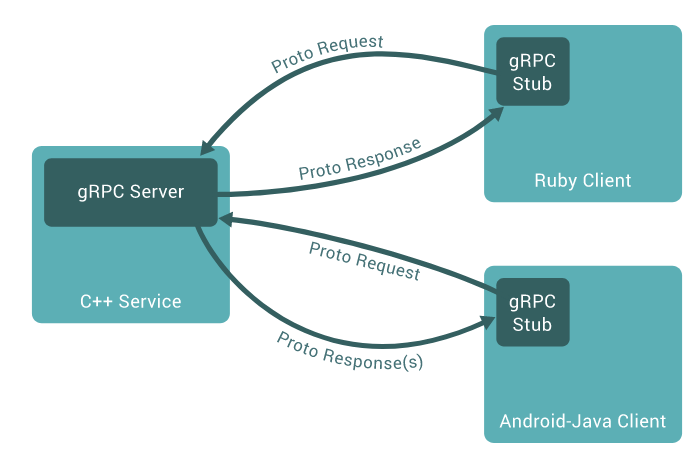
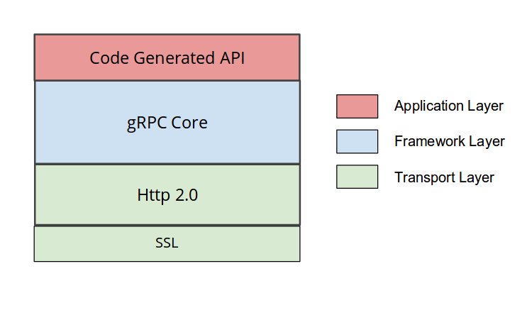

## grpc相关

gRPC 是 Google 基于 HTTP/2 以及 protobuf 的，要了解 gRPC 协议，只需要知道 gRPC 是如何在 HTTP/2 上面传输就可以了。

gRPC 通常有四种模式，unary，client streaming，server streaming 以及 bidirectional streaming，对于底层 HTTP/2 来说，它们都是 stream，并且仍然是一套 request + response 模型。
- 在服务侧，服务端实现服务接口，运行一个 gRPC 服务器来处理客户端调用。gRPC 底层架构会解码传入的请求，执行服务方法，编码服务应答。
- 在客户侧，客户端有一个存根实现了服务端同样的方法。客户端可以在本地存根调用这些方法，用合适的 protocol buffer 消息类型封装这些参数— gRPC 来负责发送请求给服务端并返回服务端 protocol buffer 响应。
- 

##### Request

gRPC 的 request 通常包含 Request-Headers, 0 或者多个 Length-Prefixed-Message 以及 EOS。

Request-Headers 直接使用的 HTTP/2 headers，在 HEADERS 和 CONTINUATION frame 里面派发。定义的 header 主要有 Call-Definition 以及 Custom-Metadata。Call-Definition 里面包括 Method（其实就是用的 HTTP/2 的 POST），Content-Type 等。而 Custom-Metadata 则是应用层自定义的任意 key-value，key 不建议使用 grpc- 开头，因为这是为 gRPC 后续自己保留的。

Length-Prefixed-Message 主要在 DATA frame 里面派发，它有一个 Compressed flag 用来表示改 message 是否压缩，如果为 1，表示该 message 采用了压缩，而压缩算法定义在 header 里面的 Message-Encoding 里面。然后后面跟着四字节的 message length 以及实际的 message。

EOS（end-of-stream） 会在最后的 DATA frame 里面带上了 END_STREAM 这个 flag。用来表示 stream 不会在发送任何数据，可以关闭了。

##### Response

Response 主要包含 Response-Headers，0 或者多个 Length-Prefixed-Message 以及 Trailers。如果遇到了错误，也可以直接返回 Trailers-Only。

Response-Headers 主要包括 HTTP-Status，Content-Type 以及 Custom-Metadata 等。Trailers-Only 也有 HTTP-Status ，Content-Type 和 Trailers。Trailers 包括了 Status 以及 0 或者多个 Custom-Metadata。

HTTP-Status 就是我们通常的 HTTP 200，301，400 这些，很通用就不再解释。Status 也就是 gRPC 的 status， 而 Status-Message 则是 gRPC 的 message。Status-Message 采用了 Percent-Encoded 的编码方式，具体参考这里。

如果在最后收到的 HEADERS frame 里面，带上了 Trailers，并且有 END_STREAM 这个 flag，那么就意味着 response 的 EOS。

##### Protobuf

gRPC 的 service 接口是基于 protobuf 定义的，我们可以非常方便的将 service 与 HTTP/2 关联起来。

- Path : /Service-Name/{method name}
- Service-Name : ?( {proto package name} "." ) {service name}
- Message-Type : {fully qualified proto message name}
- Content-Type : “application/grpc+proto”

#### 功能

grpc是一个跨平台的基于HTTP/2的rpc框架
开源，安全，多平台，高性能
一些关键功能：
- 流式
- 内建授权机制：SSL/TLS, OAuth, JWT access
  - Enabling TLS on a gRPC client
    ```go
    conn, err := grpc.Dial(serverAddr, grpc.WithTransportCredentials(credentials.NewClientTLSFromCert(nil, "")))
    ```
  - Enabling TLS on a gRPC server
    ```go
    creds, err := credentials.NewServerTLSFromFile(certFile, keyFile)
    if err != nil {
    log.Fatalf("Failed to generate credentials %v", err)
    }
    lis, err := net.Listen("tcp", ":0")
    server := grpc.NewServer(grpc.Creds(creds))
    ...
    server.Serve(lis)
    ```
  - JWT
    ```go
    jwtCreds, err := oauth.NewServiceAccountFromFile(*serviceAccountKeyFile, *oauthScope)
    if err != nil {
    log.Fatalf("Failed to create JWT credentials: %v", err)
    }
    conn, err := grpc.Dial(serverAddr, grpc.WithTransportCredentials(credentials.NewClientTLSFromCert(nil, "")), grpc.WithPerRPCCredentials(jwtCreds))
    ```
- 给予标准的官方的HTTP/2协议,拥有二进制的数据包协议,多路流复用
- 流控制
- 负载均衡
- 访问路径追踪
- 工具生态
  
#### 架构简介



#### 概念和协议

##### 服务定义
gRPC 基于如下思想：定义一个服务， 指定其可以被远程调用的方法及其参数和返回类型。gRPC 默认使用 protocol buffers 作为接口定义语言，来描述服务接口和有效载荷消息结构。如果有需要的话，可以使用其他替代方案。

```shell
service HelloService {
  rpc SayHello (HelloRequest) returns (HelloResponse);
}

message HelloRequest {
  required string greeting = 1;
}

message HelloResponse {
  required string reply = 1;
}
```

在gRPC 允许你定义四类服务方法：
- 单项 RPC，即客户端发送一个请求给服务端，从服务端获取一个应答，就像一次普通的函数调用。
  ```shell
  rpc SayHello(HelloRequest) returns (HelloResponse){
  }
  ```
  客户端发出单个请求，获得单个响应。

  - 一旦客户端通过桩(stub)调用一个方法，服务端会得到相关通知 ，通知包括客户端的元数据，方法名，允许的响应期限（如果可以的话）。服务端既可以在任何响应之前直接发送回初始的元数据，也可以等待客户端的请求信息，到底哪个先发生，取决于具体的应用。
  - 一旦服务端获得客户端的请求信息，就会做所需的任何工作来创建或组装对应的响应。如果成功的话，这个响应会和包含状态码以及可选的状态信息等状态明细及可选的追踪信息返回给客户端 。假如状态是 OK 的话，客户端会得到应答，这将结束客户端的调用。

- 服务端流式 RPC，即客户端发送一个请求给服务端，可获取一个数据流用来读取一系列消息。客户端从返回的数据流里一直读取直到没有更多消息为止。
  ```shell
  rpc LotsOfReplies(HelloRequest) returns (stream HelloResponse){
  }
  ```
  - 服务端流式 RPC 除了在得到客户端请求信息后发送回一个应答流之外，与我们的简单例子一样。在发送完所有应答后，服务端的状态详情(状态码和可选的状态信息)和可选的跟踪元数据被发送回客户端，以此来完成服务端的工作。客户端在接收到所有服务端的应答后也完成了工作
- 客户端流式 RPC，即客户端用提供的一个数据流写入并发送一系列消息给服务端。一旦客户端完成消息写入，就等待服务端读取这些消息并返回应答。
  ```shell
  rpc LotsOfGreetings(stream HelloRequest) returns (HelloResponse) {
  }
  ```
  - 客户端流式 RPC 也基本与我们的简单例子一样，区别在于客户端通过发送一个请求流给服务端，取代了原先发送的单个请求。服务端通常（但并不必须）会在接收到客户端所有的请求后发送回一个应答，其中附带有它的状态详情和可选的跟踪数据。
- 双向流式 RPC，即两边都可以分别通过一个读写数据流来发送一系列消息。这两个数据流操作是相互独立的，所以客户端和服务端能按其希望的任意顺序读写，例如：服务端可以在写应答前等待所有的客户端消息，或者它可以先读一个消息再写一个消息，或者是读写相结合的其他方式。每个数据流里消息的顺序会被保持。
  ```shell
  rpc BidiHello(stream HelloRequest) returns (stream HelloResponse){
  }
  ```
  - 双向流式 RPC ，调用由客户端调用方法来初始化，而服务端则接收到客户端的元数据，方法名和截止时间。服务端可以选择发送回它的初始元数据或等待客户端发送请求。 下一步怎样发展取决于应用，因为客户端和服务端能在任意顺序上读写 - 这些流的操作是完全独立的。例如服务端可以一直等直到它接收到所有客户端的消息才写应答，或者服务端和客户端可以像"乒乓球"一样：服务端后得到一个请求就回送一个应答，接着客户端根据应答来发送另一个请求，以此类推。
gRPC 提供 protocol buffer 编译插件，能够从一个服务定义的 .proto 文件生成客户端和服务端代码。通常 gRPC 用户可以在服务端实现这些API，并从客户端调用它们.

- 截止时间
gRPC 允许客户端在调用一个远程方法前指定一个最后期限值。这个值指定了在客户端可以等待服务端多长时间来应答，超过这个时间值 RPC 将结束并返回DEADLINE_EXCEEDED错误。在服务端可以查询这个期限值来看是否一个特定的方法已经过期，或者还剩多长时间来完成这个方法。 各语言来指定一个截止时间的方式是不同的 - 比如在 Python 里一个截止时间值总是必须的，但并不是所有语言都有一个默认的截止时间。

- RPC终止的判断
- 取消RPC
  无论客户端还是服务端均可以再任何时间取消一个 RPC 。一个取消会立即终止 RPC 这样可以避免更多操作被执行。它不是一个"撤销"， 在取消前已经完成的不会被回滚。当然，通过同步调用的 RPC 不能被取消，因为直到 RPC 结束前，程序控制权还没有交还给应用。
- 元数据集
  元数据是一个特殊 RPC 调用对应的信息(授权详情]) ，这些信息以键值对的形式存在，一般键的类型是字符串，值的类型一般也是字符串(当然也可以是二进制数据)。元数据对 gRPC 本事来说是不透明的 - 它让客户端提供调用相关的信息给服务端，反之亦然。 对于元数据的访问是语言相关的。
  - 元数据的数据格式，即一个普通的map，元素为一个数组型的slice，和http1.1的url参数格式相同
  ```go
  type MD map[string][]string
  ```
  - 创建元数据和创建普通的map相同：
  ```go
  md := metadata.New(map[string]string{"key1": "val1", "key2": "val2"})
  //或者
  md := metadata.Pairs(
  "key1", "val1",
  "key1", "val1-2", // "key1" will have map value []string{"val1", "val1-2"}
  "key2", "val2",
  )
  ```
  - 所有的key都会被转换为小写，value值虽然为[]string,但是可以将二进制转化为string类型并传递
  - 可以从输入进来的context中获取元数据信息
  ```go
  func (s *server) SomeRPC(ctx context.Context, in *pb.SomeRequest) (*pb.SomeResponse, err) {
    md, ok := metadata.FromIncomingContext(ctx)
    // do something with metadata
  }
  ```
  ---
  - **客户端接收和发送　metadata**
    ##### Sending metadata
    有两种方式发送元数据到服务端，推荐的一种是：`AppendToOutgoingContext`，当context已经存在元数据map,则合并将要添加的元数据，如果context中不存在元数据，那么就添加新的元数据map
    ```go
    // create a new context with some metadata
    ctx := metadata.AppendToOutgoingContext(ctx, "k1", "v1", "k1", "v2", "k2", "v3")

    // later, add some more metadata to the context (e.g. in an interceptor)
    ctx := metadata.AppendToOutgoingContext(ctx, "k3", "v4")

    // make unary RPC
    response, err := client.SomeRPC(ctx, someRequest)

    // or make streaming RPC
    stream, err := client.SomeStreamingRPC(ctx)
    ```
    或者使用`NewOutgoingContext`来添加或者操作元数据，但是这种方式会替换掉原有的pairs，所以使用时需要仔细的检查，而且这种方式也比`AppendToOutgoingContext`慢一些
    ```go
    // create a new context with some metadata
    md := metadata.Pairs("k1", "v1", "k1", "v2", "k2", "v3")
    ctx := metadata.NewOutgoingContext(context.Background(), md)

    // later, add some more metadata to the context (e.g. in an interceptor)
    md, _ := metadata.FromOutgoingContext(ctx)
    newMD := metadata.Pairs("k3", "v3")
    ctx = metadata.NewContext(ctx, metadata.Join(metadata.New(send), newMD))

    // make unary RPC
    response, err := client.SomeRPC(ctx, someRequest)

    // or make streaming RPC
    stream, err := client.SomeStreamingRPC(ctx)
    ```
    ##### Receiving metadata
    - **Unary call**
    Header and trailer sent along with a unary call can be retrieved using function Header and Trailer in CallOption:
        ```go
        var header, trailer metadata.MD // variable to store header and trailer
        r, err := client.SomeRPC(
            ctx,
            someRequest,
            grpc.Header(&header),    // will retrieve header
            grpc.Trailer(&trailer),  // will retrieve trailer
        )
        // do something with header and trailer
        ```
    - **Streaming call**
    For streaming calls including:(对于stream调用，包含如下几种类别)
      - Server streaming RPC(server端ＲＰＣ调用)
      - Client streaming RPC（client端ＲＰＣ调用）
      - Bidirectional streaming RPC (双向的ＲＰＣ调用)
  
      Header and trailer can be retrieved from the returned stream using function Header and Trailer in interface ClientStream:  
        ```go
        stream, err := client.SomeStreamingRPC(ctx)
        // retrieve header
        header, err := stream.Header()
        // retrieve trailer
        trailer := stream.Trailer()
        ``` 
  - **Sending and receiving metadata(服务端的发送和接收元数据)**
    ##### Receiving metadata
    - **Unary call**
    ```go
        func (s *server) SomeRPC(ctx context.Context, in *pb.someRequest) (*pb.someResponse, error) {
            md, ok := metadata.FromIncomingContext(ctx)
            // do something with metadata
        }
    ```
    - **Streaming call** 
    ```go
    func (s *server) SomeStreamingRPC(stream pb.Service_SomeStreamingRPCServer) error {
        md, ok := metadata.FromIncomingContext(stream.Context()) // get context from stream
        // do something with metadata
    }
    ```
    ##### Sending metadata
    - **unary call**
    ```go
    func (s *server) SomeRPC(ctx context.Context, in *pb.someRequest) (*pb.someResponse, error) {
        // create and send header
        header := metadata.Pairs("header-key", "val")
        grpc.SendHeader(ctx, header)
        // create and set trailer
        trailer := metadata.Pairs("trailer-key", "val")
        grpc.SetTrailer(ctx, trailer)
    }
    ```
    - **Streaming call**
    ```go
    func (s *server) SomeStreamingRPC(stream pb.Service_SomeStreamingRPCServer) error {
        // create and send header
        header := metadata.Pairs("header-key", "val")
        stream.SendHeader(header)
        // create and set trailer
        trailer := metadata.Pairs("trailer-key", "val")
        stream.SetTrailer(trailer)
    }
    ```
    ---
- 频道
  在创建客户端存根时，一个 gRPC 频道提供一个特定主机和端口服务端的连接。客户端可以通过指定频道参数来修改 gRPC 的默认行为，比如打开关闭消息压缩。一个频道具有状态，包含已连接和空闲 。 gRPC 如何处理关闭频道是语言相关的。有些语言可允许询问频道状态。

#### 错误处理以及DEBUG
在服务端正确处理完请求之后，会给client返回一个ok的status；如果处理错误，就会返回一个包含错误信息的Error

- General errors通用的错误定义
    |Case| 	Status code|
    |----|----|
    |Client application cancelled the request |　　　　GRPC_STATUS_CANCELLED|
    |Deadline expired before server returned status|　GRPC_STATUS_DEADLINE_EXCEEDED|
    |Method not found on server 　　　　　　　　　|　　　　GRPC_STATUS_UNIMPLEMENTED|
    |Server shutting down 	　　　　　　　　　　　　|　　GRPC_STATUS_UNAVAILABLE|
    |Server threw an exception 　　　　　　　　　　|　	GRPC_STATUS_UNKNOWN|
- Network failures网络失效或者网络失败
  |Case| 	Status code|
  |---|---|
  |No data transmitted before deadline expires. Also applies to cases where some data is transmitted and no other failures are detected before the deadline expires|GRPC_STATUS_DEADLINE_EXCEEDED|
  |Some data transmitted (for example, the request metadata has been written to the TCP connection) before the connection breaks|GRPC_STATUS_UNAVAILABLE|

- Protocol errors协议错误
  |Case| 	Status code|
  |---|---|
  |Could not decompress but compression algorithm supported|GRPC_STATUS_INTERNAL|
  |Compression mechanism used by client not supported by the server|GRPC_STATUS_UNIMPLEMENTED|
  |Flow-control resource limits reached| 	GRPC_STATUS_RESOURCE_EXHAUSTED|
  |Flow-control protocol violation| 	GRPC_STATUS_INTERNAL|
  |Error parsing returned status|GRPC_STATUS_UNKNOWN|
  |Unauthenticated: credentials failed to get metadata|GRPC_STATUS_UNAUTHENTICATED|
  |Invalid host set in authority metadata| GRPC_STATUS_UNAUTHENTICATED|
  |Error parsing response protocol buffer|GRPC_STATUS_INTERNAL|
  |Error parsing request protocol buffer| 	GRPC_STATUS_INTERNAL|

#### grpc-go代码分析