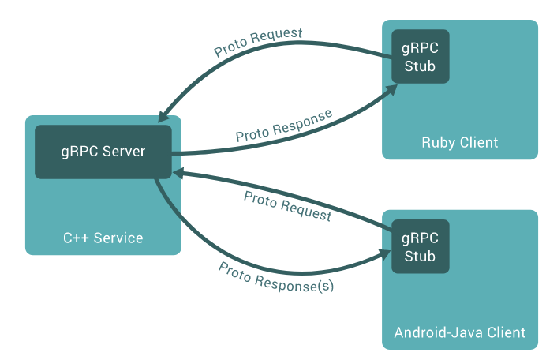
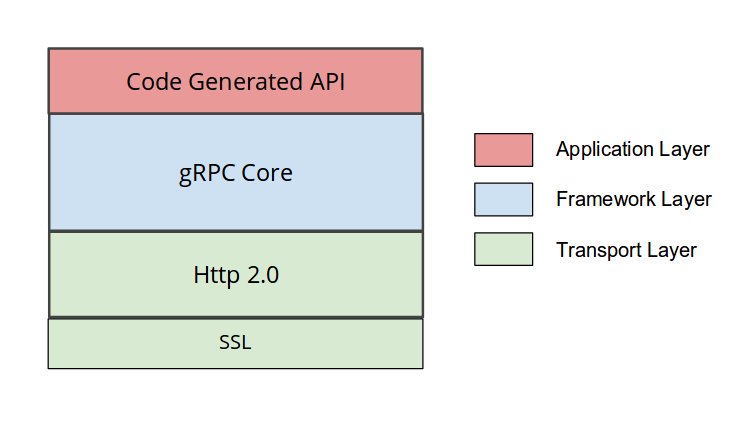
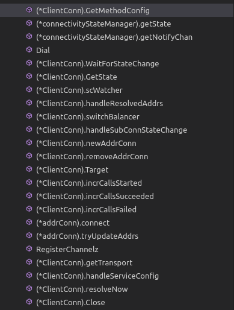
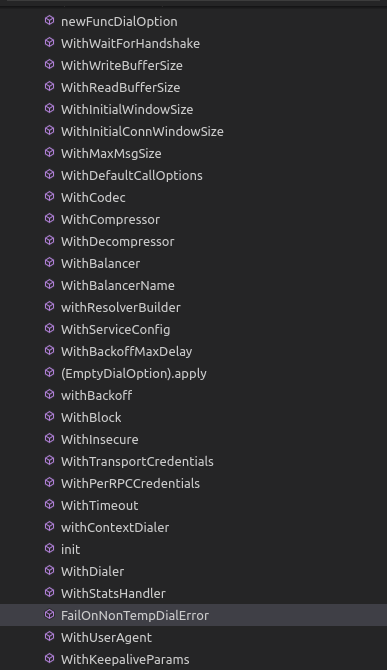
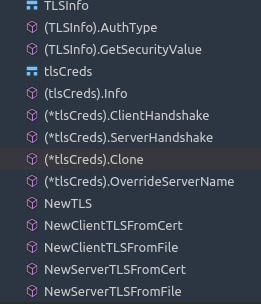
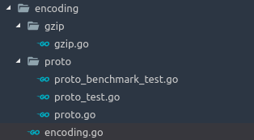
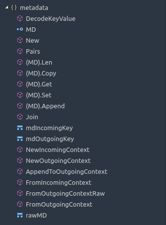
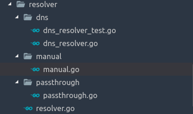
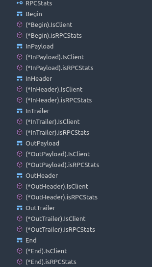
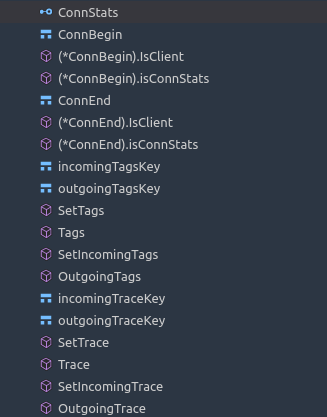

## grpc相关

gRPC 是 Google 基于 HTTP/2 以及 protobuf 的，要了解 gRPC 协议，只需要知道 gRPC 是如何在 HTTP/2 上面传输就可以了。

gRPC 通常有四种模式，unary，client streaming，server streaming 以及 bidirectional streaming，对于底层 HTTP/2 来说，它们都是 stream，并且仍然是一套 request + response 模型。
- 在服务侧，服务端实现服务接口，运行一个 gRPC 服务器来处理客户端调用。gRPC 底层架构会解码传入的请求，执行服务方法，编码服务应答。
- 在客户侧，客户端有一个存根实现了服务端同样的方法。客户端可以在本地存根调用这些方法，用合适的 protocol buffer 消息类型封装这些参数— gRPC 来负责发送请求给服务端并返回服务端 protocol buffer 响应。
- 

### Request

gRPC 的 request 通常包含 Request-Headers, 0 或者多个 Length-Prefixed-Message 以及 EOS。

Request-Headers 直接使用的 HTTP/2 headers，在 HEADERS 和 CONTINUATION frame 里面派发。定义的 header 主要有 Call-Definition 以及 Custom-Metadata。Call-Definition 里面包括 Method（其实就是用的 HTTP/2 的 POST），Content-Type 等。而 Custom-Metadata 则是应用层自定义的任意 key-value，key 不建议使用 grpc- 开头，因为这是为 gRPC 后续自己保留的。

Length-Prefixed-Message 主要在 DATA frame 里面派发，它有一个 Compressed flag 用来表示改 message 是否压缩，如果为 1，表示该 message 采用了压缩，而压缩算法定义在 header 里面的 Message-Encoding 里面。然后后面跟着四字节的 message length 以及实际的 message。

EOS（end-of-stream） 会在最后的 DATA frame 里面带上了 END_STREAM 这个 flag。用来表示 stream 不会在发送任何数据，可以关闭了。

### Response

Response 主要包含 Response-Headers，0 或者多个 Length-Prefixed-Message 以及 Trailers。如果遇到了错误，也可以直接返回 Trailers-Only。

Response-Headers 主要包括 HTTP-Status，Content-Type 以及 Custom-Metadata 等。Trailers-Only 也有 HTTP-Status ，Content-Type 和 Trailers。Trailers 包括了 Status 以及 0 或者多个 Custom-Metadata。

HTTP-Status 就是我们通常的 HTTP 200，301，400 这些，很通用就不再解释。Status 也就是 gRPC 的 status， 而 Status-Message 则是 gRPC 的 message。Status-Message 采用了 Percent-Encoded 的编码方式，具体参考这里。

如果在最后收到的 HEADERS frame 里面，带上了 Trailers，并且有 END_STREAM 这个 flag，那么就意味着 response 的 EOS。

### Protobuf

gRPC 的 service 接口是基于 protobuf 定义的，我们可以非常方便的将 service 与 HTTP/2 关联起来。

- Path : /Service-Name/{method name}
- Service-Name : ?( {proto package name} "." ) {service name}
- Message-Type : {fully qualified proto message name}
- Content-Type : “application/grpc+proto”

#### 功能

grpc是一个跨平台的基于HTTP/2的rpc框架
开源，安全，多平台，高性能
一些关键功能：
- 流式
- 内建授权机制：SSL/TLS, OAuth, JWT access
  - Enabling TLS on a gRPC client
    ```go
    conn, err := grpc.Dial(serverAddr, grpc.WithTransportCredentials(credentials.NewClientTLSFromCert(nil, "")))
    ```
  - Enabling TLS on a gRPC server
    ```go
    creds, err := credentials.NewServerTLSFromFile(certFile, keyFile)
    if err != nil {
    log.Fatalf("Failed to generate credentials %v", err)
    }
    lis, err := net.Listen("tcp", ":0")
    server := grpc.NewServer(grpc.Creds(creds))
    ...
    server.Serve(lis)
    ```
  - JWT
    ```go
    jwtCreds, err := oauth.NewServiceAccountFromFile(*serviceAccountKeyFile, *oauthScope)
    if err != nil {
    log.Fatalf("Failed to create JWT credentials: %v", err)
    }
    conn, err := grpc.Dial(serverAddr, grpc.WithTransportCredentials(credentials.NewClientTLSFromCert(nil, "")), grpc.WithPerRPCCredentials(jwtCreds))
    ```
- 给予标准的官方的HTTP/2协议,拥有二进制的数据包协议,多路流复用
- 流控制
- 负载均衡
- 访问路径追踪
- 工具生态
  
#### 架构简介



#### 概念和协议

##### 服务定义
gRPC 基于如下思想：定义一个服务， 指定其可以被远程调用的方法及其参数和返回类型。gRPC 默认使用 protocol buffers 作为接口定义语言，来描述服务接口和有效载荷消息结构。如果有需要的话，可以使用其他替代方案。

```shell
service HelloService {
  rpc SayHello (HelloRequest) returns (HelloResponse);
}

message HelloRequest {
  required string greeting = 1;
}

message HelloResponse {
  required string reply = 1;
}
```

在gRPC 允许你定义四类服务方法：
- 单项 RPC，即客户端发送一个请求给服务端，从服务端获取一个应答，就像一次普通的函数调用。
  ```shell
  rpc SayHello(HelloRequest) returns (HelloResponse){
  }
  ```
  客户端发出单个请求，获得单个响应。

  - 一旦客户端通过桩(stub)调用一个方法，服务端会得到相关通知 ，通知包括客户端的元数据，方法名，允许的响应期限（如果可以的话）。服务端既可以在任何响应之前直接发送回初始的元数据，也可以等待客户端的请求信息，到底哪个先发生，取决于具体的应用。
  - 一旦服务端获得客户端的请求信息，就会做所需的任何工作来创建或组装对应的响应。如果成功的话，这个响应会和包含状态码以及可选的状态信息等状态明细及可选的追踪信息返回给客户端 。假如状态是 OK 的话，客户端会得到应答，这将结束客户端的调用。

- 服务端流式 RPC，即客户端发送一个请求给服务端，可获取一个数据流用来读取一系列消息。客户端从返回的数据流里一直读取直到没有更多消息为止。
  ```shell
  rpc LotsOfReplies(HelloRequest) returns (stream HelloResponse){
  }
  ```
  - 服务端流式 RPC 除了在得到客户端请求信息后发送回一个应答流之外，与我们的简单例子一样。在发送完所有应答后，服务端的状态详情(状态码和可选的状态信息)和可选的跟踪元数据被发送回客户端，以此来完成服务端的工作。客户端在接收到所有服务端的应答后也完成了工作
- 客户端流式 RPC，即客户端用提供的一个数据流写入并发送一系列消息给服务端。一旦客户端完成消息写入，就等待服务端读取这些消息并返回应答。
  ```shell
  rpc LotsOfGreetings(stream HelloRequest) returns (HelloResponse) {
  }
  ```
  - 客户端流式 RPC 也基本与我们的简单例子一样，区别在于客户端通过发送一个请求流给服务端，取代了原先发送的单个请求。服务端通常（但并不必须）会在接收到客户端所有的请求后发送回一个应答，其中附带有它的状态详情和可选的跟踪数据。
- 双向流式 RPC，即两边都可以分别通过一个读写数据流来发送一系列消息。这两个数据流操作是相互独立的，所以客户端和服务端能按其希望的任意顺序读写，例如：服务端可以在写应答前等待所有的客户端消息，或者它可以先读一个消息再写一个消息，或者是读写相结合的其他方式。每个数据流里消息的顺序会被保持。
  ```shell
  rpc BidiHello(stream HelloRequest) returns (stream HelloResponse){
  }
  ```
  - 双向流式 RPC ，调用由客户端调用方法来初始化，而服务端则接收到客户端的元数据，方法名和截止时间。服务端可以选择发送回它的初始元数据或等待客户端发送请求。 下一步怎样发展取决于应用，因为客户端和服务端能在任意顺序上读写 - 这些流的操作是完全独立的。例如服务端可以一直等直到它接收到所有客户端的消息才写应答，或者服务端和客户端可以像"乒乓球"一样：服务端后得到一个请求就回送一个应答，接着客户端根据应答来发送另一个请求，以此类推。
gRPC 提供 protocol buffer 编译插件，能够从一个服务定义的 .proto 文件生成客户端和服务端代码。通常 gRPC 用户可以在服务端实现这些API，并从客户端调用它们.

- 截止时间
gRPC 允许客户端在调用一个远程方法前指定一个最后期限值。这个值指定了在客户端可以等待服务端多长时间来应答，超过这个时间值 RPC 将结束并返回DEADLINE_EXCEEDED错误。在服务端可以查询这个期限值来看是否一个特定的方法已经过期，或者还剩多长时间来完成这个方法。 各语言来指定一个截止时间的方式是不同的 - 比如在 Python 里一个截止时间值总是必须的，但并不是所有语言都有一个默认的截止时间。

- RPC终止的判断
- 取消RPC
  无论客户端还是服务端均可以再任何时间取消一个 RPC 。一个取消会立即终止 RPC 这样可以避免更多操作被执行。它不是一个"撤销"， 在取消前已经完成的不会被回滚。当然，通过同步调用的 RPC 不能被取消，因为直到 RPC 结束前，程序控制权还没有交还给应用。
- 元数据集
  元数据是一个特殊 RPC 调用对应的信息(授权详情]) ，这些信息以键值对的形式存在，一般键的类型是字符串，值的类型一般也是字符串(当然也可以是二进制数据)。元数据对 gRPC 本事来说是不透明的 - 它让客户端提供调用相关的信息给服务端，反之亦然。 对于元数据的访问是语言相关的。
  - 元数据的数据格式，即一个普通的map，元素为一个数组型的slice，和http1.1的url参数格式相同
  ```go
  type MD map[string][]string
  ```
  - 创建元数据和创建普通的map相同：
  ```go
  md := metadata.New(map[string]string{"key1": "val1", "key2": "val2"})
  //或者
  md := metadata.Pairs(
  "key1", "val1",
  "key1", "val1-2", // "key1" will have map value []string{"val1", "val1-2"}
  "key2", "val2",
  )
  ```
  - 所有的key都会被转换为小写，value值虽然为[]string,但是可以将二进制转化为string类型并传递
  - 可以从输入进来的context中获取元数据信息
  ```go
  func (s *server) SomeRPC(ctx context.Context, in *pb.SomeRequest) (*pb.SomeResponse, err) {
    md, ok := metadata.FromIncomingContext(ctx)
    // do something with metadata
  }
  ```
  ---
  - **客户端接收和发送　metadata**
    ##### Sending metadata
    有两种方式发送元数据到服务端，推荐的一种是：`AppendToOutgoingContext`，当context已经存在元数据map,则合并将要添加的元数据，如果context中不存在元数据，那么就添加新的元数据map
    ```go
    // create a new context with some metadata
    ctx := metadata.AppendToOutgoingContext(ctx, "k1", "v1", "k1", "v2", "k2", "v3")

    // later, add some more metadata to the context (e.g. in an interceptor)
    ctx := metadata.AppendToOutgoingContext(ctx, "k3", "v4")

    // make unary RPC
    response, err := client.SomeRPC(ctx, someRequest)

    // or make streaming RPC
    stream, err := client.SomeStreamingRPC(ctx)
    ```
    或者使用`NewOutgoingContext`来添加或者操作元数据，但是这种方式会替换掉原有的pairs，所以使用时需要仔细的检查，而且这种方式也比`AppendToOutgoingContext`慢一些
    ```go
    // create a new context with some metadata
    md := metadata.Pairs("k1", "v1", "k1", "v2", "k2", "v3")
    ctx := metadata.NewOutgoingContext(context.Background(), md)

    // later, add some more metadata to the context (e.g. in an interceptor)
    md, _ := metadata.FromOutgoingContext(ctx)
    newMD := metadata.Pairs("k3", "v3")
    ctx = metadata.NewContext(ctx, metadata.Join(metadata.New(send), newMD))

    // make unary RPC
    response, err := client.SomeRPC(ctx, someRequest)

    // or make streaming RPC
    stream, err := client.SomeStreamingRPC(ctx)
    ```
    ##### Receiving metadata
    - **Unary call**
    Header and trailer sent along with a unary call can be retrieved using function Header and Trailer in CallOption:
        ```go
        var header, trailer metadata.MD // variable to store header and trailer
        r, err := client.SomeRPC(
            ctx,
            someRequest,
            grpc.Header(&header),    // will retrieve header
            grpc.Trailer(&trailer),  // will retrieve trailer
        )
        // do something with header and trailer
        ```
    - **Streaming call**
    For streaming calls including:(对于stream调用，包含如下几种类别)
      - Server streaming RPC(server端ＲＰＣ调用)
      - Client streaming RPC（client端ＲＰＣ调用）
      - Bidirectional streaming RPC (双向的ＲＰＣ调用)
  
      Header and trailer can be retrieved from the returned stream using function Header and Trailer in interface ClientStream:  
        ```go
        stream, err := client.SomeStreamingRPC(ctx)
        // retrieve header
        header, err := stream.Header()
        // retrieve trailer
        trailer := stream.Trailer()
        ``` 
  - **Sending and receiving metadata(服务端的发送和接收元数据)**
    ##### Receiving metadata
    - **Unary call**
    ```go
        func (s *server) SomeRPC(ctx context.Context, in *pb.someRequest) (*pb.someResponse, error) {
            md, ok := metadata.FromIncomingContext(ctx)
            // do something with metadata
        }
    ```
    - **Streaming call** 
    ```go
    func (s *server) SomeStreamingRPC(stream pb.Service_SomeStreamingRPCServer) error {
        md, ok := metadata.FromIncomingContext(stream.Context()) // get context from stream
        // do something with metadata
    }
    ```
    ##### Sending metadata
    - **unary call**
    ```go
    func (s *server) SomeRPC(ctx context.Context, in *pb.someRequest) (*pb.someResponse, error) {
        // create and send header
        header := metadata.Pairs("header-key", "val")
        grpc.SendHeader(ctx, header)
        // create and set trailer
        trailer := metadata.Pairs("trailer-key", "val")
        grpc.SetTrailer(ctx, trailer)
    }
    ```
    - **Streaming call**
    ```go
    func (s *server) SomeStreamingRPC(stream pb.Service_SomeStreamingRPCServer) error {
        // create and send header
        header := metadata.Pairs("header-key", "val")
        stream.SendHeader(header)
        // create and set trailer
        trailer := metadata.Pairs("trailer-key", "val")
        stream.SetTrailer(trailer)
    }
    ```
    ---
- 频道
  在创建客户端存根时，一个 gRPC 频道提供一个特定主机和端口服务端的连接。客户端可以通过指定频道参数来修改 gRPC 的默认行为，比如打开关闭消息压缩。一个频道具有状态，包含已连接和空闲 。 gRPC 如何处理关闭频道是语言相关的。有些语言可允许询问频道状态。

#### 错误处理以及DEBUG
在服务端正确处理完请求之后，会给client返回一个ok的status；如果处理错误，就会返回一个包含错误信息的Error

- General errors通用的错误定义
    |Case| 	Status code|
    |----|----|
    |Client application cancelled the request |　　　　GRPC_STATUS_CANCELLED|
    |Deadline expired before server returned status|　GRPC_STATUS_DEADLINE_EXCEEDED|
    |Method not found on server 　　　　　　　　　|　　　　GRPC_STATUS_UNIMPLEMENTED|
    |Server shutting down 	　　　　　　　　　　　　|　　GRPC_STATUS_UNAVAILABLE|
    |Server threw an exception 　　　　　　　　　　|　	GRPC_STATUS_UNKNOWN|
- Network failures网络失效或者网络失败
  |Case| 	Status code|
  |---|---|
  |No data transmitted before deadline expires. Also applies to cases where some data is transmitted and no other failures are detected before the deadline expires|GRPC_STATUS_DEADLINE_EXCEEDED|
  |Some data transmitted (for example, the request metadata has been written to the TCP connection) before the connection breaks|GRPC_STATUS_UNAVAILABLE|

- Protocol errors协议错误
  |Case| 	Status code|
  |---|---|
  |Could not decompress but compression algorithm supported|GRPC_STATUS_INTERNAL|
  |Compression mechanism used by client not supported by the server|GRPC_STATUS_UNIMPLEMENTED|
  |Flow-control resource limits reached| 	GRPC_STATUS_RESOURCE_EXHAUSTED|
  |Flow-control protocol violation| 	GRPC_STATUS_INTERNAL|
  |Error parsing returned status|GRPC_STATUS_UNKNOWN|
  |Unauthenticated: credentials failed to get metadata|GRPC_STATUS_UNAUTHENTICATED|
  |Invalid host set in authority metadata| GRPC_STATUS_UNAUTHENTICATED|
  |Error parsing response protocol buffer|GRPC_STATUS_INTERNAL|
  |Error parsing request protocol buffer| 	GRPC_STATUS_INTERNAL|

#### grpc-go代码分析

* 粗读一遍源代码，然后再参考之前的简单介绍，如何设计一个rpc框架（不用考虑数据的序列化或者反序列化）
  
  **clientConn.go**
  ```go
  type ClientConn struct {
    ctx    context.Context//用于此连接的上下文管理
    cancel context.CancelFunc//通过context来设置的cancel函数

    target       string//用来域名解析的地址名称
    parsedTarget resolver.Target
    authority    string
    dopts        dialOptions//网络拨号连接的选项
    csMgr        *connectivityStateManager//连接状态的管理者

    balancerBuildOpts balancer.BuildOptions//负载均衡的选项，使用不同的域名解析来达成
    resolverWrapper   *ccResolverWrapper//域名解析的封装工具
    blockingpicker    *pickerWrapper

    mu    sync.RWMutex
    sc    ServiceConfig
    scRaw string
    conns map[*addrConn]struct{}
    // Keepalive parameter can be updated if a GoAway is received.
    mkp             keepalive.ClientParameters//客户端的心跳以及长连接设置，以及超时设置
    curBalancerName string//当前的负载均衡器的名称
    preBalancerName string // previous balancer name.
    curAddresses    []resolver.Address//当前解析后的名称的地址
    balancerWrapper *ccBalancerWrapper
    retryThrottler  atomic.Value//连接重试的频率限制

    channelzID int64 // channelz unique identification number
    czData     *channelzData
  }
  ```

  这个文件主要是提供给client使用的，包括client的Dail连接建立，每个连接建立后用于管理的context上下文以及以其他必要的内部状态变量
  ClientConn的方法函数说明：

  


  ---

  **dialOptions.go**
  dialOptions configure a Dial call. dialOptions are set by the DialOption values passed to Dial.
  这个是源代码的解释：
  dialOptions用来配置每一个Dail连接
  ```go
  type dialOptions struct {
    unaryInt    UnaryClientInterceptor //用于客户端的一元线性的函数拦截器
    streamInt   StreamClientInterceptor　//用于客户端的流式处理器
    cp          Compressor　　　　　　　　　//压缩方式
    dc          Decompressor　　　　　　　//解压方式
    bs          backoff.Strategy　　　　　//在负载均衡时的策略设置　
    block       bool　　　　　　　　　　　　//是否非阻塞的建立连接　　
    insecure    bool　　　　　　　　　　　　//是否使用传输层的安全加密机制　　　
    timeout     time.Duration　　　　　　　//连接超时设置
    scChan      <-chan ServiceConfig　　　//配置文件更新的channel
    authority   string                   //鉴权的信息
    copts       transport.ConnectOptions　//用于transport的连接设置　
    callOptions []CallOption
    // This is used by v1 balancer dial option WithBalancer to support v1
    // balancer, and also by WithBalancerName dial option.
    balancerBuilder balancer.Builder　　//负载均衡构建器
    // This is to support grpclb.
    resolverBuilder      resolver.Builder　//域名解析构建器
    waitForHandshake     bool
    channelzParentID     int64
    disableServiceConfig bool
    disableRetry         bool
  }
  ```
  默认的提供了一个　EmptyDialOption　的选项:
  EmptyDialOption does not alter the dial configuration. It can be embedded in another structure to build custom dial options.
  注释说明可以用来构建自己自定义的连接建立时的选项

  在这个文件中，有一个用来为各个设置函数作为直接的ClientConn操作函数的封装：
  ```go

    // funcDialOption wraps a function that modifies dialOptions into an
    // implementation of the DialOption interface.
    type funcDialOption struct {
      f func(*dialOptions)
    }

    func (fdo *funcDialOption) apply(do *dialOptions) {
      fdo.f(do)
    }

    func newFuncDialOption(f func(*dialOptions)) *funcDialOption {
      return &funcDialOption{
        f: f,
      }
    }
    .
    .
    .
    .
    .
    .
    func withContextDialer(f func(context.Context, string) (net.Conn, error)) DialOption {
      return newFuncDialOption(func(o *dialOptions) {
        o.copts.Dialer = f
      })
    }
    func WithDialer(f func(string, time.Duration) (net.Conn, error)) DialOption {
      return withContextDialer(
        func(ctx context.Context, addr string) (net.Conn, error) {
          if deadline, ok := ctx.Deadline(); ok {
            return f(addr, deadline.Sub(time.Now()))
          }
          return f(addr, 0)
        })
    }
  ```

  像如下图的函数都是使用这个函数来操作作为参数的　*dialOptions　变量的:

  
  ---
  **pickerWrapper.go**

* 再分析GRPC的源代码

### connectivity/connectivity.go文件
主要是定义了 **ClientConn** 的状态:

```shell
const (
	// Idle indicates the ClientConn is idle.
	Idle State = iota
	// Connecting indicates the ClienConn is connecting.
	Connecting
	// Ready indicates the ClientConn is ready for work.
	Ready
	// TransientFailure indicates the ClientConn has seen a failure but expects to recover.
	TransientFailure
	// Shutdown indicates the ClientConn has started shutting down.
	Shutdown
)
```

### codes定义了gRPC中使用的错误码，这个是跨语言通用的

```shell

// A Code is an unsigned 32-bit error code as defined in the gRPC spec.
type Code uint32

const (
	// OK is returned on success.
	OK Code = 0

	// Canceled indicates the operation was canceled (typically by the caller).
	Canceled Code = 1

	// Unknown error. An example of where this error may be returned is
	// if a Status value received from another address space belongs to
	// an error-space that is not known in this address space. Also
	// errors raised by APIs that do not return enough error information
	// may be converted to this error.
	Unknown Code = 2

	// InvalidArgument indicates client specified an invalid argument.
	// Note that this differs from FailedPrecondition. It indicates arguments
	// that are problematic regardless of the state of the system
	// (e.g., a malformed file name).
	InvalidArgument Code = 3

	// DeadlineExceeded means operation expired before completion.
	// For operations that change the state of the system, this error may be
	// returned even if the operation has completed successfully. For
	// example, a successful response from a server could have been delayed
	// long enough for the deadline to expire.
	DeadlineExceeded Code = 4

	// NotFound means some requested entity (e.g., file or directory) was
	// not found.
	NotFound Code = 5

	// AlreadyExists means an attempt to create an entity failed because one
	// already exists.
	AlreadyExists Code = 6

	// PermissionDenied indicates the caller does not have permission to
	// execute the specified operation. It must not be used for rejections
	// caused by exhausting some resource (use ResourceExhausted
	// instead for those errors). It must not be
	// used if the caller cannot be identified (use Unauthenticated
	// instead for those errors).
	PermissionDenied Code = 7

	// ResourceExhausted indicates some resource has been exhausted, perhaps
	// a per-user quota, or perhaps the entire file system is out of space.
	ResourceExhausted Code = 8

	// FailedPrecondition indicates operation was rejected because the
	// system is not in a state required for the operation's execution.
	// For example, directory to be deleted may be non-empty, an rmdir
	// operation is applied to a non-directory, etc.
	//
	// A litmus test that may help a service implementor in deciding
	// between FailedPrecondition, Aborted, and Unavailable:
	//  (a) Use Unavailable if the client can retry just the failing call.
	//  (b) Use Aborted if the client should retry at a higher-level
	//      (e.g., restarting a read-modify-write sequence).
	//  (c) Use FailedPrecondition if the client should not retry until
	//      the system state has been explicitly fixed. E.g., if an "rmdir"
	//      fails because the directory is non-empty, FailedPrecondition
	//      should be returned since the client should not retry unless
	//      they have first fixed up the directory by deleting files from it.
	//  (d) Use FailedPrecondition if the client performs conditional
	//      REST Get/Update/Delete on a resource and the resource on the
	//      server does not match the condition. E.g., conflicting
	//      read-modify-write on the same resource.
	FailedPrecondition Code = 9

	// Aborted indicates the operation was aborted, typically due to a
	// concurrency issue like sequencer check failures, transaction aborts,
	// etc.
	//
	// See litmus test above for deciding between FailedPrecondition,
	// Aborted, and Unavailable.
	Aborted Code = 10

	// OutOfRange means operation was attempted past the valid range.
	// E.g., seeking or reading past end of file.
	//
	// Unlike InvalidArgument, this error indicates a problem that may
	// be fixed if the system state changes. For example, a 32-bit file
	// system will generate InvalidArgument if asked to read at an
	// offset that is not in the range [0,2^32-1], but it will generate
	// OutOfRange if asked to read from an offset past the current
	// file size.
	//
	// There is a fair bit of overlap between FailedPrecondition and
	// OutOfRange. We recommend using OutOfRange (the more specific
	// error) when it applies so that callers who are iterating through
	// a space can easily look for an OutOfRange error to detect when
	// they are done.
	OutOfRange Code = 11

	// Unimplemented indicates operation is not implemented or not
	// supported/enabled in this service.
	Unimplemented Code = 12

	// Internal errors. Means some invariants expected by underlying
	// system has been broken. If you see one of these errors,
	// something is very broken.
	Internal Code = 13

	// Unavailable indicates the service is currently unavailable.
	// This is a most likely a transient condition and may be corrected
	// by retrying with a backoff.
	//
	// See litmus test above for deciding between FailedPrecondition,
	// Aborted, and Unavailable.
	Unavailable Code = 14

	// DataLoss indicates unrecoverable data loss or corruption.
	DataLoss Code = 15

	// Unauthenticated indicates the request does not have valid
	// authentication credentials for the operation.
	Unauthenticated Code = 16

	_maxCode = 17
)
```

## gRPC中的credentials证书

// Package credentials implements various credentials supported by gRPC library,
// which encapsulate all the state needed by a client to authenticate with a
// server and make various assertions, e.g., about the client's identity, role,
// or whether it is authorized to make a particular call.

包credentials实现了几种证书机制提供给gRPC使用，包含了客户端使用的所有的证书验证功能：连接，角色etc...

如下：
```shell
// tlsCreds is the credentials required for authenticating a connection using TLS.
type tlsCreds struct {
	// TLS configuration
	config *tls.Config
}

func (c tlsCreds) Info() ProtocolInfo {
	return ProtocolInfo{
		SecurityProtocol: "tls",
		SecurityVersion:  "1.2",
		ServerName:       c.config.ServerName,
	}
}

```
tlsCreds中所包含的方法，以及与证书相关的一些函数：



tlsCreds

## encoding 
// Package encoding defines the interface for the compressor and codec, and
// functions to register and retrieve compressors and codecs.
//
// This package is EXPERIMENTAL.

｀encoding｀提供了压缩在网络中要传输的数据，是一个实验性支持的功能
```shell
// Compressor is used for compressing and decompressing when sending or
// receiving messages.
type Compressor interface {
	// Compress writes the data written to wc to w after compressing it.  If an
	// error occurs while initializing the compressor, that error is returned
	// instead.
	Compress(w io.Writer) (io.WriteCloser, error)
	// Decompress reads data from r, decompresses it, and provides the
	// uncompressed data via the returned io.Reader.  If an error occurs while
	// initializing the decompressor, that error is returned instead.
	Decompress(r io.Reader) (io.Reader, error)
	// Name is the name of the compression codec and is used to set the content
	// coding header.  The result must be static; the result cannot change
	// between calls.
	Name() string
}

var registeredCompressor = make(map[string]Compressor)

// RegisterCompressor registers the compressor with gRPC by its name.  It can
// be activated when sending an RPC via grpc.UseCompressor().  It will be
// automatically accessed when receiving a message based on the content coding
// header.  Servers also use it to send a response with the same encoding as
// the request.
//
// NOTE: this function must only be called during initialization time (i.e. in
// an init() function), and is not thread-safe.  If multiple Compressors are
// registered with the same name, the one registered last will take effect.
func RegisterCompressor(c Compressor) {
	registeredCompressor[c.Name()] = c
}

// GetCompressor returns Compressor for the given compressor name.
func GetCompressor(name string) Compressor {
	return registeredCompressor[name]
}
```
主要就是Compressor这个接口定义，定义的三个方法，对输入数据输出数据进行压缩或者解压,`Name`用来在用户自己定义自己的`Compressor`时的名称。
```shell
// Codec defines the interface gRPC uses to encode and decode messages.  Note
// that implementations of this interface must be thread safe; a Codec's
// methods can be called from concurrent goroutines.
type Codec interface {
	// Marshal returns the wire format of v.
	Marshal(v interface{}) ([]byte, error)
	// Unmarshal parses the wire format into v.
	Unmarshal(data []byte, v interface{}) error
	// Name returns the name of the Codec implementation. The returned string
	// will be used as part of content type in transmission.  The result must be
	// static; the result cannot change between calls.
	Name() string
}

var registeredCodecs = make(map[string]Codec)

// RegisterCodec registers the provided Codec for use with all gRPC clients and
// servers.
//
// The Codec will be stored and looked up by result of its Name() method, which
// should match the content-subtype of the encoding handled by the Codec.  This
// is case-insensitive, and is stored and looked up as lowercase.  If the
// result of calling Name() is an empty string, RegisterCodec will panic. See
// Content-Type on
// https://github.com/grpc/grpc/blob/master/doc/PROTOCOL-HTTP2.md#requests for
// more details.
//
// NOTE: this function must only be called during initialization time (i.e. in
// an init() function), and is not thread-safe.  If multiple Compressors are
// registered with the same name, the one registered last will take effect.
func RegisterCodec(codec Codec) {
	if codec == nil {
		panic("cannot register a nil Codec")
	}
	contentSubtype := strings.ToLower(codec.Name())
	if contentSubtype == "" {
		panic("cannot register Codec with empty string result for String()")
	}
	registeredCodecs[contentSubtype] = codec
}
```
`codec`接口定义了对消息进行序列化时的方法，定义的方法以及用户注册自己的编码序列化的方式是和`Compressor`相似的

encoding目录下已经支持了两种方式：



* `gzip` ---> `compressor`
* `protobuf` ---> `codec`

## grpclog grpc的日志模块

有logger.go和loggerv2.go两个版本的日志系统，logger.go已经废弃掉(Deprecated),使用loggerv2.go
```shell
type LoggerV2 interface {
	// Info logs to INFO log. Arguments are handled in the manner of fmt.Print.
	Info(args ...interface{})
	// Infoln logs to INFO log. Arguments are handled in the manner of fmt.Println.
	Infoln(args ...interface{})
	// Infof logs to INFO log. Arguments are handled in the manner of fmt.Printf.
	Infof(format string, args ...interface{})
	// Warning logs to WARNING log. Arguments are handled in the manner of fmt.Print.
	Warning(args ...interface{})
	// Warningln logs to WARNING log. Arguments are handled in the manner of fmt.Println.
	Warningln(args ...interface{})
	// Warningf logs to WARNING log. Arguments are handled in the manner of fmt.Printf.
	Warningf(format string, args ...interface{})
	// Error logs to ERROR log. Arguments are handled in the manner of fmt.Print.
	Error(args ...interface{})
	// Errorln logs to ERROR log. Arguments are handled in the manner of fmt.Println.
	Errorln(args ...interface{})
	// Errorf logs to ERROR log. Arguments are handled in the manner of fmt.Printf.
	Errorf(format string, args ...interface{})
	// Fatal logs to ERROR log. Arguments are handled in the manner of fmt.Print.
	// gRPC ensures that all Fatal logs will exit with os.Exit(1).
	// Implementations may also call os.Exit() with a non-zero exit code.
	Fatal(args ...interface{})
	// Fatalln logs to ERROR log. Arguments are handled in the manner of fmt.Println.
	// gRPC ensures that all Fatal logs will exit with os.Exit(1).
	// Implementations may also call os.Exit() with a non-zero exit code.
	Fatalln(args ...interface{})
	// Fatalf logs to ERROR log. Arguments are handled in the manner of fmt.Printf.
	// gRPC ensures that all Fatal logs will exit with os.Exit(1).
	// Implementations may also call os.Exit() with a non-zero exit code.
	Fatalf(format string, args ...interface{})
	// V reports whether verbosity level l is at least the requested verbose level.
	V(l int) bool
}

// SetLoggerV2 sets logger that is used in grpc to a V2 logger.
// Not mutex-protected, should be called before any gRPC functions.
func SetLoggerV2(l LoggerV2) {
	logger = l
}

const (
	// infoLog indicates Info severity.
	infoLog int = iota
	// warningLog indicates Warning severity.
	warningLog
	// errorLog indicates Error severity.
	errorLog
	// fatalLog indicates Fatal severity.
	fatalLog
)
```
定义通用的日志接口，以及日志等级。
然后在loggerv2.go这个文件实现了一个默认的日志实现：
```shell
// loggerT is the default logger used by grpclog.
type loggerT struct {
	m []*log.Logger
	v int
}
```
## health检测以及相关

分为　`client.go` 和　`server.go`　两个检测方式

server中实现　implements `service Health`这些接口，在client.go中根据制定好的protoc协议来进行健康检查访问

## keepalive 
// Package keepalive defines configurable parameters for point-to-point healthcheck.
keepalive 定义了可配置的用于点对点健康监测的参数
```shell
// ClientParameters is used to set keepalive parameters on the client-side.
// These configure how the client will actively probe to notice when a
// connection is broken and send pings so intermediaries will be aware of the
// liveness of the connection. Make sure these parameters are set in
// coordination with the keepalive policy on the server, as incompatible
// settings can result in closing of connection.
type ClientParameters struct {
	// After a duration of this time if the client doesn't see any activity it
	// pings the server to see if the transport is still alive.
	Time time.Duration // The current default value is infinity.
	// After having pinged for keepalive check, the client waits for a duration
	// of Timeout and if no activity is seen even after that the connection is
	// closed.
	Timeout time.Duration // The current default value is 20 seconds.
	// If true, client sends keepalive pings even with no active RPCs. If false,
	// when there are no active RPCs, Time and Timeout will be ignored and no
	// keepalive pings will be sent.
	PermitWithoutStream bool // false by default.
}

// ServerParameters is used to set keepalive and max-age parameters on the
// server-side.
type ServerParameters struct {
	// MaxConnectionIdle is a duration for the amount of time after which an
	// idle connection would be closed by sending a GoAway. Idleness duration is
	// defined since the most recent time the number of outstanding RPCs became
	// zero or the connection establishment.
	MaxConnectionIdle time.Duration // The current default value is infinity.
	// MaxConnectionAge is a duration for the maximum amount of time a
	// connection may exist before it will be closed by sending a GoAway. A
	// random jitter of +/-10% will be added to MaxConnectionAge to spread out
	// connection storms.
	MaxConnectionAge time.Duration // The current default value is infinity.
	// MaxConnectionAgeGrace is an additive period after MaxConnectionAge after
	// which the connection will be forcibly closed.
	MaxConnectionAgeGrace time.Duration // The current default value is infinity.
	// After a duration of this time if the server doesn't see any activity it
	// pings the client to see if the transport is still alive.
	Time time.Duration // The current default value is 2 hours.
	// After having pinged for keepalive check, the server waits for a duration
	// of Timeout and if no activity is seen even after that the connection is
	// closed.
	Timeout time.Duration // The current default value is 20 seconds.
}
```
这个几个参数分为server端和client端，这些参数都是很重要的，尤其在一些性能或者一些莫名其妙的bug中都可以使用到,超时机制以及存活检测的机制，以及server执行强制措施的参数设置。

## metadata 请求中设置的一些元数据参数

```shell
// MD is a mapping from metadata keys to values. Users should use the following
// two convenience functions New and Pairs to generate MD.
type MD map[string][]string
```
以及存储在context中的meta数据的更新读取设置操作,在meta数据中的存储都是**小写**的格式



## naming(废弃)--->resolver

## peer
Package peer defines various peer information associated with RPCs and corresponding utils.

peer包定义了服务节点或者请求节点的一些和RPC相关的参数
```shell
// Peer contains the information of the peer for an RPC, such as the address
// and authentication information.
type Peer struct {
	// Addr is the peer address.
	Addr net.Addr
	// AuthInfo is the authentication information of the transport.
	// It is nil if there is no transport security being used.
	AuthInfo credentials.AuthInfo
}

```

## Reflection
Package reflection implements server reflection service.
reflection定义了rpc服务中使用的服务所提供的功能函数的注册功能，基于go语言原生的reflection来做的，对外提供可用的服务函数功能

## resolver
Package resolver defines APIs for name resolution in gRPC.
All APIs in this package are experimental.
resolver定义了gRPC中的名称解析服务，所有的API都是试验性尝试的
resolver.go文件定义了对外的接口，gRPC只需实现这些接口就ok;
默认支持了三种域名解析的方法：

* dns resolver
* manually resolver
* pass-through resolver

这些已经实现了resolver接口，并在init函数中默认注册自己了



## stats
Package stats is for collecting and reporting various network and RPC stats.
This package is for monitoring purpose only. All fields are read-only.
All APIs are experimental.
stats用来收集并报告gRpc的各种信息以及连接的信息
```shell
// RPCStats contains stats information about RPCs.
type RPCStats interface {
	isRPCStats()
	// IsClient returns true if this RPCStats is from client side.
	IsClient() bool
}
.
.
.
.
.
// ConnStats contains stats information about connections.
type ConnStats interface {
	isConnStats()
	// IsClient returns true if this ConnStats is from client side.
	IsClient() bool
}
```
如上的两个接口定义：

* RPCStats　rpc的状态信息
* ConnStats　连接的信息

通过下图可以了解到，其余的结构体都是对这两个接口的实现，这两个接口更偏向于契约性的定义:
**RPCStats**



**ConnStats**



## stress　一个基于　interop的压力测试示例

# gRPC中的包这里简单描述完了
