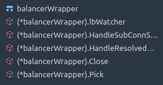
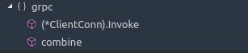
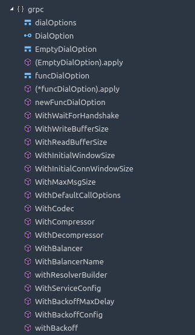
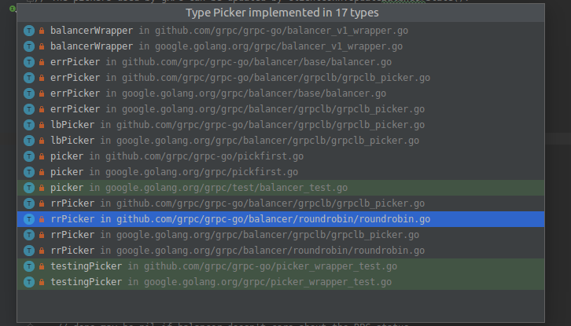
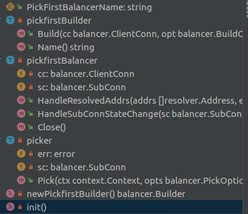
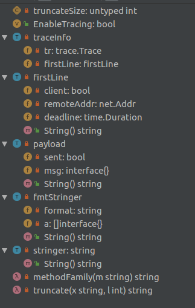
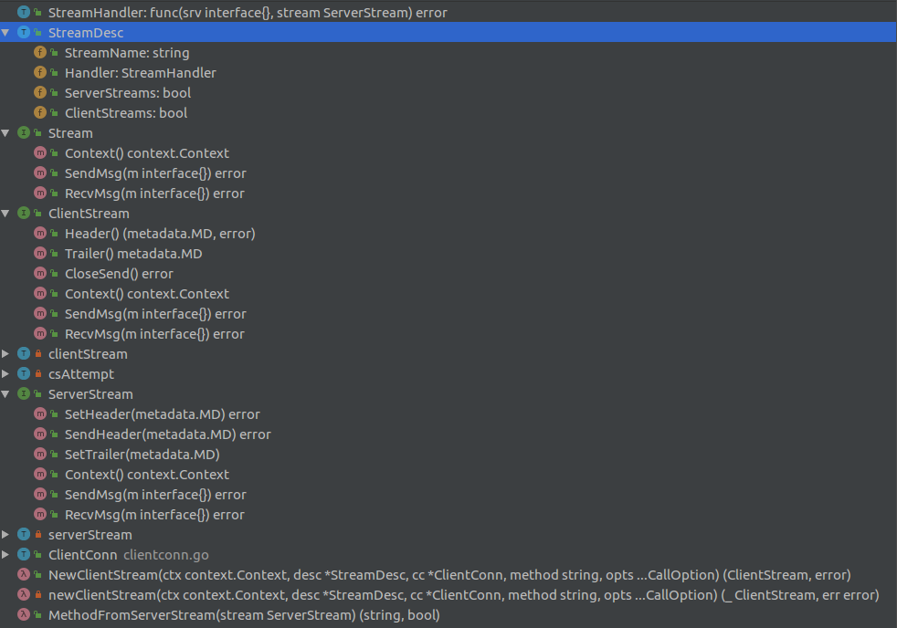

## grpc相关

**gRPC的本身实现介绍**

## balancer_conn_wrappers.go
```go
// scStateUpdate contains the subConn and the new state it changed to.
type scStateUpdate struct {
	sc    balancer.SubConn
	state connectivity.State
}

// scStateUpdateBuffer is an unbounded channel for scStateChangeTuple.
// TODO make a general purpose buffer that uses interface{}.
type scStateUpdateBuffer struct {
	c       chan *scStateUpdate
	mu      sync.Mutex
	backlog []*scStateUpdate
}
```
而根据`SubConn`的定义，`SubConn`代表了一个`gRPC sub connection`,并且包含了一个要去连接的目标地址的列表，通过接口方式对外定义了一个更新这个列表的方法，以及一个连接`Connect`的方法。

`scStateUpdate`就是更新的对应连接的连接状态；
`scStateUpdateBuffer`定义了一个用来管理`scStateUpdate`的缓冲池

```go
// ccBalancerWrapper is a wrapper on top of cc for balancers.
// It implements balancer.ClientConn interface.
type ccBalancerWrapper struct {
	cc               *ClientConn
	balancer         balancer.Balancer
	stateChangeQueue *scStateUpdateBuffer
	resolverUpdateCh chan *resolverUpdate
	done             chan struct{}

	mu       sync.Mutex
	subConns map[*acBalancerWrapper]struct{}
}
.
.
.
.
.
.
// acBalancerWrapper is a wrapper on top of ac for balancers.
// It implements balancer.SubConn interface.
type acBalancerWrapper struct {
	mu sync.Mutex
	ac *addrConn

```
`ccBalancerWrapper`:
这个结构体里包含有`cc *ClientConn`，代表从前端来的连接；`subConns`则是代表要连接去后端的连接，以及一个连接去后端的负载均衡器，域名解析器,添加或者移除`SubConn`。
就类似于一个中间的粘合器，将前后融合进一个结构体里进行管理。
`acBalancerWrapper`:
这个结构体通过支持`balancer`接口，来对后端的连接进行负载均衡

---

## balancer.go
这个文件是原来的`balancer`抽象接口，现在已经废弃，建议使用`balancer`这个包的定义:Deprecated: please use package balancer. 


----

## balancer_v1_wrapper.go

一个　balancer的实现:



```go
type balancerWrapper struct {
	balancer  Balancer // The v1 balancer.
	pickfirst bool

	cc         balancer.ClientConn
	targetAddr string // Target without the scheme.

	mu     sync.Mutex
	conns  map[resolver.Address]balancer.SubConn
	connSt map[balancer.SubConn]*scState
	// This channel is closed when handling the first resolver result.
	// lbWatcher blocks until this is closed, to avoid race between
	// - NewSubConn is created, cc wants to notify balancer of state changes;
	// - Build hasn't return, cc doesn't have access to balancer.
	startCh chan struct{}

	// To aggregate the connectivity state.
	csEvltr *balancer.ConnectivityStateEvaluator
	state   connectivity.State
}
```

---

## call.go

Invoke sends the RPC request on the wire and returns after response is
received.  This is typically called by generated code.
All errors returned by Invoke are compatible with the status package.



```go
func (cc *ClientConn) Invoke
```

提供给使用protobuf文件生成的代码使用的一个函数，附属在`ClientConn`这个结构定义上

---

## clientconn.go

在这个文件中定义了代表客户端连接的结构体
`ClientConn`的定义：
```go
// ClientConn represents a client connection to an RPC server.
type ClientConn struct {
	ctx    context.Context
	cancel context.CancelFunc

	target       string
	parsedTarget resolver.Target
	authority    string
	dopts        dialOptions
	csMgr        *connectivityStateManager

	balancerBuildOpts balancer.BuildOptions
	blockingpicker    *pickerWrapper

	mu              sync.RWMutex
	resolverWrapper *ccResolverWrapper
	sc              ServiceConfig
	scRaw           string
	conns           map[*addrConn]struct{}
	// Keepalive parameter can be updated if a GoAway is received.
	mkp             keepalive.ClientParameters
	curBalancerName string
	preBalancerName string // previous balancer name.
	curAddresses    []resolver.Address
	balancerWrapper *ccBalancerWrapper
	retryThrottler  atomic.Value

	firstResolveEvent *grpcsync.Event

	channelzID int64 // channelz unique identification number
	czData     *channelzData
}
```

一些默认值:

```go
const (
	// minimum time to give a connection to complete
	minConnectTimeout = 20 * time.Second
	// must match grpclbName in grpclb/grpclb.go
	grpclbName = "grpclb"
)
.
.
.
.
.
.
const (
	defaultClientMaxReceiveMessageSize = 1024 * 1024 * 4
	defaultClientMaxSendMessageSize    = math.MaxInt32
	// http2IOBufSize specifies the buffer size for sending frames.
	defaultWriteBufSize = 32 * 1024
	defaultReadBufSize  = 32 * 1024
)
```

以及一些error的定义:
```go
var (
	// ErrClientConnClosing indicates that the operation is illegal because
	// the ClientConn is closing.
	//
	// Deprecated: this error should not be relied upon by users; use the status
	// code of Canceled instead.
	ErrClientConnClosing = status.Error(codes.Canceled, "grpc: the client connection is closing")
	// errConnDrain indicates that the connection starts to be drained and does not accept any new RPCs.
	errConnDrain = errors.New("grpc: the connection is drained")
	// errConnClosing indicates that the connection is closing.
	errConnClosing = errors.New("grpc: the connection is closing")
	// errBalancerClosed indicates that the balancer is closed.
	errBalancerClosed = errors.New("grpc: balancer is closed")
	// We use an accessor so that minConnectTimeout can be
	// atomically read and updated while testing.
	getMinConnectTimeout = func() time.Duration {
		return minConnectTimeout
	}
)

// The following errors are returned from Dial and DialContext
var (
	// errNoTransportSecurity indicates that there is no transport security
	// being set for ClientConn. Users should either set one or explicitly
	// call WithInsecure DialOption to disable security.
	errNoTransportSecurity = errors.New("grpc: no transport security set (use grpc.WithInsecure() explicitly or set credentials)")
	// errTransportCredsAndBundle indicates that creds bundle is used together
	// with other individual Transport Credentials.
	errTransportCredsAndBundle = errors.New("grpc: credentials.Bundle may not be used with individual TransportCredentials")
	// errTransportCredentialsMissing indicates that users want to transmit security
	// information (e.g., oauth2 token) which requires secure connection on an insecure
	// connection.
	errTransportCredentialsMissing = errors.New("grpc: the credentials require transport level security (use grpc.WithTransportCredentials() to set)")
	// errCredentialsConflict indicates that grpc.WithTransportCredentials()
	// and grpc.WithInsecure() are both called for a connection.
	errCredentialsConflict = errors.New("grpc: transport credentials are set for an insecure connection (grpc.WithTransportCredentials() and grpc.WithInsecure() are both called)")
)
```
在这个文件中，定义了一个这样的函数：
```go
// newAddrConn creates an addrConn for addrs and adds it to cc.conns.
//
// Caller needs to make sure len(addrs) > 0.
func (cc *ClientConn) newAddrConn(addrs []resolver.Address, opts balancer.NewSubConnOptions) (*addrConn, error)
```
根据一个地址`addrs`列表创建一个对后端的连接`addrConn`,然后把这个连接添加到`ClientConn`的成员变量`conns  map[*addrConn]struct{}`中


addrConn的定义：
```go
// addrConn is a network connection to a given address.
type addrConn struct {
	ctx    context.Context
	cancel context.CancelFunc

	cc     *ClientConn
	dopts  dialOptions
	acbw   balancer.SubConn
	scopts balancer.NewSubConnOptions

	// transport is set when there's a viable transport (note: ac state may not be READY as LB channel
	// health checking may require server to report healthy to set ac to READY), and is reset
	// to nil when the current transport should no longer be used to create a stream (e.g. after GoAway
	// is received, transport is closed, ac has been torn down).
	transport transport.ClientTransport // The current transport.

	mu      sync.Mutex
	curAddr resolver.Address   // The current address.
	addrs   []resolver.Address // All addresses that the resolver resolved to.

	// Use updateConnectivityState for updating addrConn's connectivity state.
	state connectivity.State

	tearDownErr error // The reason this addrConn is torn down.

	backoffIdx   int // Needs to be stateful for resetConnectBackoff.
	resetBackoff chan struct{}

	channelzID         int64 // channelz unique identification number.
	czData             *channelzData
	healthCheckEnabled bool
}
```
`addrConn`中定义的这个方法：
connect starts creating a transport.It does nothing if the ac is not IDLE.
```go
func (ac *addrConn) connect() error{
    ...
    // Start a goroutine connecting to the server asynchronously.
	go ac.resetTransport()
    ...
}
```
`addrConn`的这个函数实现的xxx的接口定义，用来触发实际的连接操作的
```go
// createTransport creates a connection to one of the backends in addrs. It
// sets ac.transport in the success case, or it returns an error if it was
// unable to successfully create a transport.
//
// If waitForHandshake is enabled, it blocks until server preface arrives.
func (ac *addrConn) createTransport(addr resolver.Address, copts transport.ConnectOptions, connectDeadline time.Time, reconnect *grpcsync.Event, prefaceReceived chan struct{}) (transport.ClientTransport, error) {
    ...
    newTr, err := transport.NewClientTransport(connectCtx, ac.cc.ctx, target, copts, onPrefaceReceipt, onGoAway, onClose)
}
```

---
## codec.go
这个文件定义了序列化相关的接口：
```go
// baseCodec contains the functionality of both Codec and encoding.Codec, but
// omits the name/string, which vary between the two and are not needed for
// anything besides the registry in the encoding package.
type baseCodec interface {
	Marshal(v interface{}) ([]byte, error)
	Unmarshal(data []byte, v interface{}) error
}

var _ baseCodec = Codec(nil)
var _ baseCodec = encoding.Codec(nil)

// Codec defines the interface gRPC uses to encode and decode messages.
// Note that implementations of this interface must be thread safe;
// a Codec's methods can be called from concurrent goroutines.
//
// Deprecated: use encoding.Codec instead.
type Codec interface {
	// Marshal returns the wire format of v.
	Marshal(v interface{}) ([]byte, error)
	// Unmarshal parses the wire format into v.
	Unmarshal(data []byte, v interface{}) error
	// String returns the name of the Codec implementation.  This is unused by
	// gRPC.
	String() string
}
```
---

## dialoptions.go
这个文件定义了用来进行建立连接的一些可以进行设置的参数：
```go
// dialOptions configure a Dial call. dialOptions are set by the DialOption
// values passed to Dial.
type dialOptions struct {
	unaryInt    UnaryClientInterceptor
	streamInt   StreamClientInterceptor
	cp          Compressor
	dc          Decompressor
	bs          backoff.Strategy
	block       bool
	insecure    bool
	timeout     time.Duration
	scChan      <-chan ServiceConfig
	authority   string
	copts       transport.ConnectOptions
	callOptions []CallOption
	// This is used by v1 balancer dial option WithBalancer to support v1
	// balancer, and also by WithBalancerName dial option.
	balancerBuilder balancer.Builder
	// This is to support grpclb.
	resolverBuilder      resolver.Builder
	reqHandshake         envconfig.RequireHandshakeSetting
	channelzParentID     int64
	disableServiceConfig bool
	disableRetry         bool
	disableHealthCheck   bool
	healthCheckFunc      internal.HealthChecker
}

// DialOption configures how we set up the connection.
type DialOption interface {
	apply(*dialOptions)
}
...
type funcDialOption struct {
	f func(*dialOptions)
}

func (fdo *funcDialOption) apply(do *dialOptions) {
	fdo.f(do)
}

func newFuncDialOption(f func(*dialOptions)) *funcDialOption {
	return &funcDialOption{
		f: f,
	}
}

```
`DialOption`这个通用的接口定义,然后通过`funcDialOption`包装一层，这样其它函数构建一个`DialOption`时只需要使用`newFuncDialOption`这个函数生成就好



## pickerWrapper.go

```go
// pickerWrapper is a wrapper of balancer.Picker. It blocks on certain pick
// actions and unblock when there's a picker update.
type pickerWrapper struct {
	mu         sync.Mutex
	done       bool
	blockingCh chan struct{}
	picker     balancer.Picker

	// The latest connection happened.
	connErrMu sync.Mutex
	connErr   error
}
```

`pickerWrapper`是一个实现了`balancer.Picker`的`picker`的包装器，用来对`pick`行为进行管理

见`picker`接口的定义：

```go
// Picker is used by gRPC to pick a SubConn to send an RPC.
// Balancer is expected to generate a new picker from its snapshot every time its
// internal state has changed.
//
// The pickers used by gRPC can be updated by ClientConn.UpdateBalancerState().
type Picker interface {
	// Pick returns the SubConn to be used to send the RPC.
	// The returned SubConn must be one returned by NewSubConn().
	//
	// This functions is expected to return:
	// - a SubConn that is known to be READY;
	// - ErrNoSubConnAvailable if no SubConn is available, but progress is being
	//   made (for example, some SubConn is in CONNECTING mode);
	// - other errors if no active connecting is happening (for example, all SubConn
	//   are in TRANSIENT_FAILURE mode).
	//
	// If a SubConn is returned:
	// - If it is READY, gRPC will send the RPC on it;
	// - If it is not ready, or becomes not ready after it's returned, gRPC will block
	//   until UpdateBalancerState() is called and will call pick on the new picker.
	//
	// If the returned error is not nil:
	// - If the error is ErrNoSubConnAvailable, gRPC will block until UpdateBalancerState()
	// - If the error is ErrTransientFailure:
	//   - If the RPC is wait-for-ready, gRPC will block until UpdateBalancerState()
	//     is called to pick again;
	//   - Otherwise, RPC will fail with unavailable error.
	// - Else (error is other non-nil error):
	//   - The RPC will fail with unavailable error.
	//
	// The returned done() function will be called once the rpc has finished, with the
	// final status of that RPC.
	// done may be nil if balancer doesn't care about the RPC status.
	Pick(ctx context.Context, opts PickOptions) (conn SubConn, done func(DoneInfo), err error)
}
```
以及对`picker`的所定义的结构列表：



## pickfirst.go

这个文件也是一个picker接口的实现

```go
func init() {
	balancer.Register(newPickfirstBuilder())
}
```
在`init`函数中将自己注册到`balancer`中，通过`newPickfirstBuilder`这个函数构建`pickfirstBuilder`,将`ClientConn`传递到`pickfirstBalancer`这个`picker`接口的实现中，然后上层框架使用`HandleResolvedAddrs`和`HandleSubConnStateChange`这两个方法来进行`ClientConn`的状态更新通知



## proxy.go

一个代理服务实现

## resolver_conn_wraper.go

```go
// ccResolverWrapper is a wrapper on top of cc for resolvers.
// It implements resolver.ClientConnection interface.
type ccResolverWrapper struct {
	cc       *ClientConn
	resolver resolver.Resolver
	addrCh   chan []resolver.Address
	scCh     chan string
	done     chan struct{}
}
```
`ccResolverWrapper`通过封装`ClientConn`和`resolver.Resolver`的实现结构，而根据`ClientConn`的定义，`ccResolverWrapper`也实现`ClientConn`接口

```go
// ClientConn contains the callbacks for resolver to notify any updates
// to the gRPC ClientConn.
//
// This interface is to be implemented by gRPC. Users should not need a
// brand new implementation of this interface. For the situations like
// testing, the new implementation should embed this interface. This allows
// gRPC to add new methods to this interface.
type ClientConn interface {
	// NewAddress is called by resolver to notify ClientConn a new list
	// of resolved addresses.
	// The address list should be the complete list of resolved addresses.
	NewAddress(addresses []Address)
	// NewServiceConfig is called by resolver to notify ClientConn a new
	// service config. The service config should be provided as a json string.
	NewServiceConfig(serviceConfig string)
}

```
`ccResolverWrapper`主要用来将新的地址解析结果通知到实际的`ClientConn`,或者新的服务配置
```go
// watcher processes address updates and service config updates sequentially.
// Otherwise, we need to resolve possible races between address and service
// config (e.g. they specify different balancer types).
func (ccr *ccResolverWrapper) watcher() 
```


## rpc_util.go

提供一些辅助的工具函数，像压缩，编解码，matedata的before-after的链式包装函数，最大传输的消息大小，等等这些工具函数实现

## server_config.go

```go
Deprecated: Users should not use this struct. Service config should be received through name resolver, as specified here
```

已经废弃的结构定义，再看吧！！！！！

## server.go 

## trace.go

```go
// EnableTracing controls whether to trace RPCs using the golang.org/x/net/trace package.
// This should only be set before any RPCs are sent or received by this program.
var EnableTracing bool
```

`trace.go`里通过`golang.org/x/net/trace`实现了对每一次的grpc的请求的追踪的工具




## stream.go



```go
// StreamHandler defines the handler called by gRPC server to complete the
// execution of a streaming RPC. If a StreamHandler returns an error, it
// should be produced by the status package, or else gRPC will use
// codes.Unknown as the status code and err.Error() as the status message
// of the RPC.
type StreamHandler func(srv interface{}, stream ServerStream) error

// StreamDesc represents a streaming RPC service's method specification.
type StreamDesc struct {
	StreamName string
	Handler    StreamHandler

	// At least one of these is true.
	ServerStreams bool
	ClientStreams bool
}
```
`StreamHandler`定义了一个处理`ServerStream`的函数类型；然后通过`StreamDesc`这个定义来包装后，描述`server`端的的rpc的方法实现，用户可以不用理会这个东西，这个更多是提供给grpc-go底层来使用的；像用于区分client/server的标志位。

```go
// ClientStream defines the client-side behavior of a streaming RPC.
//
// All errors returned from ClientStream methods are compatible with the
// status package.
type ClientStream interface {
	// Header returns the header metadata received from the server if there
	// is any. It blocks if the metadata is not ready to read.
	Header() (metadata.MD, error)
	// Trailer returns the trailer metadata from the server, if there is any.
	// It must only be called after stream.CloseAndRecv has returned, or
	// stream.Recv has returned a non-nil error (including io.EOF).
	Trailer() metadata.MD
	// CloseSend closes the send direction of the stream. It closes the stream
	// when non-nil error is met.
	CloseSend() error
	// Context returns the context for this stream.
	//
	// It should not be called until after Header or RecvMsg has returned. Once
	// called, subsequent client-side retries are disabled.
	Context() context.Context
	// SendMsg is generally called by generated code. On error, SendMsg aborts
	// the stream. If the error was generated by the client, the status is
	// returned directly; otherwise, io.EOF is returned and the status of
	// the stream may be discovered using RecvMsg.
	//
	// SendMsg blocks until:
	//   - There is sufficient flow control to schedule m with the transport, or
	//   - The stream is done, or
	//   - The stream breaks.
	//
	// SendMsg does not wait until the message is received by the server. An
	// untimely stream closure may result in lost messages. To ensure delivery,
	// users should ensure the RPC completed successfully using RecvMsg.
	//
	// It is safe to have a goroutine calling SendMsg and another goroutine
	// calling RecvMsg on the same stream at the same time, but it is not safe
	// to call SendMsg on the same stream in different goroutines.
	SendMsg(m interface{}) error
	// RecvMsg blocks until it receives a message into m or the stream is
	// done. It returns io.EOF when the stream completes successfully. On
	// any other error, the stream is aborted and the error contains the RPC
	// status.
	//
	// It is safe to have a goroutine calling SendMsg and another goroutine
	// calling RecvMsg on the same stream at the same time, but it is not
	// safe to call RecvMsg on the same stream in different goroutines.
	RecvMsg(m interface{}) error
}
```

`ClientStream` 是客户端的rpc的行为定义，包含了这些方法：
* `SendMsg`
* `RecvMsg`
* `Header`
* `Context`
* `Trailer`
* `CloseSend`
  
有些方法默认是提供给grpc的生成的代码来使用的，使用者了解一下就好了

```go
func (cc *ClientConn) NewStream(ctx context.Context, desc *StreamDesc, method string, opts ...CallOption) (ClientStream, error)

// NewClientStream is a wrapper for ClientConn.NewStream.
func NewClientStream(ctx context.Context, desc *StreamDesc, cc *ClientConn, method string, opts ...CallOption) (ClientStream, error) {
	return cc.NewStream(ctx, desc, method, opts...)
}

func newClientStream(ctx context.Context, desc *StreamDesc, cc *ClientConn, method string, opts ...CallOption) (_ ClientStream, err error)
```

这个方法将一个`stream`创建完成后并绑定到一个连接上,也是提供给底层的`grpc`生成的代码来使用的：
```go
NewClientStream-->(cc *ClientConn) NewStream-->newClientStream
```
`ClientStream`接口的具体实现：`clientStream｀

```go
// clientStream implements a client side Stream.
type clientStream struct {
	callHdr  *transport.CallHdr
	opts     []CallOption
	callInfo *callInfo
	cc       *ClientConn
	desc     *StreamDesc

	codec baseCodec
	cp    Compressor
	comp  encoding.Compressor

	cancel context.CancelFunc // cancels all attempts

	sentLast  bool // sent an end stream
	beginTime time.Time

	methodConfig *MethodConfig

	ctx context.Context // the application's context, wrapped by stats/tracing

	retryThrottler *retryThrottler // The throttler active when the RPC began.

	mu                      sync.Mutex
	firstAttempt            bool       // if true, transparent retry is valid
	numRetries              int        // exclusive of transparent retry attempt(s)
	numRetriesSincePushback int        // retries since pushback; to reset backoff
	finished                bool       // TODO: replace with atomic cmpxchg or sync.Once?
	attempt                 *csAttempt // the active client stream attempt
	// TODO(hedging): hedging will have multiple attempts simultaneously.
	committed  bool                       // active attempt committed for retry?
	buffer     []func(a *csAttempt) error // operations to replay on retry
	bufferSize int                        // current size of buffer
}
```

这个结构体中：
* `cc *ClientConn` 这个stream使用的连接的接口实现
* `desc *StreamDesc` 这个RPC接口的描述
* `attempt *csAttempt` 用来做重试管理的。

```go
// csAttempt implements a single transport stream attempt within a
// clientStream.
type csAttempt struct {
	cs   *clientStream
	t    transport.ClientTransport
	s    *transport.Stream
	p    *parser
	done func(balancer.DoneInfo)

	finished  bool
	dc        Decompressor
	decomp    encoding.Compressor
	decompSet bool

	mu sync.Mutex // guards trInfo.tr
	// trInfo.tr is set when created (if EnableTracing is true),
	// and cleared when the finish method is called.
	trInfo traceInfo

	statsHandler stats.Handler
}
```

`csAttempt`的定义中，三个成员变量：


* `cs *clientStream` 是和这个`csAttempt`绑定的实际的连接
* `t transport.ClientTransport` 这个是传输层的抽象，类似于`http.Transport`的功能，不过只用来在客户端
* `s *transport.Stream`　这个是代表一个通用的Stream的结构,用于在`Transport`来对Steam进行管理

