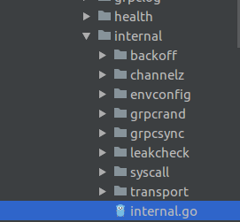
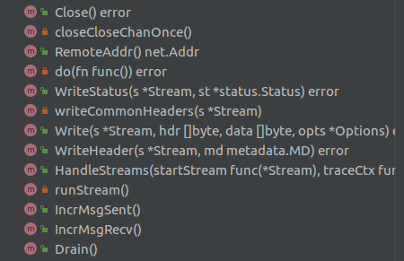

## grpc相关

`internal`的介绍



```go
// Package internal contains gRPC-internal code, to avoid polluting
// the godoc of the top-level grpc package.  It must not import any grpc
// symbols to avoid circular dependencies.
package internal
```

这个包仅仅提供给grpc自己使用，主要的提供一些工具以及别的东西；重点关注`transport`和`syscall`

------
### syscall

```go
// Package syscall provides functionalities that grpc uses to get low-level operating system
// stats/info.
```
Package syscall主要提供了已经使用函数包装好的用来获得底层的操作系统的信息的接口

----
### transport

* handler_server.go

```go
// This file is the implementation of a gRPC server using HTTP/2 which
// uses the standard Go http2 Server implementation (via the
// http.Handler interface), rather than speaking low-level HTTP/2
// frames itself. It is the implementation of *grpc.Server.ServeHTTP.
```
在`handler_server.go`文件中，使用`http2`实现了`gRPC server`

```go
// serverHandlerTransport is an implementation of ServerTransport
// which replies to exactly one gRPC request (exactly one HTTP request),
// using the net/http.Handler interface. This http.Handler is guaranteed
// at this point to be speaking over HTTP/2, so it's able to speak valid
// gRPC.
type serverHandlerTransport struct {
	rw               http.ResponseWriter
	req              *http.Request
	timeoutSet       bool
	timeout          time.Duration
	didCommonHeaders bool

	headerMD metadata.MD

	closeOnce sync.Once
	closedCh  chan struct{} // closed on Close

	// writes is a channel of code to run serialized in the
	// ServeHTTP (HandleStreams) goroutine. The channel is closed
	// when WriteStatus is called.
	writes chan func()

	// block concurrent WriteStatus calls
	// e.g. grpc/(*serverStream).SendMsg/RecvMsg
	writeStatusMu sync.Mutex

	// we just mirror the request content-type
	contentType string
	// we store both contentType and contentSubtype so we don't keep recreating them
	// TODO make sure this is consistent across handler_server and http2_server
	contentSubtype string

	stats stats.Handler
}
```
`serverHandlerTransport`是对`ServerTransport`的实现，对每一个`request`有一个`serverHandlerTransport`来对应，同时兼容了go的官方通用库`net/http.Handler`



许多方法都是在函数体内声明一个函数变量，然后再投进`do(fn func()) error`函数，再由`runStream`进行执行

```go
......
// do runs fn in the ServeHTTP goroutine.
func (ht *serverHandlerTransport) do(fn func()) error {
	// Avoid a panic writing to closed channel. Imperfect but maybe good enough.
	select {
	case <-ht.closedCh:
		return ErrConnClosing
	default:
		select {
		case ht.writes <- fn:
			return nil
		case <-ht.closedCh:
			return ErrConnClosing
		}
	}
}
......
func (ht *serverHandlerTransport) runStream() {
	for {
		select {
		case fn, ok := <-ht.writes:
			if !ok {
				return
			}
			fn()
		case <-ht.closedCh:
			return
		}
	}
}
.......
```

* http_util.go 
  
```go
  type bufWriter struct {
	buf       []byte
	offset    int
	batchSize int
	conn      net.Conn
	err       error

	onFlush func()
}

type framer struct {
	writer *bufWriter
	fr     *http2.Framer
}

```

定义了`bufWriter`和`framer`，以及一些http2头的写入读取辅助函数

-------
  
* transport.go

* http2_server.go

* http2_client.go
  
```go
// http2Client implements the ClientTransport interface with HTTP2.
type http2Client struct {
	ctx        context.Context
	cancel     context.CancelFunc
	ctxDone    <-chan struct{} // Cache the ctx.Done() chan.
	userAgent  string
	md         interface{}
	conn       net.Conn // underlying communication channel
	loopy      *loopyWriter
	remoteAddr net.Addr
	localAddr  net.Addr
	authInfo   credentials.AuthInfo // auth info about the connection

	readerDone chan struct{} // sync point to enable testing.
	writerDone chan struct{} // sync point to enable testing.
	// goAway is closed to notify the upper layer (i.e., addrConn.transportMonitor)
	// that the server sent GoAway on this transport.
	goAway chan struct{}
	// awakenKeepalive is used to wake up keepalive when after it has gone dormant.
	awakenKeepalive chan struct{}

	framer *framer
	// controlBuf delivers all the control related tasks (e.g., window
	// updates, reset streams, and various settings) to the controller.
	controlBuf *controlBuffer
	fc         *trInFlow
	// The scheme used: https if TLS is on, http otherwise.
	scheme string

	isSecure bool

	creds []credentials.PerRPCCredentials

	// Boolean to keep track of reading activity on transport.
	// 1 is true and 0 is false.
	activity         uint32 // Accessed atomically.
	kp               keepalive.ClientParameters
	keepaliveEnabled bool

	statsHandler stats.Handler

	initialWindowSize int32

	// configured by peer through SETTINGS_MAX_HEADER_LIST_SIZE
	maxSendHeaderListSize *uint32

	bdpEst *bdpEstimator
	// onSuccess is a callback that client transport calls upon
	// receiving server preface to signal that a succefull HTTP2
	// connection was established.
	onSuccess func()

	maxConcurrentStreams  uint32
	streamQuota           int64
	streamsQuotaAvailable chan struct{}
	waitingStreams        uint32
	nextID                uint32

	mu            sync.Mutex // guard the following variables
	state         transportState
	activeStreams map[uint32]*Stream
	// prevGoAway ID records the Last-Stream-ID in the previous GOAway frame.
	prevGoAwayID uint32
	// goAwayReason records the http2.ErrCode and debug data received with the
	// GoAway frame.
	goAwayReason GoAwayReason

	// Fields below are for channelz metric collection.
	channelzID int64 // channelz unique identification number
	czData     *channelzData
}
```
`http2Client`实现了`ClientTransport`这个定义的接口