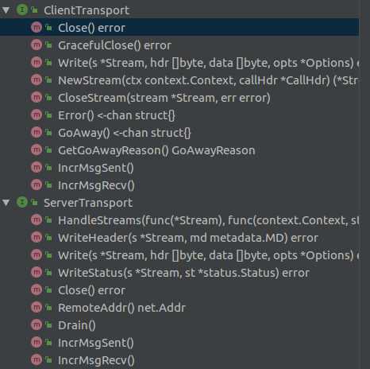

## grpc相关

`internal`的介绍


```go
// Package internal contains gRPC-internal code, to avoid polluting
// the godoc of the top-level grpc package.  It must not import any grpc
// symbols to avoid circular dependencies.
package internal
```

这个包仅仅提供给grpc自己使用，主要的提供一些工具以及别的东西；重点关注`transport`和`syscall`

------
### syscall

```go
// Package syscall provides functionalities that grpc uses to get low-level operating system
// stats/info.
```
Package syscall主要提供了已经使用函数包装好的用来获得底层的操作系统的信息的接口

----
### transport

* handler_server.go

```go
// This file is the implementation of a gRPC server using HTTP/2 which
// uses the standard Go http2 Server implementation (via the
// http.Handler interface), rather than speaking low-level HTTP/2
// frames itself. It is the implementation of *grpc.Server.ServeHTTP.
```
在`handler_server.go`文件中，使用`http2`实现了`gRPC server`

```go
// serverHandlerTransport is an implementation of ServerTransport
// which replies to exactly one gRPC request (exactly one HTTP request),
// using the net/http.Handler interface. This http.Handler is guaranteed
// at this point to be speaking over HTTP/2, so it's able to speak valid
// gRPC.
type serverHandlerTransport struct {
	rw               http.ResponseWriter
	req              *http.Request
	timeoutSet       bool
	timeout          time.Duration
	didCommonHeaders bool

	headerMD metadata.MD

	closeOnce sync.Once
	closedCh  chan struct{} // closed on Close

	// writes is a channel of code to run serialized in the
	// ServeHTTP (HandleStreams) goroutine. The channel is closed
	// when WriteStatus is called.
	writes chan func()

	// block concurrent WriteStatus calls
	// e.g. grpc/(*serverStream).SendMsg/RecvMsg
	writeStatusMu sync.Mutex

	// we just mirror the request content-type
	contentType string
	// we store both contentType and contentSubtype so we don't keep recreating them
	// TODO make sure this is consistent across handler_server and http2_server
	contentSubtype string

	stats stats.Handler
}
```
`serverHandlerTransport`是对`ServerTransport`的实现，对每一个`request`有一个`serverHandlerTransport`来对应，同时兼容了go的官方通用库`net/http.Handler`


许多方法都是在函数体内声明一个函数变量，然后再投进`do(fn func()) error`函数，再由`runStream`进行执行

```go
......
// do runs fn in the ServeHTTP goroutine.
func (ht *serverHandlerTransport) do(fn func()) error {
	// Avoid a panic writing to closed channel. Imperfect but maybe good enough.
	select {
	case <-ht.closedCh:
		return ErrConnClosing
	default:
		select {
		case ht.writes <- fn:
			return nil
		case <-ht.closedCh:
			return ErrConnClosing
		}
	}
}
......
func (ht *serverHandlerTransport) runStream() {
	for {
		select {
		case fn, ok := <-ht.writes:
			if !ok {
				return
			}
			fn()
		case <-ht.closedCh:
			return
		}
	}
}
.......
```

* http_util.go 
  
```go
  type bufWriter struct {
	buf       []byte
	offset    int
	batchSize int
	conn      net.Conn
	err       error

	onFlush func()
}

type framer struct {
	writer *bufWriter
	fr     *http2.Framer
}

```

定义了`bufWriter`和`framer`，以及一些http2头的写入读取辅助函数

-------
  
* transport.go

```go
// recvMsg represents the received msg from the transport. All transport
// protocol specific info has been removed.
type recvMsg struct {
	data []byte
	// nil: received some data
	// io.EOF: stream is completed. data is nil.
	// other non-nil error: transport failure. data is nil.
	err error
}

// recvBuffer is an unbounded channel of recvMsg structs.
// Note recvBuffer differs from controlBuffer only in that recvBuffer
// holds a channel of only recvMsg structs instead of objects implementing "item" interface.
// recvBuffer is written to much more often than
// controlBuffer and using strict recvMsg structs helps avoid allocation in "recvBuffer.put"
type recvBuffer struct {
	c       chan recvMsg
	mu      sync.Mutex
	backlog []recvMsg
	err     error
}


......
//
// recvBufferReader implements io.Reader interface to read the data from
// recvBuffer.
type recvBufferReader struct {
	ctx     context.Context
	ctxDone <-chan struct{} // cache of ctx.Done() (for performance).
	recv    *recvBuffer
	last    []byte // Stores the remaining data in the previous calls.
	err     error
}

```

* `recvMsg`是一个包含实际的接受的数据的结构体，结构体中的`err`是接收这个消息时的错误信息
* `recvBuffer`通过定义一个`pool`和一个`chan`，来对消息的读写进行同步以及缓冲
* `recvBufferReader`通过包装`recvBuffer`结构，并且实现`io.Reader`接口`func (r *recvBufferReader) read(p []byte) (n int, err error)`


```go
type streamState uint32

const (
	streamActive    streamState = iota
	streamWriteDone             // EndStream sent
	streamReadDone              // EndStream received
	streamDone                  // the entire stream is finished.
)

// Stream represents an RPC in the transport layer.
type Stream struct {
	id           uint32
	st           ServerTransport    // nil for client side Stream
	ctx          context.Context    // the associated context of the stream
	cancel       context.CancelFunc // always nil for client side Stream
	done         chan struct{}      // closed at the end of stream to unblock writers. On the client side.
	ctxDone      <-chan struct{}    // same as done chan but for server side. Cache of ctx.Done() (for performance)
	method       string             // the associated RPC method of the stream
	recvCompress string
	sendCompress string
	buf          *recvBuffer
	trReader     io.Reader
	fc           *inFlow
	recvQuota    uint32
	wq           *writeQuota

	// Callback to state application's intentions to read data. This
	// is used to adjust flow control, if needed.
	requestRead func(int)

	headerChan chan struct{} // closed to indicate the end of header metadata.
	headerDone uint32        // set when headerChan is closed. Used to avoid closing headerChan multiple times.

	// hdrMu protects header and trailer metadata on the server-side.
	hdrMu   sync.Mutex
	header  metadata.MD // the received header metadata.
	trailer metadata.MD // the key-value map of trailer metadata.

	noHeaders bool // set if the client never received headers (set only after the stream is done).

	// On the server-side, headerSent is atomically set to 1 when the headers are sent out.
	headerSent uint32

	state streamState

	// On client-side it is the status error received from the server.
	// On server-side it is unused.
	status *status.Status

	bytesReceived uint32 // indicates whether any bytes have been received on this stream
	unprocessed   uint32 // set if the server sends a refused stream or GOAWAY including this stream

	// contentSubtype is the content-subtype for requests.
	// this must be lowercase or the behavior is undefined.
	contentSubtype string
}

```
`Stream`代表了在transport层面上的的一个rpc请求,`Stream`里定义的成员变量，用来更新当前`Stream`的读写状态，并根据这些读写状态，再去做出不同的处理流程

```go
// ClientTransport is the common interface for all gRPC client-side transport
// implementations.
type ClientTransport interface {
	// Close tears down this transport. Once it returns, the transport
	// should not be accessed any more. The caller must make sure this
	// is called only once.
	Close() error

	// GracefulClose starts to tear down the transport. It stops accepting
	// new RPCs and wait the completion of the pending RPCs.
	GracefulClose() error

	// Write sends the data for the given stream. A nil stream indicates
	// the write is to be performed on the transport as a whole.
	Write(s *Stream, hdr []byte, data []byte, opts *Options) error

	// NewStream creates a Stream for an RPC.
	NewStream(ctx context.Context, callHdr *CallHdr) (*Stream, error)

	// CloseStream clears the footprint of a stream when the stream is
	// not needed any more. The err indicates the error incurred when
	// CloseStream is called. Must be called when a stream is finished
	// unless the associated transport is closing.
	CloseStream(stream *Stream, err error)

	// Error returns a channel that is closed when some I/O error
	// happens. Typically the caller should have a goroutine to monitor
	// this in order to take action (e.g., close the current transport
	// and create a new one) in error case. It should not return nil
	// once the transport is initiated.
	Error() <-chan struct{}

	// GoAway returns a channel that is closed when ClientTransport
	// receives the draining signal from the server (e.g., GOAWAY frame in
	// HTTP/2).
	GoAway() <-chan struct{}

	// GetGoAwayReason returns the reason why GoAway frame was received.
	GetGoAwayReason() GoAwayReason

	// IncrMsgSent increments the number of message sent through this transport.
	IncrMsgSent()

	// IncrMsgRecv increments the number of message received through this transport.
	IncrMsgRecv()
}

// ServerTransport is the common interface for all gRPC server-side transport
// implementations.
//
// Methods may be called concurrently from multiple goroutines, but
// Write methods for a given Stream will be called serially.
type ServerTransport interface {
	// HandleStreams receives incoming streams using the given handler.
	HandleStreams(func(*Stream), func(context.Context, string) context.Context)

	// WriteHeader sends the header metadata for the given stream.
	// WriteHeader may not be called on all streams.
	WriteHeader(s *Stream, md metadata.MD) error

	// Write sends the data for the given stream.
	// Write may not be called on all streams.
	Write(s *Stream, hdr []byte, data []byte, opts *Options) error

	// WriteStatus sends the status of a stream to the client.  WriteStatus is
	// the final call made on a stream and always occurs.
	WriteStatus(s *Stream, st *status.Status) error

	// Close tears down the transport. Once it is called, the transport
	// should not be accessed any more. All the pending streams and their
	// handlers will be terminated asynchronously.
	Close() error

	// RemoteAddr returns the remote network address.
	RemoteAddr() net.Addr

	// Drain notifies the client this ServerTransport stops accepting new RPCs.
	Drain()

	// IncrMsgSent increments the number of message sent through this transport.
	IncrMsgSent()

	// IncrMsgRecv increments the number of message received through this transport.
	IncrMsgRecv()
}
```



* `ClientTransport`
* `ServerTransport`

两个不同的对`Transport`的抽象，分别对应`Client`端和`Server`端，但是两个抽象的方法是不同的如以上的截图所示；但是两种`Transport`的处理对象都是`Stream`

----
* http2_server.go

----
* http2_client.go
  
```go
// http2Client implements the ClientTransport interface with HTTP2.
type http2Client struct {
	ctx        context.Context
	cancel     context.CancelFunc
	ctxDone    <-chan struct{} // Cache the ctx.Done() chan.
	userAgent  string
	md         interface{}
	conn       net.Conn // underlying communication channel
	loopy      *loopyWriter
	remoteAddr net.Addr
	localAddr  net.Addr
	authInfo   credentials.AuthInfo // auth info about the connection

	readerDone chan struct{} // sync point to enable testing.
	writerDone chan struct{} // sync point to enable testing.
	// goAway is closed to notify the upper layer (i.e., addrConn.transportMonitor)
	// that the server sent GoAway on this transport.
	goAway chan struct{}
	// awakenKeepalive is used to wake up keepalive when after it has gone dormant.
	awakenKeepalive chan struct{}

	framer *framer
	// controlBuf delivers all the control related tasks (e.g., window
	// updates, reset streams, and various settings) to the controller.
	controlBuf *controlBuffer
	fc         *trInFlow
	// The scheme used: https if TLS is on, http otherwise.
	scheme string

	isSecure bool

	creds []credentials.PerRPCCredentials

	// Boolean to keep track of reading activity on transport.
	// 1 is true and 0 is false.
	activity         uint32 // Accessed atomically.
	kp               keepalive.ClientParameters
	keepaliveEnabled bool

	statsHandler stats.Handler

	initialWindowSize int32

	// configured by peer through SETTINGS_MAX_HEADER_LIST_SIZE
	maxSendHeaderListSize *uint32

	bdpEst *bdpEstimator
	// onSuccess is a callback that client transport calls upon
	// receiving server preface to signal that a succefull HTTP2
	// connection was established.
	onSuccess func()

	maxConcurrentStreams  uint32
	streamQuota           int64
	streamsQuotaAvailable chan struct{}
	waitingStreams        uint32
	nextID                uint32

	mu            sync.Mutex // guard the following variables
	state         transportState
	activeStreams map[uint32]*Stream
	// prevGoAway ID records the Last-Stream-ID in the previous GOAway frame.
	prevGoAwayID uint32
	// goAwayReason records the http2.ErrCode and debug data received with the
	// GoAway frame.
	goAwayReason GoAwayReason

	// Fields below are for channelz metric collection.
	channelzID int64 // channelz unique identification number
	czData     *channelzData
}
```
`http2Client`实现了`ClientTransport`这个定义的接口