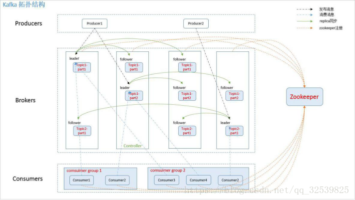
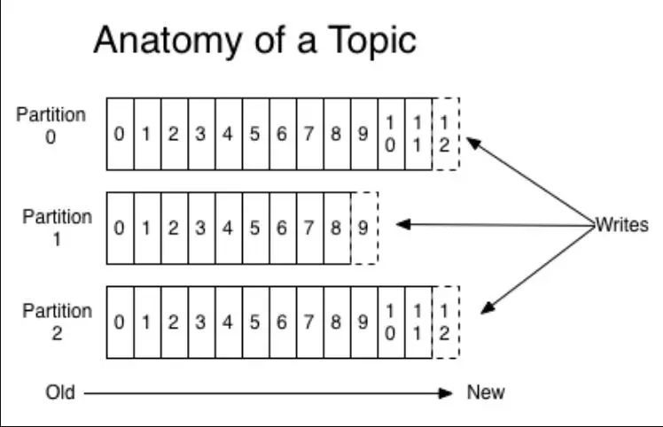
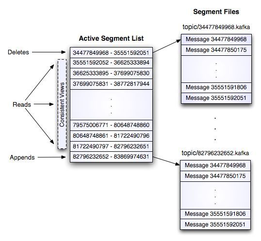

## kafka 之北


---

####  简介：

Apache Kafka 是分布式发布-订阅消息系统（消息中间件）。它最初由 LinkedIn 公司开发，之后成为 Apache 项目的一部分。Kafka 是一种快速、可扩展的、设计内在就是分布式的，分区的和可复制的提交日志服务。

---

#### 特性与用途

    它是分布式系统，易于向外扩展；
    它同时为发布和订阅提供高吞吐量；
    它支持多订阅者，当失败时能自动平衡消费者；
    它将消息持久化到磁盘，因此可用于批量消费；

---

#### 组件以及功能

* **Broker**
  Kafka 集群包含一个或多个服务器，这种服务器被称为 broker

* **Topic**
  每条发布到 Kafka 集群的消息都有一个类别，这个类别被称为 Topic

* **Partition**
  Partition 是物理上的概念，每个 Topic 包含一个或多个 Partition.

* **Producer**
  负责发布消息到 Kafka broker

* **Consumer**
  消息消费者，向 Kafka broker 读取消息的客户端

* **Consumer Group**
  每个 Consumer 属于一个特定的 Consumer Group（可为每个 Consumer 指定 group name，若不指定 group name 则属于默认的 group）

* **replica**
  partition  的副本，保障 partition  的高可用

* **leader**
  replica中的一个角色，producer和consumer只跟leader交互

* **follower**
  replica中的一个角色，从leader中复制数据

* **controller**
  Kafka集群中的其中一个服务器，用来进行leader election以及各种failover


---


Kafka 通过 Zookeeper 管理集群配置，选举 leader。Producer 使用 push 模式将消息发布到 broker，Consumer 使用 pull 模式从 broker 订阅并消费消息。

### Producer发布消息

Producer采用push模式将消息发布到broker，每条消息都被append到partition，属于顺序写磁盘

producer发送消息到broker时，会根据分区算法将其存储到哪一个partition

* 指定了partition,则直接使用
* 未指定partition,但指定key，通过对key的 value进行hash 选出一个partition
* partition和key 都为指定，使用轮询选出一个partition
  
##### 写数据流程



    1:producer先从zookeeper的"/brokers/.../state"节点找到该 partition 的leader
    2:producer将消息发送给该leader，leader将消息写入本地log,所有对partition的读和写都通过leader
    3:followers从leader pull消息，写入本地 log后向leader发送 ACK
    4:leader收到所有ISR(in-sync replicas) 中的 replica的ACK后向 producer发送ACK
    5:物理上把topic分成一个或多个partition，每个partition物理上对应一个文件夹（该文件夹存储该 partition 的所有消息和索引文件）
    6:partition中的每条Message包含了以下三个属性： offset:MessageSize:data
    7:topic可以有若干个分区，且分区可以动态修改，但是只允许增加不允许减少。每个分区中的消息是有序的。各个分区之间的消息是无序的。新消息采用追加的方式写入，这种顺序写入方式，从而使kafka的吞吐能力非常强大

#### 读取
**分段**:Kafka 解决查询效率的手段之一是将数据文件分段，比如有 100 条 Message，它们的 offset 是从 0 到 99。假设将数据文件分成 5 段，第一段为 0-19，第二段为 20-39，以此类推，每段放在一个单独的数据文件里面，数据文件以该段中最小的 offset 命名。这样在查找指定 offset 的 Message 的时候，用二分查找就可以定位到该 Message 在哪个段中。
**索引**:数据文件分段使得可以在一个较小的数据文件中查找对应 offset 的 Message 了，但是这依然需要顺序扫描才能找到对应 offset 的 Message。为了进一步提高查找的效率，Kafka 为每个分段后的数据文件建立了索引文件，文件名与数据文件的名字是一样的，只是文件扩展名为.index。索引文件中包含若干个索引条目，每个条目表示数据文件中一条 Message 的索引。索引包含两个部分，分别为相对 offset 和 position。

**consumer消费**:

    1:每一个consumer实例都属于一个consumer group。
    2:每一条消息只会被同一个consumer group里的一个consumer实例消费。
    3:不同consumer group可以同时消费同一条消息。
    4:如果某consumer group中consumer数量少于partition数量，则至少有一个consumer会消费多个partition的数据。
    5:如果consumer的数量与partition数量相同，则正好一个consumer消费一个partition的数据。
    6:如果consumer的数量多于partition的数量时，会有部分consumer无法消费该topic下任何一条消息。
    7:consumer记录每个partition所消费的maximum offset，并定期commit到offset manager（broker）
    8:consumer注册到zookeeper
    9:属于同一个group的consumer（group id一样）平均分配partition，每个partition只会被一个consumer消费
    10:当broker或同一个group的其他consumer的状态发生变化的时候，consumer rebalance就会发生

常用命令

```shell
./kafka-topics.sh --alter --zookeeper zookeeper-default-1.component.svc.cluster.local:2181/kafka  --partitions 64 --topic xxxxxxxx
```