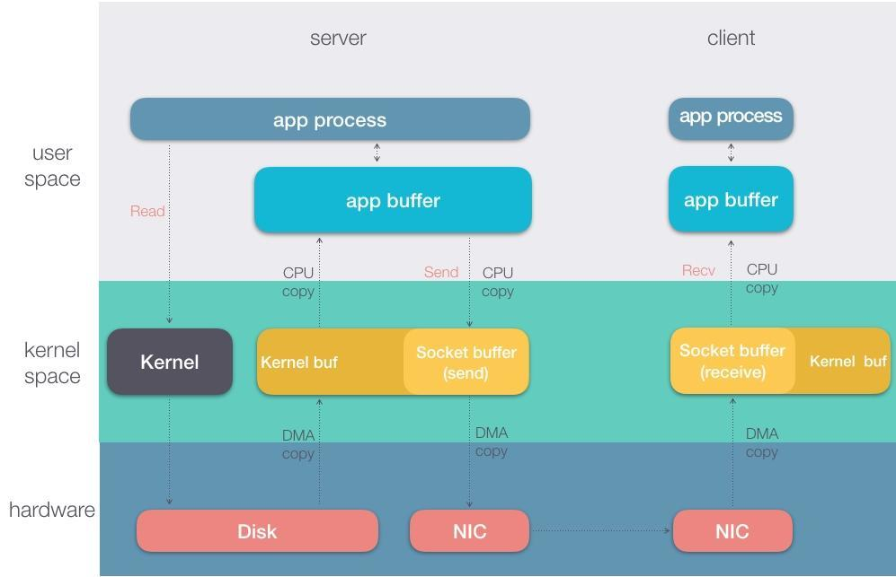
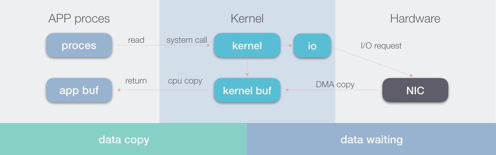
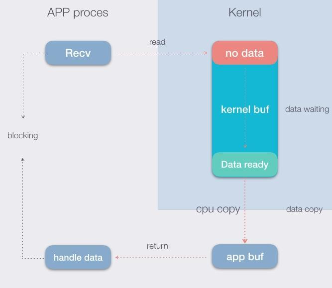
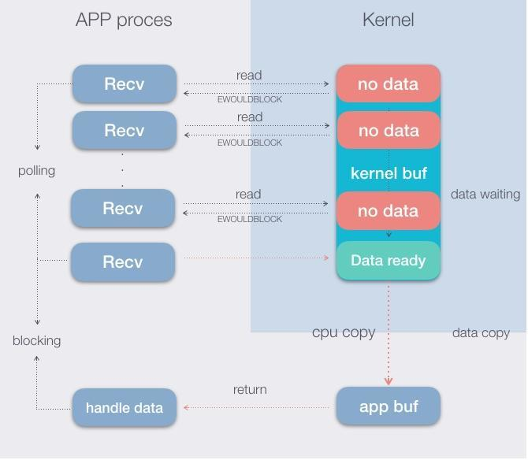
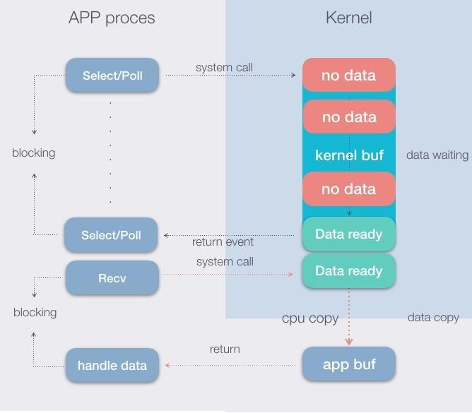
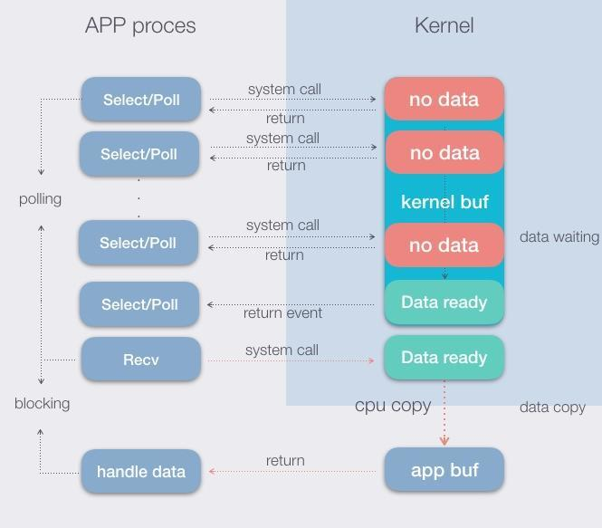
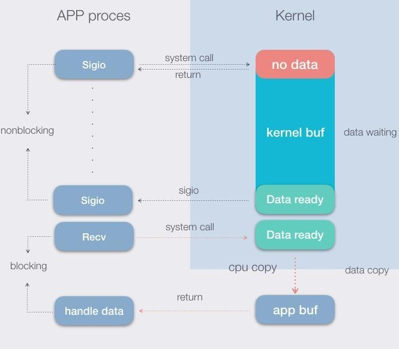
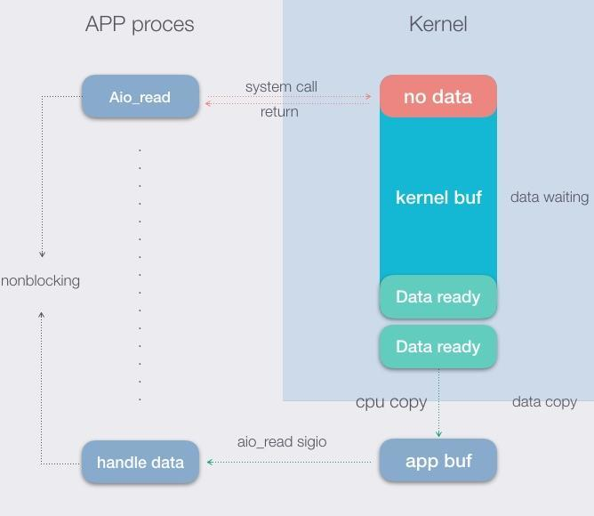

## IO CPU
REF(https://www.jianshu.com/p/e62f0ef9629d)
##### IO 输入输出
##### CPU　计算

**现代的服务器的关注的两个主要的地方，实际上存储只是这两个的混合物，记好比火影忍者中的土遁和水遁合并为木遁的技能一样**

    一次请求中的整个的数据流动，包含client-server.
    数据在三个主要层次流动，即硬件，内核，应用。在流动的过程中，
    从一个层流向另一个层即为IO操作。
    


**DMA**

     Direct Memory Access，直接内存访问方式，即现在的计算机硬件设备，
     可以独立地直接读写系统内存，而不需CPU完全介入处理。
     也就是数据从DISK或者NIC从把数据copy到内核buf，不需要计算机cpu的
     参与，而是通过设备上的芯片（cpu）参与。对于内核来说，这样的数据读
     取过程中，cpu可以做别的事情。

**IO**



    通常现代的程序软件都运行在内存里，内存又分为用户态和内核态，后者隶
    属于操作系统。所谓的IO，就是将硬件（磁盘、网卡）的数据读取到程序的
    内存中。
    因为应用程序很少可以直接和硬件交互，因此操作系统作为两者的桥梁。通
    常操作系统在对接两端（应用程序与硬件）时，自身有一个内核buf，用于
    数据的copy中转。
    应用的读IO操作，即将网卡的数据，copy到应用的进程buf，中途会经过内核的buf。


5中基本的网络I/O模型，主要分为同步和异步I/O:

* 阻塞I/O（blocking）:IO过程分为两个阶段，等待数据准备和数据拷贝过程。这里涉及两个对象，其一是发起IO操作的进程（线程），其二是内核对象。所谓阻塞是指进程在两个阶段都阻塞，即线程挂起，不能做别的事情。
* 


* 非阻塞I/O（nonblocking）:在nonblockingIO中，如果没有io数据，那么发起的系统调用也会马上返回，会返回一个EWOULDBLOCK错误。函数返回之后，线程没有被挂起，当然是可以继续做别的。
  


* 多路复用I/O（multiplexing）:由内核负责监控应用指定的socket文件描述符，当socket准备好数据（可读，可写，异常）的时候，通知应用进程。准备好数据是一个事件，当事件发生的时候，通知应用进程，而应用进程可以根据事件事先注册回调函数。多路复用I/O的本质就是 多路监听 + 阻塞/非阻塞IO。多路监听即select，poll，epoll这些系统调用。后面的才是真正的IO，红色的线表示，即前文介绍的阻塞或者非阻塞IO。
  


select poll epoll更多时候是配合非阻塞的方式使用。如下图：



* 信号驱动I/O（SIGIO）:让内核在描述符就绪时发送SIGIO信号通知进程。这种模型为信号驱动式I/O（signal-driven I/O），和事件驱动类似，也是一种回调方式。与非阻塞方式不一样的地方是，发起了信号驱动的系统调用，进程没有挂起，可以做的事情，可是实际中，代码逻辑通常还是主循环，主循环里可能还是会阻塞。因此使用这样的IO的软件很少
  


* 异步I/O（asynchronous）




```shell
这里有一个基本认知，就是，在任意给定时刻，某个 CPU 上仅有一个任务处于活动状态。大多数情形下这个任务是某个用户程序，例如你的 Web 浏览器或音乐播放器，但它也可能是一个操作系统线程。可以确信的是，它是一个任务，不是两个或更多，也不是零个，对，永远是一个。

这听上去可能会有些问题。比如，你的音乐播放器是否会独占 CPU 而阻止其它任务运行？从而使你不能打开任务管理工具去杀死音乐播放器，甚至让鼠标点击也失效，因为操作系统没有机会去处理这些事件。你可能会愤而喊出，“它究竟在搞什么鬼？”，并引发骚乱。

此时便轮到中断大显身手了。中断就好比，一声巨响或一次拍肩后，神经系统通知大脑去感知外部刺激一般。计算机主板上的芯片组同样会中断 CPU 运行以传递新的外部事件，例如键盘上的某个键被按下、网络数据包的到达、一次硬盘读取的完成，等等。硬件外设、主板上的中断控制器和 CPU 本身，它们共同协作实现了中断机制。

中断对于记录我们最珍视的资源——时间——也至关重要。计算机启动过程中，操作系统内核会设置一个硬件计时器以让其产生周期性计时中断，例如每隔 10 毫秒触发一次。每当计时中断到来，内核便会收到通知以更新系统统计信息和盘点如下事项：当前用户程序是否已运行了足够长时间？是否有某个 TCP 定时器超时了？中断给予了内核一个处理这些问题并采取合适措施的机会。这就好像你给自己设置了整天的周期闹铃并把它们用作检查点：我是否应该去做我正在进行的工作？是否存在更紧急的事项？直到你发现 10 年时间已逝去……

这些内核对 CPU 周期性的劫持被称为滴答tick，也就是说，是中断让你的操作系统滴答了一下。不止如此，中断也被用作处理一些软件事件，如整数溢出和页错误，其中未涉及外部硬件。中断是进入操作系统内核最频繁也是最重要的入口。对于学习电子工程的人而言，这些并无古怪，它们是操作系统赖以运行的机制。

计算机上电时，每个设备都被授予了一根中断线，或者称为 IRQ。这些 IRQ 然后被系统中的中断控制器映射成值介于 0 到 255 之间的中断向量。等到中断到达 CPU，它便具备了一个完好定义的数值，异于硬件的某些其它诡异行为。

相应地，CPU 中还存有一个由内核维护的指针，指向一个包含 255 个函数指针的数组，其中每个函数被用来处理某个特定的中断向量。后文中，我们将继续深入探讨这个数组，它也被称作中断描述符表（IDT）。

每当中断到来，CPU 会用中断向量的值去索引中断描述符表，并执行相应处理函数。这相当于，在当前正在执行任务的上下文中，发生了一个特殊函数调用，从而允许操作系统以较小开销快速对外部事件作出反应。
```
