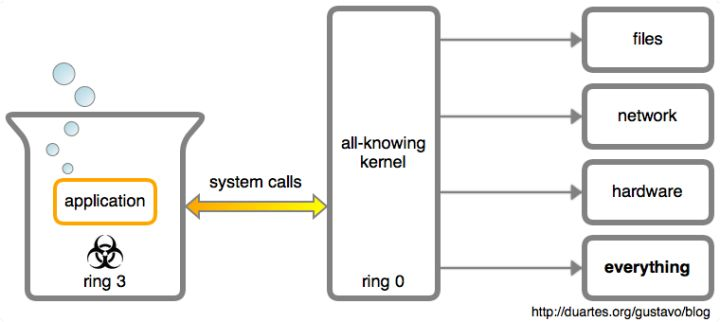

## libc glibc

`glibc` 和 `libc` 都是 Linux 下的 C 函数库。
`libc` 是 Linux 下的 ANSI C 函数库；glibc 是 Linux 下的 `GUN C` 函数库。
`libc` 实际上是一个泛指。凡是符合实现了 C 标准规定的内容，都是一种 `libc` 。
`glibc` 是 GNU 组织对 `libc` 的一种实现。它是 `unix/linux` 的根基之一。
微软也有自己的 `libc` 实现，叫 `msvcrt` 。
嵌入式行业里还常用 `uClibc` ，是一个迷你版的 `libc` 。
`libc`库中封装了系统调用，通过`libc`库间接调用 
原生的调用glibc也有提供，glibc 提供了 syscall(2) 函数，它可以不通过封装来产生一个系统调用
**`ANSI C` 和 `GNU C` 有什么区别呢？**

`ANSI C` 函数库是基本的 C 语言函数库，包含了 C 语言最基本的库函数。这个库可以根据头文件划分为 15 个部分，其中包括：
* `<ctype.h>`：包含用来测试某个特征字符的函数的函数原型，以及用来转换大小写字母的函数原型；
* `<errno.h>`：定义用来报告错误条件的宏；
* `<float.h>`：包含系统的浮点数大小限制；
* `<math.h>`：包含数学库函数的函数原型；
* `<stddef.h>`：包含执行某些计算 C 所用的常见的函数定义；
* `<stdio.h>`：包含标准输入输出库函数的函数原型，以及他们所用的信息；
* `<stdlib.h>`：包含数字转换到文本，以及文本转换到数字的函数原型，还有内存分配、随机数字以及其他实用函数的函数原型；
* `<string.h>`：包含字符串处理函数的函数原型；
* `<time.h>`：包含时间和日期操作的函数原型和类型；
* `<stdarg.h>`：包含函数原型和宏，用于处理未知数值和类型的函数的参数列表；
* `<signal.h>`：包含函数原型和宏，用于处理程序执行期间可能出现的各种条件；
* `<setjmp.h>`：包含可以绕过一般函数调用并返回序列的函数的原型，即非局部跳转；
* `<locale.h>`：包含函数原型和其他信息，使程序可以针对所运行的地区进行修改。地区的表示方法可以使计算机系统处理不同的数据表达约定，如全世界的日期、时间、美元数和大数字；
* `<assert.h>`：包含宏和信息，用于进行诊断，帮助程序调试。

上述库函数在其各种支持 C 语言的 IDE 中都是有的。

`GNU C` 函数库是一种类似于第三方插件的东西。由于 Linux 是用 C 语言写的，所以 Linux 的一些操作是用 C 语言实现的，因此，
`GUN` 组织开发了一个 C 语言的库 以便让我们更好的利用 C 语言开发基于 Linux 操作系统的程序。 不过现在的不同的 Linux 的
发行版本对这两个函数库有不同的处理方法，有的可能已经集成在同一个库里了。


----

## syscall
它与外部世界的每个交流都要在内核的帮助下通过系统调用才能完成。一个应用程序要想保存一个文件、写到终端、或者打开一个 TCP 连接，内核都要参与。应用程序是被内核高度怀疑的：认为它到处充斥着 bug，甚至是个充满邪恶想法的脑子。

这些系统调用是从一个应用程序到内核的函数调用。出于安全考虑，它们使用了特定的机制，实际上你只是调用了内核的 API。“ 系统调用(system call)”这个术语指的是调用由内核提供的特定功能（比如，系统调用 open()）或者是调用途径。你也可以简称为：syscall。



### 通过man syscall查看系统调用的文档
```shell
SYSCALL(2)                                                                             Linux Programmer's Manual                                                                             SYSCALL(2)

NAME
       syscall - indirect system call

SYNOPSIS
       #define _GNU_SOURCE         /* See feature_test_macros(7) */
       #include <unistd.h>
       #include <sys/syscall.h>   /* For SYS_xxx definitions */

       int syscall(int number, ...);

DESCRIPTION
       syscall()  is a small library function that invokes the system call whose assembly language interface has the specified number with the specified arguments.  Employing syscall() is useful, for
       example, when invoking a system call that has no wrapper function in the C library.

       syscall() saves CPU registers before making the system call, restores the registers upon return from the system call, and stores any error code returned by the system call in  errno(3)  if  an
       error occurs.

       Symbolic constants for system call numbers can be found in the header file <sys/syscall.h>.

RETURN VALUE
       The return value is defined by the system call being invoked.  In general, a 0 return value indicates success.  A -1 return value indicates an error, and an error code is stored in errno.

NOTES
       syscall() first appeared in 4BSD.

   Architecture-specific requirements
       Each  architecture  ABI has its own requirements on how system call arguments are passed to the kernel.  For system calls that have a glibc wrapper (e.g., most system calls), glibc handles the
       details of copying arguments to the right registers in a manner suitable for the architecture.  However, when using syscall() to make a system call, the caller might need to  handle  architec‐
       ture-dependent details; this requirement is most commonly encountered on certain 32-bit architectures.

       For  example,  on the ARM architecture Embedded ABI (EABI), a 64-bit value (e.g., long long) must be aligned to an even register pair.  Thus, using syscall() instead of the wrapper provided by
       glibc, the readahead() system call would be invoked as follows on the ARM architecture with the EABI:

           syscall(SYS_readahead, fd, 0,
                   (unsigned int) (offset >> 32),
                   (unsigned int) (offset & 0xFFFFFFFF),
                   count);

       Since the offset argument is 64 bits, and the first argument (fd) is passed in r0, the caller must manually split and align the 64-bit value so that it is passed in the  r2/r3  register  pair.
       That means inserting a dummy value into r1 (the second argument of 0).

       Similar issues can occur on MIPS with the O32 ABI, on PowerPC with the 32-bit ABI, and on Xtensa.

       The affected system calls are fadvise64_64(2), ftruncate64(2), posix_fadvise(2), pread64(2), pwrite64(2), readahead(2), sync_file_range(2), and truncate64(2).

   Architecture calling conventions
       Every architecture has its own way of invoking and passing arguments to the kernel.  The details for various architectures are listed in the two tables below.

       The  first  table lists the instruction used to transition to kernel mode, (which might not be the fastest or best way to transition to the kernel, so you might have to refer to the VDSO), the
       register used to indicate the system call number, and the register used to return the system call result.

       arch/ABI   instruction          syscall #   retval Notes

```

 [Linux](https://github.com/torvalds/linux/blob/v3.17/arch/x86/syscalls/syscall_64.tbl) 和 [Windows](https://j00ru.vexillium.org/syscalls/nt/32/) 的全部系统调用列表。它们各自有大约 310 和 460 个系统调用。看这些系统调用是非常有趣的，因为，它们代表了软件在现代的计算机上能够做什么。

 系统调用主要是通过中断门实现的，通过软中断int发出中断信号。由于要支持的系统功能很多，不可能每个系统调用就占用一个中断向量。所以规定了0x80为系统调用的中断向量号，在进行系统调用之前，向eax中写入系统调用的子功能号，再进行系统调用的时候，系统就会根据eax的值来决定调用哪个中断处理例程。

 **系统调用** : 是操作系统提供给用户程序调用的接口。用户程序通过接口来获得操作系统内核提供的服务。系统调用可被看成是一个内核与用户空间程序交互的接口——它好比一个中间人，把用户进程的请求传达给内核，待内核把请求处理完毕后再将处理结果送回给用户空间。系统调用的概念涉及到内核态和用户态:

 **内核态** ： 当一个任务（进程）执行系统调用而陷入内核代码中执行时，我们就称进程处于内核运行态（或简称为内核态）。此时处理器处于特权级最高的（0级）内核代码中执行。当进程处于内核态时，执行的内核代码会使用当前进程的内核栈。每个进程都有自己的内核栈。

**用户态** ： 当进程在执行用户自己的代码时，则称其处于用户运行态（用户态）。即此时处理器在特权级最低的（3级）用户代码中运行。当正在执行用户程序而突然被中断程序中断时，此时用户程序也可以象征性地称为处于进程的内核态。因为中断处理程序将使用当前进程的内核栈。这与处于内核态的进程的状态有些类似。

应用代码从用户态到内核态是通过系统调用实现的。实现过程如下：

    1、准备调用参数
    2、系统调用进入内核态
    3、内核态执行
    4、内核态的返回数据复制到用户态
    5、用户态得到调用结果

常见的unix系统调用主要分为三类：
* 文件操作系统的系统调用
  （create ，open，read，write，close，link，unlink，lseek，chmod，rename） 打开，关闭，读写，链接，取消链接，建立文件,lseek 设定文件的读写位置chmod 改变对文件的访问权限,rename 更改文件名
* 控制类的系统调用
  fork 创建一个子进程,wait 父进程等待子进程终止,exit 终止子进程的执行,exec 启动执行一个指定文件
* 信号和时间类的调用
  kill 把信号传送给一个或几个相关进程,sigaction 声明准备接收的信号类型,sigreturn 从信号返回，继续执行被信号中断的操作, stime 设置日历时间,time 获得日历时间,times 获得执行所花费的时间
  