#### Cassandra之中一共包含下面5种Key:

* Primary Key
* Partition Key
* Composite Key
* Compound Key
* Clustering Key
  
Primary key 是用来获取某一行的数据， 可以是一列或者多列（复合列 composite）;
Primary = Partition Key  + [Clustering Key] （Clustering Key 可选）;
Clustering keys 包括下面两种情况：

    (1) composite key
    (2) compound key

```sql
//partition key, clustering key 都可以是复合列
// partition key ->(k_part_one,k_part_two)
// clustering key -> k_clust_one, k_clust_two, k_clust_three
create table stackoverflow (
      k_part_one text,
      k_part_two int,
      k_clust_one text,
      k_clust_two int,
      k_clust_three uuid,
      data text,
      PRIMARY KEY((k_part_one,k_part_two), k_clust_one, k_clust_two, k_clust_three)      
);
```

**Partition Key **: Cassandra会对partition key 做一个hash计算，并自己决定将这一条记录放在哪个node; 
Partition Key的设计，可以完全的借用MySQL的主键。MySQL的主键可以是单一主键，也可以是复合主键.
primary key一旦定义，后续无法修改。primary key 包含两部分，可以表示为(part1, part2)，其中，part1是partition key，用于确定数据的partition，part2为可选部分，为clustering key，用于确定数据在partition内部的顺序，其中，clustering key是可选的，而partition key是必须部分.
Partition Key 长度必须小于等于 65535 字节.

**Composite Key**:
partition key包含多columns时，称为Composite Partition Key。这种Partition Key 可以将数据划分为多份，可以解决Cassandra中的热点问题或者是大量数据写入单节点的问题。不过，这种情况下，如果要读取数据，需要指定所有的partition key的columns。

**Clustering Key** : 主要用于进行Range Query. 并且使用的时候需要按照建表顺序进行提供信息,
Cassandra中所有的数据都只能根据Primary Key中的字段来排序, 因此, 如果想根据某个column来排序, 必须将改column加到Primary key中, 如 primary key (id, c1, c2 ,c3), 其中id时partition key, c1, c2 ,c3是Clustering Key.(如果想用id和c1作为partition key, 只需添加括号: primary key ((id, c1), c2 ,c3)).

#### 简化的cassandra数据模型:
```java
Map<RowKey, SortedMap<ColumnKey, ColumnValue>>
```
Cassandra 整体数据可以理解成一个巨大的嵌套的Map。 只能按顺序一层一层的深入，不能跳过中间某一层.

**Cassandra之中的存储，是2-level nested Map
Partition Key –> Custering Key –> Data
partition key: eq and in
clustering key: < <= = >= > in**


**Compound Key**:
同时包含partition key 和 cluster key。cluster key用于数据在节点内的排序，指定cluster key后，可以快速的读取数据。

**Materialized view**:
Cassandra 也提供了 materialized view。Cassandra 的 materialized view 其实是基于另外的表的数据创建的一张新表， 新表与原来的表相比具有不同的primay key和属性.

##### Cassandra 之中的Hash 算法： MurMur3

MurmurHash 是一种非加密型哈希函数，适用于一般的哈希检索操作。由Austin Appleby在2008年发明，并出现了多个变种，都已经发布到了公有领域(public domain)。与其它流行的哈希函数相比，对于规律性较强的key，MurmurHash的随机分布特征表现更良好
Murmur哈希算法最大的特点是：

    碰撞率低
    计算速度快

因此，不仅是Cassandra，在常见的大数据库底层，都使用了这个算法作为底层的存储算法。

-------

#### Cassandra中的数据类型:
- 数字数据类型
  
    **int**：32位有符号整型
    **bigint**：64位长整型
    **smallint**：16位有符号整型
    **tinyint**：8位有符号整型
    **varint**：可变精度有符号整数
    **float**：32位 IEEE-754 浮点型
    **double**：64位 IEEE-754 浮点型
    **decimal**：可变精度的 decimal

- 文本数据类型
    
    **text, varchar**：UTF-8编码的字符串
    **ascii**：ASCII字符串。

- 时间和标识符数据类型

    **timestamp**：时间可以使用64位有符号的整数表示，但是一般为了可读性，我们会选择支持 ISO 8601 标准的时间戳表示。建议在使用时间戳的时候都指定时区，而不是依赖系统的时区。
    **date, time**：是支持 ISO 8601 标准的。
    **uuid**：通用唯一识别码（universally unique identifier，UUID）是128位数据类型，其实现包含了很多种类型，其中最有名的为 Type 1 和 Type 4。CQL 中的 uuid 实现是 Type 4 UUID，其实现完全是基于随机数的。UUID 的数据类似于 ab7c46ac-c194-4c71-bb03-0f64986f3daa，uuid 类型通常用作代理键，可以单独使用，也可以与其他值组合使用。由于 UUID 的长度有限，因此并不能绝对保证它们是唯一的。我们可以在 CQL 中使用 uuid() 获取 Type 4 UUID。
    **timeuuid**：这个是 Type 1 UUID，它的实现基于计算机的 MAC 地址，系统时间和用于防止重复的序列号。CQL 中提供了 now(), dateOf() 以及 unixTimestampOf() 等函数来操作 timeuuid 数据类型。由于这些简便的函数，timeuuid 的使用频率比 uuid 数据类型多。

- 集合数据类型
    
    **set** : 这种数据类型可以存储集合数据类型，set 里面的元素存储是无序的，但是 cql 返回的数据是有序的。set 里面可以存储前面介绍的数据类型，也可以是用户自定义数据类型，甚至是其他集合类型
    **list** : 包含了有序的列表数据，默认情况下，数据是按照插入顺序保存的
    **map** : 数据类型包含了 key/value 键值对。key 和 value 可以是任何类型，除了 counter 类型
- 其他简单数据类型
    **boolean**：值只能为 true/false，在 cql 中输入的这两个值无论大小如何写法，其输出都是 True/False；
    **blob**：二进制大对象（binary large object）是任意字节数组的术语简称。这个类型在存储媒体或者其他二进制数据类型时很有用，Cassandra 并不会检查其中存储的二进制数据是否有效。Cassandra 中二进制大对象是以十六进制存储的，如果我们想将任意的文本数据类型使用 blob 存储，可以使用 textAsBlob() 函数实现。
    **inet**：这个数据类型可以表示 IPv4 或 IPv6 网络地址。cqlsh 接受用于定义 IPv4 地址的任何合法格式，包括包含十进制，八进制或十六进制值的点或非点式表示。CQL 统一输出为 1.1.1.1 这种 ip 地址形式。
    **counter**：计数器数据类型是64位有符号整数，其值不能直接设置，而只能递增或递减。计数器类型的使用有一些特殊限制，它不能用作主键的一部分；如果使用计数器，则除primary key 列之外的所有列都必须是计数器
- 用户自定义数据类型
    Cassandra 中如果内置的数据类型无法满足我们的需求，我们可以使用自定义数据类型的功能。比如我们想用一个字段存储用户的地址信息，然后我们需要获取地址的邮编、街道等信息，如果使用 text 来存储是不能满足我们的需求的。这时候就可以自己定义数据类型，如下：
    ```sql
    cqlsh:sample_keyspace> CREATE TYPE address (
                    ... street text,
                    ... city text,
                    ... state text,
                    ... zip_code int);
    ```
    Cassandra 中数据类型的定义是 keyspace 范围的，也就是说， address 数据类型只能在 sample_keyspace 里面使用

#### SStable

在 Cassandra 中，当达到一定条件触发 flush 的时候，表对应的 Memtable 中的数据会被写入到这张表对应的数据目录（通过 data_file_directories 参数配置）中，并生成一个新的 SSTable（Sorted Strings Table，这个概念是从 Google 的 BigTable 借用的）。每个 SSTable 是由一系列的不可修改的文件组成，这些文件在 Cassandra 中被称为 Component,SSTable 由以下 Component 组成:
```shell
total 216
-rw-r--r--. 1 cassandra cassandra    67 Jul  1 10:14 mc-17-big-CompressionInfo.db
-rw-r--r--. 1 cassandra cassandra 81146 Jul  1 10:14 mc-17-big-Data.db
-rw-r--r--. 1 cassandra cassandra    10 Jul  1 10:14 mc-17-big-Digest.crc32
-rw-r--r--. 1 cassandra cassandra    32 Jul  1 10:14 mc-17-big-Filter.db
-rw-r--r--. 1 cassandra cassandra   108 Jul  1 10:14 mc-17-big-Index.db
-rw-r--r--. 1 cassandra cassandra  4942 Jul  1 10:14 mc-17-big-Statistics.db
-rw-r--r--. 1 cassandra cassandra    56 Jul  1 10:14 mc-17-big-Summary.db
-rw-r--r--. 1 cassandra cassandra    92 Jul  1 10:14 mc-17-big-TOC.txt
-rw-r--r--. 1 cassandra cassandra    59 Jul  2 06:37 mc-21-big-CompressionInfo.db
-rw-r--r--. 1 cassandra cassandra 71477 Jul  2 06:37 mc-21-big-Data.db
-rw-r--r--. 1 cassandra cassandra    10 Jul  2 06:37 mc-21-big-Digest.crc32
-rw-r--r--. 1 cassandra cassandra    40 Jul  2 06:37 mc-21-big-Filter.db
-rw-r--r--. 1 cassandra cassandra   205 Jul  2 06:37 mc-21-big-Index.db
-rw-r--r--. 1 cassandra cassandra  4975 Jul  2 06:37 mc-21-big-Statistics.db
-rw-r--r--. 1 cassandra cassandra    56 Jul  2 06:37 mc-21-big-Summary.db
-rw-r--r--. 1 cassandra cassandra    92 Jul  2 06:37 mc-21-big-TOC.txt
```

 从上面文件名可以看出，所有的 Component 都是由 mc-17-big 开头的，每个文件名都是由 version-generation-SSTable Format type-Component name 组成，由 - 分割，每个字符的含义如下：

    version：这个代表 SSTable 存储格式的版本号，目前最新的 Cassandra 3.11.4 版本为 md，其他有效的版本为 jb、ka、la、lb、ma、mb 以及 mc 等，比如 Cassandra 3.0.8 的版本就是 mc。具体参见 org.apache.cassandra.io.sstable.format.big.BigFormat.BigVersion；
    generation：代表索引号，每次生成新的 SSTable 时，这个索引号都会递增；
    SSTable Format type：SSTable格式类型，主要有两种 BIG 和 LEGACY，但是他们的名字都是 big；
    Component name：代表当前文件存储的信息类型，比如 Data 代表存储的是用户实际写入的数据；Index 代表存储的是索引数据等。当前版本的 Cassandra 组件有 Data.db、Digest.crc32、CompressionInfo.db、Summary.db、Filter.db、Index.db、TOC.txt 以及 Statistics.db。

上面这些组件共同构建 SSTable，每种文件存储不同类型的数据，本文就是来介绍这些文件的作用以及文件之间的关联

    mc-17-big-Data.db : 是存储用户插入到 Cassandra 对应表中数据的
    mc-17-big-Index.db : SSTable 对应的 mc-17-big-Data.db 可能会很大，为了加快查询速度，Cassandra 对 mc-17-big-Data.db 文件中的每个 Partition Key 建立了相关索引数据，这个就是 mc-17-big-Index.db 文件的作用了。mc-17-big-Index.db 文件存储的内容其实很简单，存储的是 Partition Key 及其在 mc-17-big-Data.db 文件中的起始偏移量
    mc-17-big-Summary.db : 如果 mc-17-big-Index.db 文件也很大，也可能会影响查询速度。所以 Cassandra 引入了 mc-17-big-Summary.db 文件，对索引文件 mc-17-big-Index.db 进行抽样。具体过程为：每隔128个 Partition Key 就将对应的 Partition Key 及其在索引文件中的起始偏移量写入到 Summary.db 文件中去。同时，Summary.db 文件最后面还会存储 mc-17-big-Index.db 文件中的起止 Partition Key。

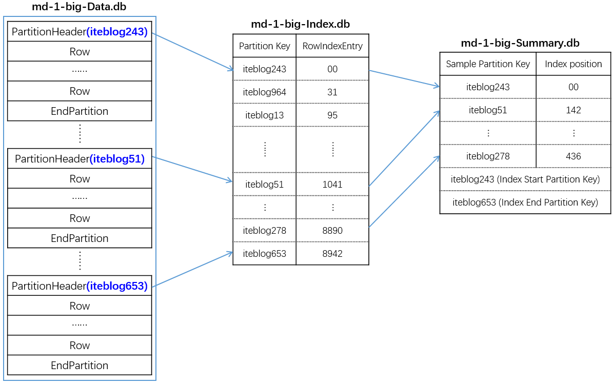
    
    mc-1-big-Statistics.db : 
    包含有关 SSTable 的统计元数据的文件。主要包含当前 SSTable 的：
        最大最小 token 的值及对应的 Partition Key；
        Partitioner，默认为 org.apache.cassandra.dht.Murmur3Partitioner，和 Bloom Filter FP chance，主要用于校验 SSTable，在读取 Data.db 之前会先被读取；
        SSTable 元数据，比如 SSTable 最大最小的时间戳、最大最小 local deletion time、最大最小的 TTL、SSTable 文件的压缩率、行数、列个数以及最大和最小的 ClustringValues，如果为空这保存为 0 等等
        Partition Key 的类型；
        Clustering Key 的类型；
        静态列的名字及类型；
        正常类的名字及类型；
        Clustering Key 的类型；

    md-1-big-CompressionInfo.db : 存储 SSTable 的压缩相关的信息，包括使用的压缩算法的名字（LZ4Compressor，SnappyCompressor 和 DeflateCompressor，SSTable 的压缩算法可以在创建表的时候通过 WITH compression = {'sstable_compression': 'SnappyCompressor' 设置，默认为 LZ4Compressor），压缩算法的配置选项，chunkLength（默认为 65536），未压缩数据的长度，chunk 的个数等相关的信息
    md-1-big-Filter.db : 存储 Partition Key 布隆过滤器相关的信息，这个文件会被加载到内存，在查询的时候可以确定某行数据是否在这个 SSTable 中，减少访问磁盘的次数
    md-1-big-Digest.crc32 : 这个文件存储的仅仅是数据文件的 CRC 校验码信息
    md-1-big-TOC.txt : 这个文件主要存储 SSTable 的 Component 名字

```shell
[root@cassandra-default-0 truncated-1562049422294-indexes]# cat mc-17-big-TOC.txt
CompressionInfo.db
Summary.db
Index.db
Filter.db
Data.db
TOC.txt
Statistics.db
Digest.crc32
```

#### Partitions

Cassandra 一般是由多台节点组成的，每台节点负责一定范围的，如果使用 Murmur3hash 的时候，每个节点负责的 Token 类似于下面那样:
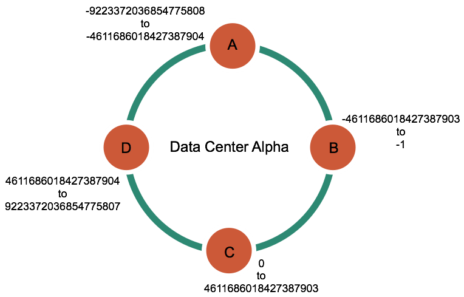
Token 范围为 -9223372036854775808 ~ -4611686018427387904 的数据存储在 A 节点；同理，Token 范围为 -4611686018427387903 ~ -1 之间的数据存储在 B节点，其他类似；每个 Token 范围由多个 Partition 构成，每个 Partition 由一行或多行数据组成,在底层存储中，多个 Partition 组成一个 SSTable（Sorted-String Table）文件


-----------------------------------------------------------------------

#### 系统要求:

Scylla 只运行在 linux64位的机器环境中,以下是所支持的linux发行版本:
|Linux distribution |Version|
| ----- | ----- |
|CentOS/RHEL 	|7.2 and above|
|Ubuntu 	|14.04 *, 16.04|
|Ubuntu 	|18.04 **|
|Debian 	|8.6 and above (minor releases)|
|Debian 	|9.0 **|

#### cpu Core :

ScyllaDB 会最大化的使用所持有的资源,The shard-per-core机制会让Scylla随着cpu核数的增加而线性扩张,同时对所持有的存储和网络带宽资源进行均衡

#### 内存memery :

在中-高的负载情况下,推荐使用`64 GB-256 GB`大小的内存,同时随着cpu核数的增加,也要变更对应的岑村分配
推荐每个CPU核对应响应的内存数,推荐每个cpu核:`16 GB or 2GB per`

`/etc/sysconfig/scylla-server --memory 2G` 配置可以指定消耗的内存数
`/etc/sysconfig/scylla-server --smp 2` 配置可以指定使用的cpu数
#### 硬盘存储 :

#### CONSISTENC一致性

- ANY
- ONE
- TWO
- THREE
- QUORUM
- ALL
- LOCAL_QUORUM
- LOCAL_ONE
- SERIAL
- LOCAL_SERIAL

串行化一致性只被使用在条件更新:`INSERT, UPDATE and DELETE with an IF condition)`,类似于`paxos`的串行化一样.当一个一致性为`QUORUM`的写操作,那么一个一致性要求为`QUORUM`的读操作就可以读取出刚才写入的数据,如果一个一致性为`ANY`的写操作,那么只有一致性为`SERIAL`的读操作才可以读出刚才写入的数据

-----
#### cassandra 迁移至 scyllaDB,可以遵循以下步骤:
    1:在 scylladb中创建和cassandra相同的数据表schema
    2:配置上层的应用程序进行双写,同时写入cassandra 和 scylladb
    3:为即将迁移的cassandra中的数据制作snapshot
    4:使用sstableloader tool加载 sstable中的snapshot数据
    5:停止cassandra的服务
----

    Scylla 3.0 is a drop-in replacement for Apache Cassandra 3.11, supporting both the data format (SSTable) and all relevant external interfaces, with many features from more advance Apache Cassandra releases.
    Scylla 3.0 是 Apache Cassandra 3.11 的一个很好的替代,支持同样的数据格式(SSTABLE),和所有的对外接口:
    1:All Apache Cassandra Drivers
    2:Tooling: cqlsh, nodetool, cassandra-stress, and all of Cassandra 3.x tools
    3:Protocols: CQL, Thrift, JMX
    4:SSTable format

----

#### Global Secondary indexes(Secondary indexes)

在Scylla中分布数据是根据在schema中定义的partition key来进行的,这是一个非常高效的查询一列数据的方式,但是这也意味着用一个非non-partition key来查询数据时,会非常的低效.
Global Secondary indexes可以提供这样一种机制:在非non-partition keys的列上建立索引
Secondary Index的原理类似于创建一张新的表, 该表的primary key就是索引的列

Secondary indexes可以提供许下的功能:

    1:可以在不停止程序的情况下,动态的建立索引和删除索引
    2:可以在使用Secondary indexes的情况下,reads是可扩展的
    3:更新Secondary indexes上的materialized views数据将会非常的迅速

##### How Secondary Index Queries Work?

Scylla breaks indexed queries into two parts:

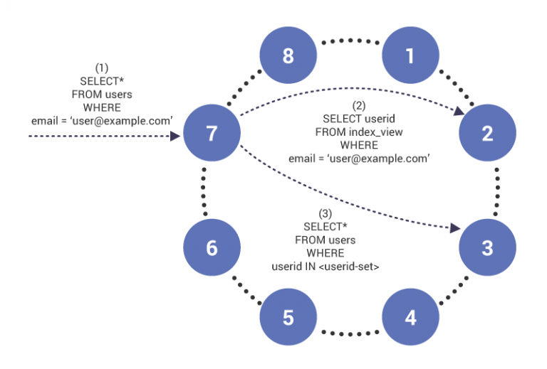

    1:a query on the index table to retrieve partition keys for the indexed table, and
    2:a query to the indexed table using the retrieved partition keys.

In the example above:

    The query arrives on node 7, which acts as a coordinator for the query.
    The node notices the query on an index column and issues a read to index table on node two, which has the index table row for “user@example.com”;
    This query will return a set of user IDs that are now used to retrieve contents of the indexed table.

To enable experimental features in Scylla, add the line experimental: true to scylla.yaml. Stop and restart the node. You can also start a docker node using the -experimental 1 option.

Global Secondary indexes:现在还是一项实验性功能,可以通过配置文件选择是否支持

----------


#### Local Secondary Indexes

本地二级索引是对`Global Secondary Indexes`的一个增强,本地二级索引允许Scylla在partition key和index是同一个key的时候进行工作负载优化.

* `Partition Key` 负责将数据分布到集群节点上
* `Clustering Key` 负责在partition中的数据排序
* Primary key在表的key只有一个field的情况下雨`partition key`是等效的
* `Composite/compound Key`是多列key
* Cassandra的`Primary Key`由`Partition Key`和`Clustering Key`两部分组成
* Cassandra中所有的数据都只能根据`Primary Key`中的字段来排序, 因此, 如果想根据某个column来排序, 必须将改column加到`Primary key`中

----------------

#### cqlsh 语言协议交互,和cassandra保持一致,cqlsh本身基于python 2.7

----------
#### Scylla Materialized Views

有时查询一些数据时,需要使用更多的key来进行辅助检索,例如:

    1:用户记录表包含`name`和`ID`两列数据,但有时需要根据`name`,有时需要根据`ID`来查询
    2:当需要根据分数来进行判定时,选取并筛选出不同时间断的的最高得分

在Scylla中,数据根据`partition key`来进行分区和查找,有时应用会根据另一个普通列查找一个`partition or partitions`,在这个普通列上建立索引可以加快查询,有时会需要在`clustering key`上建立索引

一个`materialized view`就是一个全局索引,等效于一个新的表,不可以直接更新这个`materialized view`,如果需要更新的话,就需要更新`materialized view`依赖的底层表
每一个`materialized view`中的数据都有对应的底层数据

Scylla Counters:

Counter  可以用来设置计数器,用于统计页面的访问次数,应用的下载次数等等这些常用的数据统计;
一个`counter`类型的列值是只允许增加,减少,读和删除,作为一种类型counters是类似于`uint64`的整数,所有之上的更新都是原子性的,非常适合于统计.
```sql
CREATE TABLE cf (pk int PRIMARY KEY, my_counter counter);
UPDATE cf SET my_counter = my_counter + 6 WHERE pk = 0;
UPDATE cf SET my_counter = my_counter - 1 WHERE pk = 0;
```

--------
## Scylla Architecture

    Scylla Ring Architecture - High-Level view of Scylla Ring Architecture 全局视角的Scylla Ring架构
    Scylla Fault Tolerance - Deep dive into Scylla Fault Tolerance Scylla中的节点失效处理
    Consistency Level Console Demo - Console Demos of Consistency Level Settings Scylla中的一致性模型
    Scylla Anti-Entropy - High-Level view of Scylla Anti-Entropy 全局维度了解Scylla的反熵修复工具
    SSTable - Scylla SSTable 2.0 and 3.0 Format Information Scylla中的SSTable结构信息
    Compaction Strategies - High-level analysis of different compaction strategies  Scylla中的压缩策略


### Scylla Ring Architecture

一个Scylla集群是由多个nodes(不是机器)组成的,这些node可以想象为一个环

Scylla `keyspace`是一系列的表的合集,同时定义了这些表的数据如何分布在Scylla集群的虚拟node中的,这些如何分布数据的参数在创建`keyspace`时就被指定:`replication factor` 复制因子

table 就是schema所定义的标准的行与列,`primary key`应该是columns中的一个

```sql
CREATE TABLE users (
     ID int,
     NAME text,
     ADDRESS text,
     PHONE text,
     PHONE_2 text,
     PRIMARY KEY (ID)
);
```

primary key唯一的定义了在表中的行,clustering keys则用来在一个指定的partition上进行的排序

token 是一个用来标识所有的`nodes`和`partitions`值,`partition key`唯一标识了一个分区,token就是根据primary key hash计算出来的,然后根据这个值放置到对应的虚拟node

`partition`是存储在`node`以及复制`node`中的有序数据,在物理层面上,一个`partition`就是被`partition key`唯一标识出来的已经排序好的数据

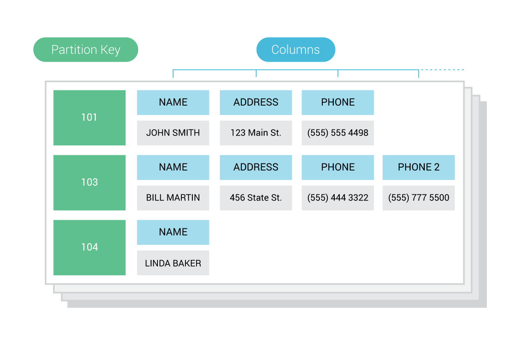

在上图中,有三个`partition`,`partition key`分别为:101,102,103
`partition key`主要用来标识存储指定的`partition`的`node`,同时也用来在一个集群中的`node`上分布数据

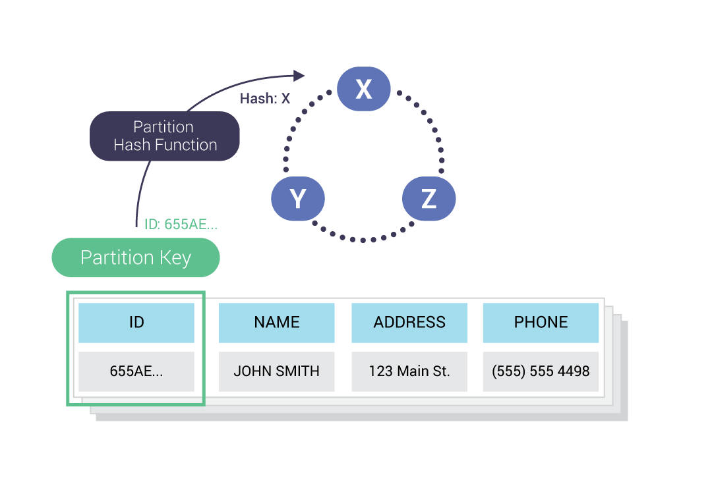

partition hash function 计算并决定了数据在集群中的哪一个node上存储,通过为每一个`partition`计算出来的token来确定;默认使用 Murmur3 hashing function 来计算这个值,然后确定放置在集群的何处

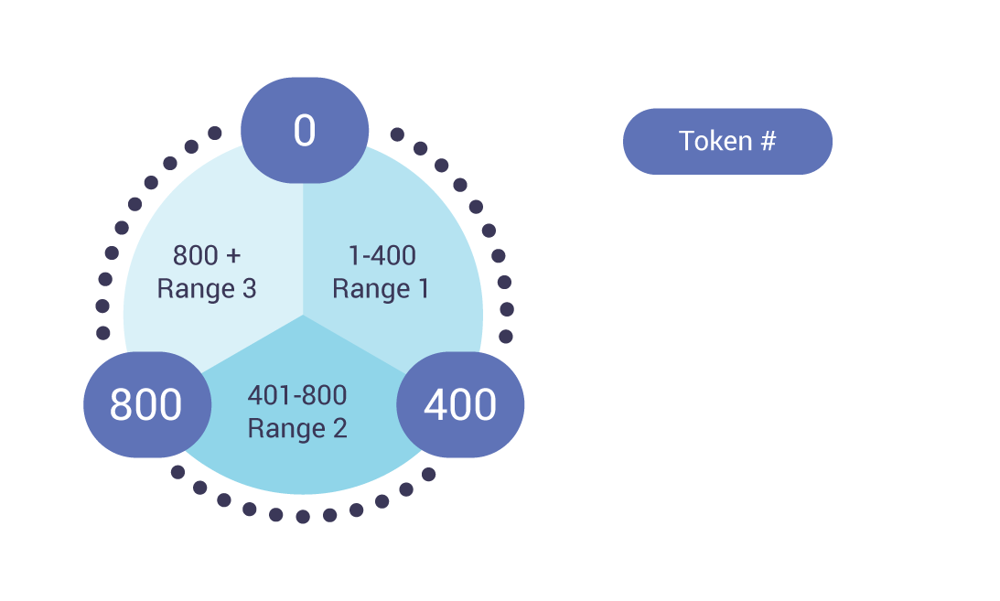

上图假设` 0-1200 token `被分散到3节点的集群上,Scylla默认使用`Murmur3 partitioner`计算分布token,

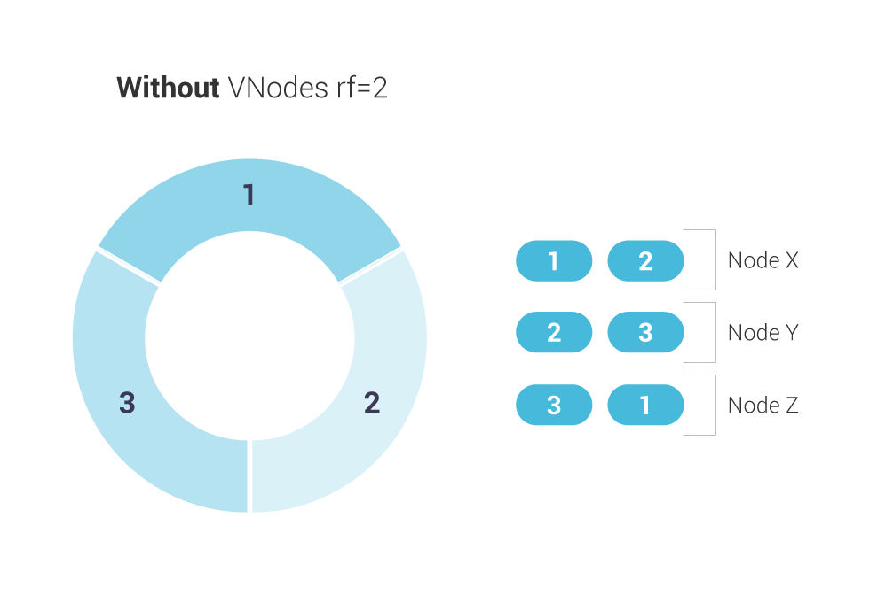

在上图中, 每个数字代表一个token区域, 复制因子为2
但是在Scylla中,又使用了` Vnode-oriented architecture`面向虚拟节点的架构,一个虚拟节点代表一个`token`区域,一个实际的物理节点可以装载多个`token range`不连续的虚拟节点;这种面向虚拟节点的架构的好处就是:
1:增加或者移除一个物理节点时的负载均衡更好
2:在重新加载数据文件时速度更快,不在一个节点一个文件的加载,可以并行的快速加载重建数据文件

同时,虚拟节点数是可以配置的,默认是256个

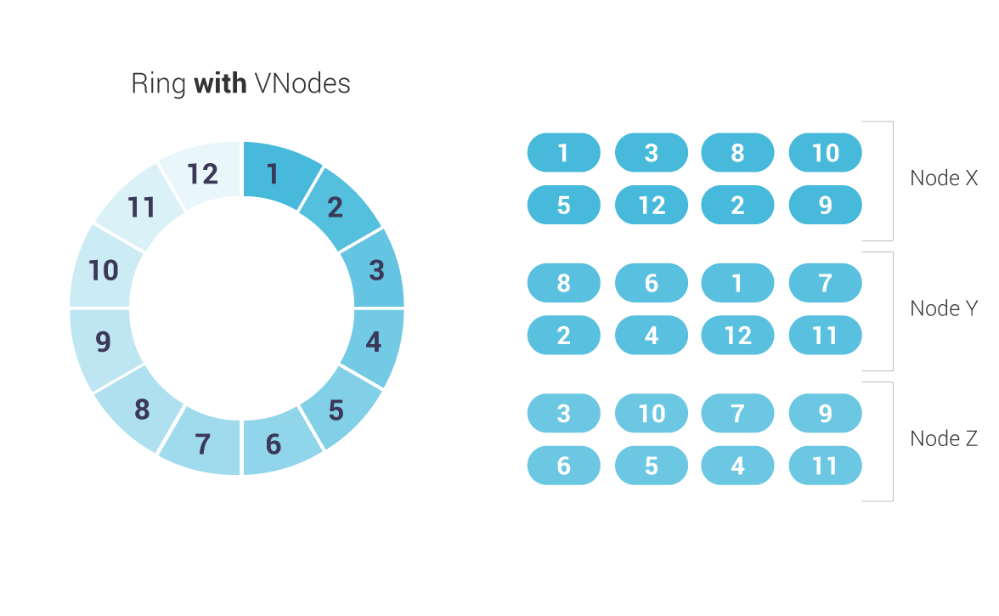

可以使用nodetool工具查看当前的节点状态
```shell
$ nodetool ring <keyspace>
[root@cassandra-default-0 /]# nodetool -u cassandra -pw cassandra ring xxxxxxx

Datacenter: default
==========
Address        Rack        Status State   Load            Owns                Token                                       
                                                                              9138188076677973395                         
10.224.5.91    Rack1       Up     Normal  244.32 MiB      100.00%             -8765817163706173032                        
10.224.10.113  Rack1       Up     Normal  244.29 MiB      100.00%             -8711880640738946554                        
10.224.10.113  Rack1       Up     Normal  244.29 MiB      100.00%             -8615616206296336382                        
10.224.10.113  Rack1       Up     Normal  244.29 MiB      100.00%             -8610072045723225931                        
10.224.5.91    Rack1       Up     Normal  244.32 MiB      100.00%             -7995389989716582996                        
10.224.5.91    Rack1       Up     Normal  244.32 MiB      100.00%             -7687884359435169266                        
.....                      

Datacenter: olap
==========
Address        Rack        Status State   Load            Owns                Token                                       
                                                                              9186461206844394444                         
10.224.8.5     Rack1       Down   Normal  177.02 MiB      75.02%              -8609766012404536075                        
10.224.8.95    Rack1       Up     Normal  281.4 KiB       78.80%              -8454809580430567766                        
10.224.6.5     Rack1       Down   Normal  177.01 MiB      72.62%              -8414043834769784280                        
10.224.6.5     Rack1       Down   Normal  177.01 MiB      72.62%              -8354106377341756316                        
10.224.2.9     Rack1       Down   Normal  177 MiB         73.57%              -7908497066862545981                        
10.224.8.95    Rack1       Up     Normal  281.4 KiB       78.80%              -7797069260332782949                        
10.224.8.95    Rack1       Up     Normal  281.4 KiB       78.80%              -7729052548325044440                        
10.224.2.9     Rack1       Down   Normal  177 MiB         73.57%              -7214628813984985896                        
10.224.2.9     Rack1       Down   Normal  177 MiB         73.57%              -6904841483258241661                        
10.224.6.5     Rack1       Down   Normal  177.01 MiB      72.62%              -6858487009271043304                        
10.224.8.95    Rack1       Up     Normal  281.4 KiB       78.80%              -6772505638122627967                                       
.....

```
输出会显示一个`node`的`token`,`token ring`的相关信息

可以看到,对每一个`token`,都会有对应的`node`,哪一个`rack`,当前的`status (Up or Down)`状态

```shell
$ nodetool describering <keyspace>
TokenRange(start_token:4811166359693093281, end_token:4827637813908199086, endpoints:[10.224.8.5, 10.224.10.113, 10.224.2.9, 10.224.8.95, 10.224.0.99, 10.224.5.91], rpc_endpoints:[10.224.8.5, 10.224.10.113, 10.224.2.9, 10.224.8.95, 10.224.0.99, 10.224.5.91], endpoint_details:[EndpointDetails(host:10.224.8.5, datacenter:olap, rack:Rack1), EndpointDetails(host:10.224.10.113, datacenter:default, rack:Rack1), EndpointDetails(host:10.224.2.9, datacenter:olap, rack:Rack1), EndpointDetails(host:10.224.8.95, datacenter:olap, rack:Rack1), EndpointDetails(host:10.224.0.99, datacenter:default, rack:Rack1), EndpointDetails(host:10.224.5.91, datacenter:default, rack:Rack1)])
TokenRange(start_token:1392066066874037531, end_token:1471177223511821957, endpoints:[10.224.8.95, 10.224.0.99, 10.224.5.91, 10.224.10.113, 10.224.8.5, 10.224.6.5], rpc_endpoints:[10.224.8.95, 10.224.0.99, 10.224.5.91, 10.224.10.113, 10.224.8.5, 10.224.6.5], endpoint_details:[EndpointDetails(host:10.224.8.95, datacenter:olap, rack:Rack1), EndpointDetails(host:10.224.0.99, datacenter:default, rack:Rack1), EndpointDetails(host:10.224.5.91, datacenter:default, rack:Rack1), EndpointDetails(host:10.224.10.113, datacenter:default, rack:Rack1), EndpointDetails(host:10.224.8.5, datacenter:olap, rack:Rack1), EndpointDetails(host:10.224.6.5, datacenter:olap, rack:Rack1)])
TokenRange(start_token:-6223919276413008133, end_token:-6163626923455140730, endpoints:[10.224.6.5, 10.224.5.91, 10.224.8.5, 10.224.0.99, 10.224.2.9, 10.224.10.113], rpc_endpoints:[10.224.6.5, 10.224.5.91, 10.224.8.5, 10.224.0.99, 10.224.2.9, 10.224.10.113], endpoint_details:[EndpointDetails(host:10.224.6.5, datacenter:olap, rack:Rack1), EndpointDetails(host:10.224.5.91, datacenter:default, rack:Rack1), EndpointDetails(host:10.224.8.5, datacenter:olap, rack:Rack1), EndpointDetails(host:10.224.0.99, datacenter:default, rack:Rack1), EndpointDetails(host:10.224.2.9, datacenter:olap, rack:Rack1), EndpointDetails(host:10.224.10.113, datacenter:default, rack:Rack1)])
```

输出显示了一个`keyspace`在6个物理节点的`TokenRange`分布


可以通过如下命令获取更新的集群信息:
```shell
[root@cassandra-default-0 /]# nodetool -u cassandra -pw cassandra describecluster        
Cluster Information:
	Name: cassandra-default-cluster
	Snitch: org.apache.cassandra.locator.GossipingPropertyFileSnitch
	DynamicEndPointSnitch: enabled
	Partitioner: org.apache.cassandra.dht.Murmur3Partitioner
	Schema versions:
		44fb3a0e-4c08-30bd-8452-b46ad5d4f1f7: [10.224.10.113, 10.224.0.99, 10.224.5.91, 10.224.8.95]

		UNREACHABLE: [10.224.6.5, 10.224.8.5, 10.224.2.9]

```

### Fault Tolerance 容错性

`Scylla` 通过指定的复制策略复制数据,复制策略决定了如何去复制和放置复制的数据,Scylla运行在`hash ring`上,所有的`node`都是平等的角色,没有`master`主节点,或者slave节点,或者备份集合.
`Replication Factor (RF)`复制因子指定了多少个复制数据会被放置到对应的`node`上,`rf=1`意味着当负载`node crash`之后,数据将无法恢复,只有当>2时,才会有保证;但是一般默认建议使用rf=3.
数据的复制是一个自动机制,`Read or write`读或者写操作会落在任何一份复制数据上

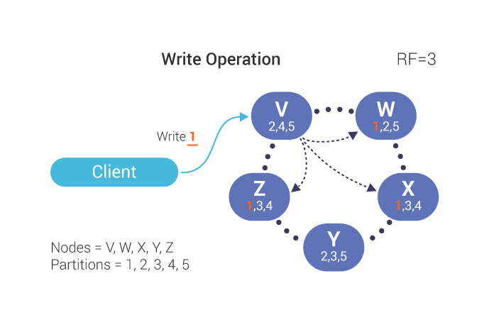

在如上的例子中,client发起一个请求,对`node V`上的`partition 1`进行写操作,`partition 1`的数据会被复制到`nodes W, X, Z`;`Replication Factor (RF)`因子为3,但是如上V,并不是一个数据的复制落点处,仅仅是个协调者节点,但是更通常的,复制数据node会是这个`coordinator node`

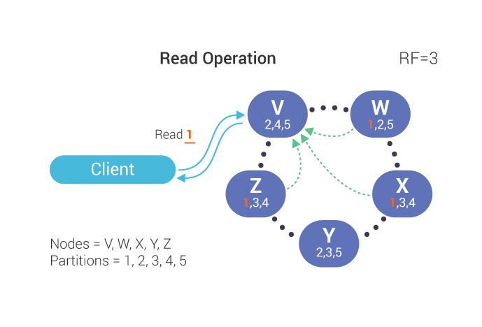

在读操作阶段,client发送请求到`coordinator`节点
`Consistency Level`一致性等级会决定,集群中多少份复制数据对读或者写的操作有返回确认后才能被认为是操作成功

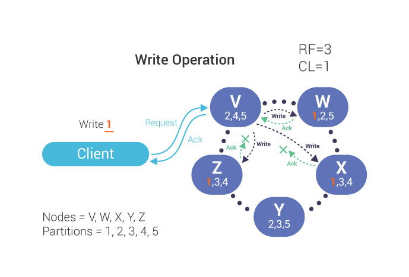
在写操作中,`coordinator node`和放置复制数据的节点(`Replication Factor`)进行通讯,只有当符合当前的一致性要求的复制数据节点返回确认之后,才会被认为是写成功.

在上图中,当client请求`coordinator node `之后,由于一致性要求是 `ONE`,`coordinator node V`只需要W node的返回即可确认写入操作.

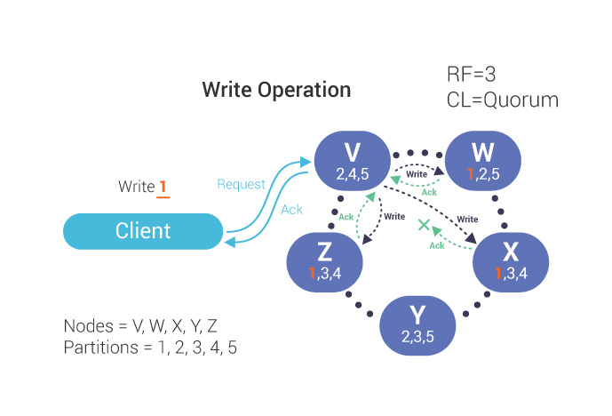
当`Consistency Level`设置为`QUORUM`时,`coordinator`节点就必须要等待`Replication Factor`复制因子3中的多数节点确认才可以认为是写入操作OK.

`Consistency Level and Replication Factor`都会对性能造成影响:
越低等级要求的`Consistency Level`一致性要求和少量的`Replication Factor`复制因子,系统就会读写操作更快,但是这样会当节点Down之后容错就会很差;
越高等级要求的`Consistency Level`一致性要求和更多的`Replication Factor`复制因子,系统会读写更慢,可用性更差.但是容错性会更好

在`CAP`理论中,一个分布式系统中的`Consistency, Availability and Partition Tolerance`,增强其中两个,会削减另外一个:


Scylla选择了`availability`和`partition tolerance`,这是基于:
1:不可能在可能有网络分区的情况下,保持一致性和高可用
2:如果牺牲一致性,将会收获高可用

### Consistency一致性

CONSISTENC一致性

- ANY
- ONE
- TWO
- THREE
- QUORUM
- ALL
- LOCAL_QUORUM
- LOCAL_ONE
- SERIAL
- LOCAL_SERIAL

串行化一致性只被使用在条件更新:`INSERT, UPDATE and DELETE with an IF condition)`,类似于`paxos`的串行化一样.当一个一致性为`QUORUM`的写操作,那么一个一致性要求为`QUORUM`的读操作就可以读取出刚才写入的数据,如果一个一致性为`ANY`的写操作,那么只有一致性为`SERIAL`的读操作才可以读出刚才写入的数据

### Scylla Anti-Entropy