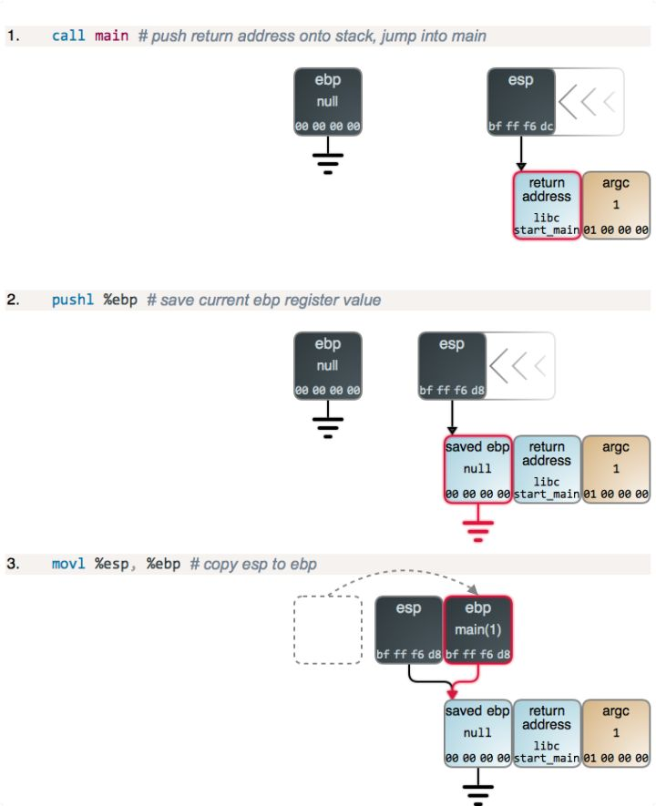

## STACK 栈的调用

当一个函数被调用时，将会创建一个 栈帧(stack frame)去支持函数的运行。这个栈帧包含函数的局部变量和调用者传递给它的参数。这个栈帧也包含了允许被调用的函数（callee）安全返回给其调用者的内部事务信息。栈帧的精确内容和结构因处理器架构和函数调用规则而不同。下图是一个处于栈顶部的一个单个栈帧：


在图上的场景中，有三个 CPU 寄存器进入栈。 栈指针(stack pointer) esp（LCTT 译注：扩展栈指针寄存器） 指向到栈的顶部。栈的顶部总是被最后一个推入到栈且还没有弹出的东西所占据，就像现实世界中堆在一起的一叠盘子或者 100 美元大钞一样。

保存在 esp 中的地址始终在变化着，因为栈中的东西不停被推入和弹出，而它总是指向栈中的最后一个推入的东西。许多 CPU 指令的一个副作用就是自动更新 esp，离开寄存器而使用栈是行不通的。

在 Intel 的架构中，绝大多数情况下，栈的增长是向着低位内存地址的方向。因此，这个“顶部” 在包含数据的栈中是处于低位的内存地址（在这种情况下，包含的数据是 local_buffer）。注意，关于从 esp 到 local_buffer 的箭头不是随意连接的。这个箭头代表着事务：它专门指向到由 local_buffer 所拥有的第一个字节，因为，那是一个保存在 esp 中的精确地址。

第二个寄存器跟踪的栈是 ebp（LCTT 译注：扩展基址指针寄存器），它包含一个 基指针(base pointer)或者称为 帧指针(frame pointer)。它指向到一个当前运行的函数的栈帧内的固定位置，并且它为参数和局部变量的访问提供一个稳定的参考点（基址）。仅当开始或者结束调用一个函数时，ebp 的内容才会发生变化。因此，我们可以很容易地处理在栈中的从 ebp 开始偏移后的每个东西。如图所示。

不像 esp， ebp 大多数情况下是在程序代码中通过花费很少的 CPU 来进行维护的。有时候，完成抛弃 ebp 有一些性能优势，可以通过 编译标志 来做到这一点。Linux 内核就是一个这样做的示例。

最后，eax（LCTT 译注：扩展的 32 位通用数据寄存器）寄存器惯例被用来转换大多数 C 数据类型返回值给调用者。

现在，我们来看一下在我们的栈帧中的数据。下图清晰地按字节展示了字节的内容，就像你在一个调试器中所看到的内容一样，内存是从左到右、从顶部至底部增长的，如下图所示：


局部变量 local_buffer 是一个字节数组，包含一个由 null 终止的 ASCII 字符串，这是 C 程序中的一个基本元素。这个字符串可以读取自任意地方，例如，从键盘输入或者来自一个文件，它只有 7 个字节的长度。因为，local_buffer 只能保存 8 字节，所以还剩下 1 个未使用的字节。这个字节的内容是未知的，因为栈不断地推入和弹出，除了你写入的之外，你根本不会知道内存中保存了什么。这是因为 C 编译器并不为栈帧初始化内存，所以它的内容是未知的并且是随机的 —— 除非是你自己写入。

再往上走，local1 是一个 4 字节的整数，并且你可以看到每个字节的内容。它似乎是一个很大的数字，在8 后面跟着的都是零，在这里可能会误导你。

Intel 处理器是 小端(little endian)机器，这表示在内存中的数字也是首先从小的一端开始的。因此，在一个多字节数字中，较小的部分在内存中处于最低端的地址。因为一般情况下是从左边开始显示的，这背离了我们通常的数字表示方式。我们讨论的这种从小到大的机制，使我想起《格里佛游记》：就像小人国的人们吃鸡蛋是从小头开始的一样，Intel 处理器处理它们的数字也是从字节的小端开始的。

因此，local1 事实上只保存了一个数字 8，和章鱼的腿数量一样。然而，param1 在第二个字节的位置有一个值 2，因此，它的数学上的值是 2 * 256 = 512（我们与 256 相乘是因为，每个位置值的范围都是从 0 到 255）。同时，param2 承载的数量是 1 * 256 * 256 = 65536。

这个栈帧的内部数据是由两个重要的部分组成：前一个栈帧的地址（保存的 ebp 值）和函数退出才会运行的指令的地址（返回地址）。它们一起确保了函数能够正常返回，从而使程序可以继续正常运行。

现在，我们来看一下栈帧是如何产生的，以及去建立一个它们如何共同工作的内部蓝图。首先，栈的增长是非常令人困惑的，因为它与你你预期的方式相反。例如，在栈上分配一个 8 字节，就要从 esp 减去 8，去，而减法是与增长不同的奇怪方式。

我们来看一个简单的 C 程序：
```c
int add(int a, int b)
{
    int result = a + b;
    return result;
}

int main(int argc)
{
    int answer;
    answer = add(40, 2);
}
```


第 2 步和第 3 步，以及下面的第 4 步，都只是函数的 序言(prologue)，几乎所有的函数都是这样的：ebp的当前值被保存到了栈的顶部，然后，将 esp 的内容拷贝到 ebp，以建立一个新的栈帧。main 的序言和其它函数一样，但是，不同之处在于，当程序启动时 ebp 被清零。

如果你去检查栈下方（右边）的整形变量（argc），你将找到更多的数据，包括指向到程序名和命令行参数（传统的 C 的 argv）、以及指向 Unix 环境变量以及它们真实的内容的指针。但是，在这里这些并不是重点，因此，继续向前调用 add()：


在 main 从 esp 减去 12 之后得到它所需的栈空间，它为 a 和 b 设置值。在内存中的值展示为十六进制，并且是小端格式，与你从调试器中看到的一样。一旦设置了参数值，main 将调用 add，并且开始运行：


现在，有一点小激动！我们进入了另一个函数序言，但这次你可以明确看到栈帧是如何从 ebp 到栈建立一个链表。这就是调试器和高级语言中的 Exception 对象如何对它们的栈进行跟踪的。当一个新帧产生时，你也可以看到更多这种典型的从 ebp 到 esp 的捕获。我们再次从 esp 中做减法得到更多的栈空间。

当 ebp 寄存器的值拷贝到内存时，这里也有一个稍微有些怪异的字节逆转。在这里发生的奇怪事情是，寄存器其实并没有字节顺序：因为对于内存，没有像寄存器那样的“增长的地址”。因此，惯例上调试器以对人类来说最自然的格式展示了寄存器的值：数位从最重要的到最不重要。因此，这个在小端机器中的副本的结果，与内存中常用的从左到右的标记法正好相反。我想用图去展示你将会看到的东西，因此有了下面的图。

在比较难懂的部分，我们增加了注释：


---

所有的流程图

