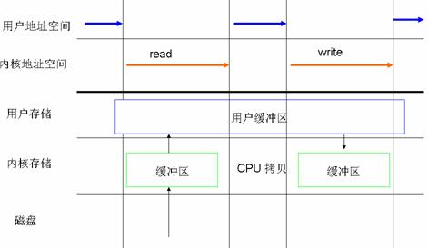
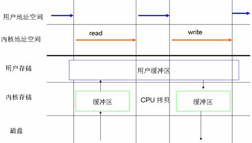
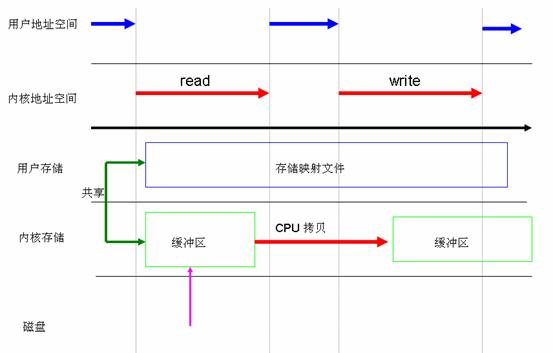
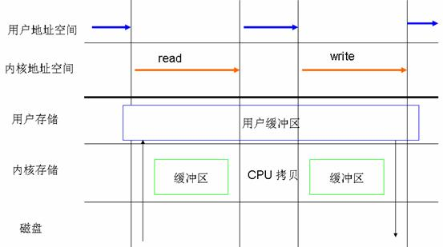
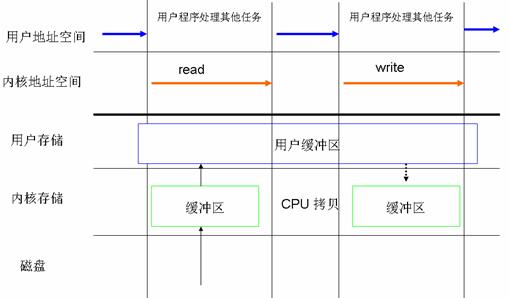

## system

### 缓存 I/O (Buffered I/O)
缓存 I/O 又被称作标准 I/O，大多数文件系统的默认 I/O 操作都是缓存 I/O。在 Linux 的缓存 I/O 机制中，操作系统会将 I/O 的数据缓存在文件系统的页缓存（ page cache ）中，也就是说，数据会先被拷贝到操作系统内核的缓冲区中，然后才会从操作系统内核的缓冲区拷贝到应用程序的地址空间。缓存 I/O 有以下这些优点：
* 缓存 I/O 使用了操作系统内核缓冲区，在一定程度上分离了应用程序空间和实际的物理设备。
* 缓存 I/O 可以减少读盘的次数，从而提高性能。
  
**当应用程序尝试读取某块数据的时候，如果这块数据已经存放在了页缓存中，那么这块数据就可以立即返回给应用程序，而不需要经过实际的物理读盘操作。当然，如果数据在应用程序读取之前并未被存放在页缓存中，那么就需要先将数据从磁盘读到页缓存中去。对于写操作来说，应用程序也会将数据先写到页缓存中去，数据是否被立即写到磁盘上去取决于应用程序所采用的写操作机制：如果用户采用的是同步写机制（ synchronous writes ）, 那么数据会立即被写回到磁盘上，应用程序会一直等到数据被写完为止；如果用户采用的是延迟写机制（ deferred writes ），那么应用程序就完全不需要等到数据全部被写回到磁盘，数据只要被写到页缓存中去就可以了。在延迟写机制的情况下，操作系统会定期地将放在页缓存中的数据刷到磁盘上。与异步写机制（ asynchronous writes ）不同的是，延迟写机制在数据完全写到磁盘上的时候不会通知应用程序，而异步写机制在数据完全写到磁盘上的时候是会返回给应用程序的。所以延迟写机制本身是存在数据丢失的风险的，而异步写机制则不会有这方面的担心**

**在缓存 I/O 机制中，DMA 方式可以将数据直接从磁盘读到页缓存中，或者将数据从页缓存直接写回到磁盘上，而不能直接在应用程序地址空间和磁盘之间进行数据传输，这样的话，数据在传输过程中需要在应用程序地址空间和页缓存之间进行多次数据拷贝操作，这些数据拷贝操作所带来的 CPU 以及内存开销是非常大的。
对于某些特殊的应用程序来说，避开操作系统内核缓冲区而直接在应用程序地址空间和磁盘之间传输数据会比使用操作系统内核缓冲区获取更好的性能.**

### 自缓存应用程序（ self-caching applications）

**对于某些应用程序来说，它会有它自己的数据缓存机制，比如，它会将数据缓存在应用程序地址空间，这类应用程序完全不需要使用操作系统内核中的高速缓冲存储器，这类应用程序就被称作是自缓存应用程序（ self-caching applications ）。数据库管理系统是这类应用程序的一个代表。对于自缓存应用程序来说，缓存 I/O 明显不是一个好的选择。由此引出我们这篇文章着重要介绍的 Linux 中的直接 I/O 技术。Linux 中的直接 I/O 技术非常适用于自缓存这类应用程序，该技术省略掉缓存 I/O 技术中操作系统内核缓冲区的使用，数据直接在应用程序地址空间和磁盘之间进行传输，从而使得自缓存应用程序可以省略掉复杂的系统级别的缓存结构，而执行程序自己定义的数据读写管理，从而降低系统级别的管理对应用程序访问数据的影响。在下面一节中，我们会着重介绍 Linux 中提供的直接 I/O 机制的设计与实现，该机制为自缓存应用程序提供了很好的支持。**

## Linux 中提供的几种文件访问方式

* 标准访问文件的方式
 

* 同步访问文件的方式
  

* 内存映射方式
在很多操作系统包括 Linux 中，内存区域（ memory region ）是可以跟一个普通的文件或者块设备文件的某一个部分关联起来的，若进程要访问内存页中某个字节的数据，操作系统就会将访问该内存区域的操作转换为相应的访问文件的某个字节的操作。Linux 中提供了系统调用 mmap() 来实现这种文件访问方式。与标准的访问文件的方式相比，内存映射方式可以减少标准访问文件方式中 read() 系统调用所带来的数据拷贝操作，即减少数据在用户地址空间和操作系统内核地址空间之间的拷贝操作。映射通常适用于较大范围，对于相同长度的数据来讲，映射所带来的开销远远低于 CPU 拷贝所带来的开销。当大量数据需要传输的时候，采用内存映射方式去访问文件会获得比较好的效率。

* 直接 I/O 方式
凡是通过直接 I/O 方式进行数据传输，数据均直接在用户地址空间的缓冲区和磁盘之间直接进行传输，完全不需要页缓存的支持。操作系统层提供的缓存往往会使应用程序在读写数据的时候获得更好的性能，但是对于某些特殊的应用程序，比如说数据库管理系统这类应用，他们更倾向于选择他们自己的缓存机制，因为数据库管理系统往往比操作系统更了解数据库中存放的数据，数据库管理系统可以提供一种更加有效的缓存机制来提高数据库中数据的存取性能。
直接 I/O 最主要的优点就是通过减少操作系统内核缓冲区和应用程序地址空间的数据拷贝次数，降低了对文件读取和写入时所带来的 CPU 的使用以及内存带宽的占用。这对于某些特殊的应用程序，比如自缓存应用程序来说，不失为一种好的选择。如果要传输的数据量很大，使用直接 I/O 的方式进行数据传输，而不需要操作系统内核地址空间拷贝数据操作的参与，这将会大大提高性能。
直接 I/O 并不一定总能提供令人满意的性能上的飞跃。设置直接 I/O 的开销非常大，而直接 I/O 又不能提供缓存 I/O 的优势。缓存 I/O 的读操作可以从高速缓冲存储器中获取数据，而直接 I/O 的读数据操作会造成磁盘的同步读，这会带来性能上的差异 , 并且导致进程需要较长的时间才能执行完；对于写数据操作来说，使用直接 I/O 需要 write() 系统调用同步执行，否则应用程序将会不知道什么时候才能够再次使用它的 I/O 缓冲区。与直接 I/O 读操作类似的是，直接 I/O 写操作也会导致应用程序关闭缓慢。所以，应用程序使用直接 I/O 进行数据传输的时候通常会和使用异步 I/O 结合使用。
  

* 异步访问文件的方式
就是进程发出数据传输请求之后，进程不会被阻塞，也不用等待任何操作完成，进程可以在数据传输的时候继续执行其他的操作。相对于同步访问文件的方式来说，异步访问文件的方式可以提高应用程序的效率，并且提高系统资源利用率。直接 I/O 经常会和异步访问文件的方式结合在一起使用。

